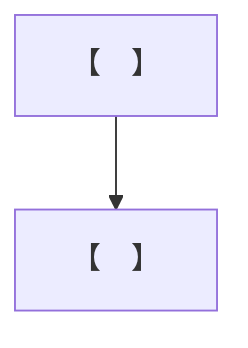
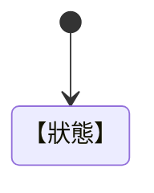
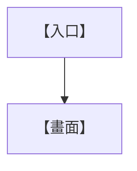

# 【遊戲名稱】Game Design Document

> GDD｜版本【　】｜狀態【　】

| 文件欄位 | 內容 |
|---|---|
| 專案代號 | 【　】 |
| 文件擁有人 | 【　】 |
| 建立日期 | 【　】 |
| 最後更新 | 【　】 |
| 對應 GCP 版本 | 【　】 |
| 對應 TDD 版本 | 【　】 |
| 保密等級 | 【　】 |

## 修訂紀錄

| 版本 | 日期 | 作者 | 變更摘要 | 審核人 |
|---|---|---|---|---|
|  |  |  |  |  |

## 核准紀錄

| 角色 | 姓名 | 決定 | 日期 | 備註 |
|---|---|---|---|---|
| Product Owner |  |  |  |  |
| Lead Game Designer |  |  |  |  |
| Technical Lead |  |  |  |  |
| Art Lead |  |  |  |  |
| Science / Education Lead |  |  |  |  |
| QA Lead |  |  |  |  |

---

## 1. 文件目的與閱讀方式

### 1.1 文件目的

【　】

### 1.2 文件範圍

【　】

### 1.3 相關文件

| 文件 | 版本 | 連結 | 關係 |
|---|---|---|---|
|  |  |  |  |

### 1.4 用詞與縮寫

| 用詞／縮寫 | 定義 |
|---|---|
|  |  |

## 2. 遊戲總覽

### 2.1 高概念

【　】

### 2.2 類型與標籤

【　】

### 2.3 平台與遊玩情境

| 項目 | 定義 |
|---|---|
| 主要平台 |  |
| 次要平台 |  |
| 單次遊玩時間 |  |
| 完整遊戲時間 |  |
| 玩家人數 |  |
| 連線需求 |  |

### 2.4 目標玩家

| 玩家群 | 年齡／背景 | 需求 | 設計回應 |
|---|---|---|---|
|  |  |  |  |

### 2.5 玩家承諾

【　】

### 2.6 獨特賣點

1. 【　】
2. 【　】
3. 【　】

### 2.7 設計目標

| ID | 目標 | 可觀察結果 | 優先級 |
|---|---|---|---|
| DG-001 |  |  |  |

### 2.8 非目標

| ID | 非目標 | 排除原因 |
|---|---|---|
| NG-001 |  |  |

## 3. 設計支柱

### 3.1 支柱一：【　】

| 欄位 | 內容 |
|---|---|
| 定義 |  |
| 玩家感受 |  |
| 對玩法的要求 |  |
| 不符合支柱的例子 |  |
| 驗證方式 |  |

### 3.2 支柱二：【　】

| 欄位 | 內容 |
|---|---|
| 定義 |  |
| 玩家感受 |  |
| 對玩法的要求 |  |
| 不符合支柱的例子 |  |
| 驗證方式 |  |

### 3.3 支柱三：【　】

| 欄位 | 內容 |
|---|---|
| 定義 |  |
| 玩家感受 |  |
| 對玩法的要求 |  |
| 不符合支柱的例子 |  |
| 驗證方式 |  |

## 4. 玩家體驗與循環

### 4.1 核心動詞

| 動詞 | 輸入 | 目標 | 即時回饋 | 失敗／限制 |
|---|---|---|---|---|
|  |  |  |  |  |

### 4.2 逐秒循環

【　】

### 4.3 任務循環

【　】

### 4.4 章節循環

【　】

### 4.5 長期進程循環

【　】

### 4.6 遊戲流程圖

### 4.7 節奏曲線

| 階段 | 時間 | 強度 | 新資訊 | 玩家輸出 | 休息點 |
|---|---:|---:|---|---|---|
|  |  |  |  |  |  |

## 5. 控制、鏡頭與互動

### 5.1 控制配置

| 行動 | 鍵盤滑鼠 | 觸控 | 手掣 | 可重綁 |
|---|---|---|---|---|
|  |  |  |  |  |

### 5.2 角色移動

| 參數 | 數值／規則 | 備註 |
|---|---|---|
|  |  |  |

### 5.3 鏡頭規格

| 狀態 | 距離 | 角度 | FOV | 碰撞處理 | 玩家控制 |
|---|---:|---:|---:|---|---|
|  |  |  |  |  |  |

### 5.4 互動規則

| 互動類型 | 進入條件 | 提示 | 執行 | 中斷 | 回饋 |
|---|---|---|---|---|---|
|  |  |  |  |  |  |

### 5.5 操作狀態圖

## 6. 玩家角色

### 6.1 身分與能力

【　】

### 6.2 屬性與狀態

| 屬性／狀態 | 類型 | 初始值 | 範圍 | 變更來源 | 玩家可見性 |
|---|---|---:|---|---|---|
|  |  |  |  |  |  |

### 6.3 工具與裝備

| ID | 名稱 | 功能 | 取得方式 | 限制 | 升級／變體 |
|---|---|---|---|---|---|
|  |  |  |  |  |  |

### 6.4 自訂項目

| 類別 | 選項 | 解鎖 | 限制 |
|---|---|---|---|
|  |  |  |  |

## 7. 世界與關卡結構

### 7.1 世界架構

【　】

### 7.2 地圖關係

### 7.3 區域規格

| ID | 區域 | 功能 | 入口 | 出口 | 關鍵地標 | 任務 | 效能限制 |
|---|---|---|---|---|---|---|---|
|  |  |  |  |  |  |  |  |

### 7.4 關卡設計規則

| 規則 ID | 規則 | 理由 | 驗證方式 |
|---|---|---|---|
| LD-001 |  |  |  |

### 7.5 導航與防卡死

| 情境 | 預防 | 偵測 | 恢復 |
|---|---|---|---|
|  |  |  |  |

## 8. 敘事設計

### 8.1 世界觀

【　】

### 8.2 主題與界線

| 主題 | 期望表達 | 避免表達 | 驗證人 |
|---|---|---|---|
|  |  |  |  |

### 8.3 故事概要

【　】

### 8.4 角色表

| ID | 角色 | 敘事功能 | 目標 | 衝突 | 角色弧 | 表現注意 |
|---|---|---|---|---|---|---|
|  |  |  |  |  |  |  |

### 8.5 敘事節點

| ID | 觸發 | 前置 | 內容 | 玩家選擇 | 狀態變更 | 後續 |
|---|---|---|---|---|---|---|
|  |  |  |  |  |  |  |

### 8.6 對話規格

| 欄位 | 規則 |
|---|---|
| 每句長度 |  |
| 選項數量 |  |
| 可跳過規則 |  |
| 重播規則 |  |
| 字幕規則 |  |
| 本地化限制 |  |

## 9. 任務與章節

### 9.1 章節總表

| ID | 名稱 | 核心體驗 | 前置 | 時長 | 解鎖 | 狀態 |
|---|---|---|---|---:|---|---|
|  |  |  |  |  |  |  |

### 9.2 任務結構規則

| 欄位 | 規格 |
|---|---|
| 任務開始 |  |
| 目標顯示 |  |
| 進度更新 |  |
| 失敗條件 |  |
| 重試／回復 |  |
| 中途離開 |  |
| 完成判定 |  |

### 9.3 章節規格範本

#### 【章節 ID／名稱】

| 欄位 | 內容 |
|---|---|
| 核心目標 |  |
| 玩家起點 |  |
| 完成狀態 |  |
| 建議時間 |  |
| 必要系統 |  |
| 新資產 |  |
| 學習成果 |  |
| 風險／敏感內容 |  |

| 節點 | 時間 | 地點 | 玩家目標 | 主要行動 | 回饋 | 檢查點 |
|---|---:|---|---|---|---|---|
|  |  |  |  |  |  |  |

### 9.4 任務規格範本

| 欄位 | 內容 |
|---|---|
| 任務 ID |  |
| 名稱 |  |
| 類型 |  |
| 前置條件 |  |
| 開始觸發 |  |
| 完成條件 |  |
| 失敗條件 |  |
| 中止／恢復 |  |
| 獎勵 |  |
| 分析事件 |  |

| 步驟 ID | 玩家目標 | 系統條件 | UI 文案鍵 | 提示 | 下一步 |
|---|---|---|---|---|---|
|  |  |  |  |  |  |

## 10. 遊戲系統規格

### 10.1 系統清單

| 系統 ID | 系統名稱 | 玩家價值 | 輸入 | 輸出 | 相依系統 | Owner |
|---|---|---|---|---|---|---|
| SYS-001 |  |  |  |  |  |  |

### 10.2 系統規格範本

#### 【系統 ID／名稱】

| 欄位 | 內容 |
|---|---|
| 目的 |  |
| 玩家輸入 |  |
| 系統規則 |  |
| 狀態 |  |
| 即時回饋 |  |
| 完成／失敗 |  |
| 邊界情況 |  |
| 存檔資料 |  |
| 無障礙 |  |
| 分析事件 |  |
| 技術相依 |  |

### 10.3 數值與平衡表

| ID | 參數 | 預設 | 最小 | 最大 | 單位 | 調整理由 | 資料來源 |
|---|---|---:|---:|---:|---|---|---|
|  |  |  |  |  |  |  |  |

## 11. 教育與科學內容

### 11.1 學習成果矩陣

| LO ID | 玩家應能 | 教學行動 | 遊戲內證據 | 評估方式 | 年齡層 | 審核人 |
|---|---|---|---|---|---|---|
| LO-001 |  |  |  |  |  |  |

### 11.2 概念模型

| 概念 | 遊戲模型 | 簡化內容 | 不可省略 | 常見誤解 | 修正方式 |
|---|---|---|---|---|---|
|  |  |  |  |  |  |

### 11.3 科學宣稱登記

| Claim ID | 遊戲內宣稱 | 類型 | 來源 | 證據等級 | 限制 | 核准人 |
|---|---|---|---|---|---|---|
| CLM-001 |  |  |  |  |  |  |

### 11.4 模擬資料登記

| Dataset ID | 用途 | 來源 | 真實／模擬 | 轉換 | 限制 | 核准 |
|---|---|---|---|---|---|---|
|  |  |  |  |  |  |  |

### 11.5 安全、保安與倫理審核

| 內容 | 潛在誤解／傷害 | 遊戲處理 | 外部要求 | 審核人 | 狀態 |
|---|---|---|---|---|---|
|  |  |  |  |  |  |

## 12. 模式、難度與提示

### 12.1 模式差異矩陣

| 維度 | 模式 A | 模式 B | 共用內容 | QA 要點 |
|---|---|---|---|---|
|  |  |  |  |  |

### 12.2 難度曲線

| 章節／節點 | 新概念 | 已知概念 | 複雜度 | 失敗成本 | 提示可用性 |
|---|---|---|---:|---|---|
|  |  |  |  |  |  |

### 12.3 提示層級

| 層級 | 觸發 | 內容形式 | 冷卻 | 對評價影響 |
|---|---|---|---|---|
|  |  |  |  |  |

## 13. 進程、回饋與獎勵

### 13.1 進度結構

【　】

### 13.2 解鎖表

| ID | 內容 | 前置條件 | 解鎖時機 | 永久／單局 | 顯示方式 |
|---|---|---|---|---|---|
|  |  |  |  |  |  |

### 13.3 評價規則

| 維度 | 行為證據 | 計算方式 | 顯示 | 可改善方式 |
|---|---|---|---|---|
|  |  |  |  |  |

### 13.4 獎勵表

| ID | 獎勵 | 目的 | 取得條件 | 重複規則 | 避免行為扭曲 |
|---|---|---|---|---|---|
|  |  |  |  |  |  |

## 14. UI／UX

### 14.1 資訊架構

### 14.2 畫面清單

| UI ID | 畫面 | 入口 | 主要任務 | 主要元件 | 離開方式 | 原型連結 |
|---|---|---|---|---|---|---|
| UI-001 |  |  |  |  |  |  |

### 14.3 HUD 規格

| 元件 | 顯示條件 | 位置 | 內容 | 狀態 | 可及性 |
|---|---|---|---|---|---|
|  |  |  |  |  |  |

### 14.4 UI 狀態

| 元件 | Default | Hover | Focus | Active | Disabled | Loading | Error |
|---|---|---|---|---|---|---|---|
|  |  |  |  |  |  |  |  |

### 14.5 文案規則

| 類型 | 字數限制 | 語氣 | 變數格式 | 錯誤處理 |
|---|---:|---|---|---|
|  |  |  |  |  |

## 15. 美術與動畫方向

### 15.1 視覺支柱

| 支柱 | 定義 | 必須 | 避免 | 參考連結 |
|---|---|---|---|---|
|  |  |  |  |  |

### 15.2 色彩與材質

| 類別 | 色彩／材質 | 功能 | 對比要求 | 限制 |
|---|---|---|---|---|
|  |  |  |  |  |

### 15.3 動畫清單

| ID | 對象 | 動畫 | 觸發 | 循環 | 時長 | Gameplay Event |
|---|---|---|---|---|---:|---|
|  |  |  |  |  |  |  |

### 15.4 VFX 清單

| ID | 效果 | 用途 | 觸發 | 時長 | 效能級別 | 可及性替代 |
|---|---|---|---|---:|---|---|
|  |  |  |  |  |  |  |

## 16. 聲音與音樂

### 16.1 聲音支柱

【　】

### 16.2 音樂狀態

| ID | 狀態 | 進入條件 | 離開條件 | 過渡 | 循環 | 優先級 |
|---|---|---|---|---|---|---|
|  |  |  |  |  |  |  |

### 16.3 音效清單

| ID | 事件 | 音效 | 變體 | 空間化 | 字幕／視覺替代 | 優先級 |
|---|---|---|---|---|---|---|
|  |  |  |  |  |  |  |

### 16.4 語音清單

| ID | 角色 | 文案鍵 | 情緒 | 語言 | 檔案 | 狀態 |
|---|---|---|---|---|---|---|
|  |  |  |  |  |  |  |

## 17. 可及性與本地化

### 17.1 可及性需求

| ID | 類別 | 需求 | 設計處理 | 測試方法 | 狀態 |
|---|---|---|---|---|---|
| A11Y-001 |  |  |  |  |  |

### 17.2 本地化範圍

| 語言 | 首發／後續 | 字型 | 文案擴張率 | 語音 | Owner |
|---|---|---|---:|---|---|
|  |  |  |  |  |  |

### 17.3 文化與敏感內容

| 內容 | 地區 | 風險 | 處理 | 審核人 |
|---|---|---|---|---|
|  |  |  |  |  |

## 18. 存檔、分析與私隱

### 18.1 存檔需求

| 資料 | 儲存時機 | 位置 | 版本遷移 | 清除方式 | 敏感性 |
|---|---|---|---|---|---|
|  |  |  |  |  |  |

### 18.2 分析事件

| Event ID | 觸發 | 參數 | 產品問題 | 保存期 | 同意要求 |
|---|---|---|---|---|---|
|  |  |  |  |  |  |

### 18.3 私隱界線

| 資料類型 | 是否收集 | 理由 | 法律／機構依據 | 保護措施 |
|---|---|---|---|---|
|  |  |  |  |  |

## 19. 範圍、相依與開放問題

### 19.1 版本範圍

| 功能 | Must | Should | Could | Won't | Owner |
|---|:---:|:---:|:---:|:---:|---|
|  |  |  |  |  |  |

### 19.2 外部相依

| ID | 相依項 | Owner | 需要日期 | 影響 | 備援 |
|---|---|---|---|---|---|
| DEP-001 |  |  |  |  |  |

### 19.3 設計風險

| ID | 風險 | 機率 | 影響 | 緩解 | 觸發條件 | Owner |
|---|---|---|---|---|---|---|
| RSK-001 |  |  |  |  |  |  |

### 19.4 開放問題

| ID | 問題 | 決策人 | 截止日期 | 狀態 | 決定／連結 |
|---|---|---|---|---|---|
| Q-001 |  |  |  |  |  |

## 20. 驗收準則

| ID | 功能／體驗 | Given | When | Then | 驗證人 | 狀態 |
|---|---|---|---|---|---|---|
| AC-001 |  |  |  |  |  |  |

## 附錄 A：設計決策紀錄

| ADR ID | 日期 | 問題 | 選項 | 決定 | 理由 | 影響 |
|---|---|---|---|---|---|---|
|  |  |  |  |  |  |  |

## 附錄 B：參考資料

| ID | 類型 | 名稱 | 連結／位置 | 使用範圍 | 授權／引用 |
|---|---|---|---|---|---|
|  |  |  |  |  |  |

## 附錄 C：刪除內容紀錄

| ID | 內容 | 原因 | 版本 | 可重用條件 | 相關決策 |
|---|---|---|---|---|---|
|  |  |  |  |  |  |
