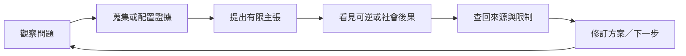
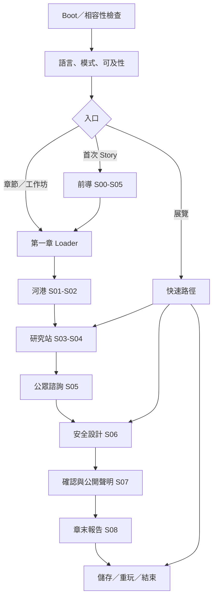
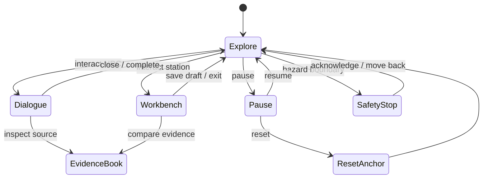
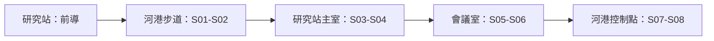
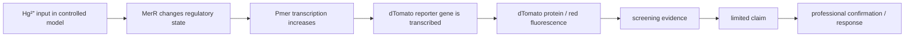

# 《微界工程師：生命迴路》Game Design Document

> GDD｜版本 2.0｜狀態：固定斜俯視鏡頭與第二至第八章整合腳本已納入；待團隊簽核

| 文件欄位 | 內容 |
|---|---|
| 專案代號 | `MCE-LC-2026` |
| 文件擁有人 | Lead Game Designer（待指派姓名） |
| 建立日期 | 2026-07-26 |
| 最後更新 | 2026-07-27（v2.0 邏輯／鏡頭／Future chapters 再審） |
| 對應 GCP | `00_GAME_CONCEPT_PROPOSAL.md` v1.4 |
| 對應 TDD | `03_TECHNICAL_DESIGN_DOCUMENT.md` v2.0 |
| 目標 Release | 2026 iGEM Public RC：前導章＋第一章＋展覽快速路徑 |
| 保密等級 | 團隊內部開發；經 Science／Safety／Brand 核准後可公開 |

## 修訂紀錄

| 版本 | 日期 | 作者 | 變更摘要 | 審核人 |
|---|---|---|---|---|
| 1.0 | 2026-07-26 | 文件整合草案 | 依獨立製作審核完成 GDD；把 2026 P0 與 Future chapters 分開 | — |
| 2.0 | 2026-07-27 | 邏輯／技術再審 | 鎖定固定斜俯視鏡頭；移除自由／肩後鏡頭；加入 C2–C8 Scene scripts；修正品質、LacI、資料、PET、青蒿素、雙重用途與終章邏輯 | 待團隊簽核 |

## 核准紀錄

| 角色 | 姓名 | 決定 | 日期 | 備註 |
|---|---|---|---|---|
| Product Owner | 待指派 | 待決定 | — | 核准 P0 範圍與對外承諾 |
| Lead Game Designer | 待指派 | 待決定 | — | 核准玩法、節奏與內容邊界 |
| Technical Lead | 待指派 | 待決定 | — | 核准技術可行性與效能預算 |
| Art Lead | 待指派 | 待決定 | — | 核准視覺方向與資產量 |
| Science／Education Lead | 待指派 | 待決定 | — | 核准科學因果、學習成果與模擬標示 |
| Safety／HP Lead | 待指派 | 待決定 | — | 核准安全、保安、倫理與持份者表述 |
| QA Lead | 待指派 | 待決定 | — | 核准驗收與 Release Gate |

---

## 1. 文件目的與閱讀方式

### 1.1 文件目的

本文件把 GCP 與完整腳本轉化為可估算、可實作、可測試的遊戲設計基線。它回答「玩家做甚麼、看見甚麼、何時算完成、哪些內容屬 2026、哪些內容只保留為未來設計」；程式架構、資料格式與效能細節以 TDD 為準，逐句對白與狀態旗標以完整腳本及 continuity 為準。

### 1.2 文件範圍

- **P0：** Story Campaign 模式選擇、前導章 S00–S05、第一章 S00–S08、設定、存檔、章末四維報告、快速重設及展覽快速路徑。
- **P1：** Beta 後才考慮的 PWA、完整英文第一章、平板、教師摘要、少量語音。
- **R&D：** Junior Mission 的紙面／2D／共用 3D 灰盒。
- **Future：** 第二至第八章完整實作；本 GDD 已保留逐 Scene 整合製作腳本、旗標、canonical 結果與共用系統需求，但它們不列入 2026 完成定義、production manifest 或 P0 QA surface。

### 1.3 相關文件

| 文件 | 版本 | 連結 | 關係 |
|---|---|---|---|
| Game Concept Proposal | 1.4 | [00_GAME_CONCEPT_PROPOSAL.md](00_GAME_CONCEPT_PROPOSAL.md) | 願景、完整產品路線與來源背景 |
| 獨立製作審核 | 1.0 | [18_INDEPENDENT_PRODUCTION_READINESS_AUDIT.md](18_INDEPENDENT_PRODUCTION_READINESS_AUDIT.md) | 2026 範圍裁決與高風險處置 |
| Technical Design Document | 2.0 | [03_TECHNICAL_DESIGN_DOCUMENT.md](03_TECHNICAL_DESIGN_DOCUMENT.md) | 架構、資料、效能、部署 |
| Asset Guidelines | 1.0 | [04_ASSET_LIST_AND_PRODUCTION_GUIDELINES.md](04_ASSET_LIST_AND_PRODUCTION_GUIDELINES.md) | 資產 ID、預算、交付 |
| Project Management Plan | 1.0 | [05_PROJECT_MANAGEMENT_PLAN.md](05_PROJECT_MANAGEMENT_PLAN.md) | 時程、容量、RACI、風險 |
| QA Test Plan | 1.0 | [06_QA_TEST_PLAN.md](06_QA_TEST_PLAN.md) | 測試、RTM、Release Gate |
| Source & Claim Register | 1.1 | [22_SOURCE_AND_CLAIM_REGISTER.md](22_SOURCE_AND_CLAIM_REGISTER.md) | MerR／aptamer 來源、maturity、公開 wording 與禁止主張 |
| 前導章完整腳本 | Greybox candidate | [07A_PRE_CHAPTER_FULL_SCRIPT.md](07A_PRE_CHAPTER_FULL_SCRIPT.md) | 前導對白、互動及 flags 的內容來源 |
| 第一章完整腳本 | Greybox candidate | [07_CHAPTER_01_FULL_SCRIPT.md](07_CHAPTER_01_FULL_SCRIPT.md) | 第一章對白、選項、狀態與演出來源 |
| Script System & Continuity | 1.3 | [15_SCRIPT_SYSTEM_AND_CONTINUITY.md](15_SCRIPT_SYSTEM_AND_CONTINUITY.md) | mode loader、save summary、standalone 及跨章契約 |

### 1.4 用詞與縮寫

| 用詞／縮寫 | 定義 |
|---|---|
| P0／P1 | 必須交付／可在核心穩定後加入的優先級 |
| R&D／Future | 驗證未知／不進入 2026 生產承諾 |
| Critical Path | 玩家完成章節必經的最短合法路徑 |
| Evidence → Claim → Consequence | 取得證據、形成有限主張、看見後果並修訂的核心玩法語法 |
| DBTL | Design–Build–Test–Learn；章節級工程循環 |
| Guided Mode | 引導模式；增加圖像、短句及逐步提示，但不改變 canonical 科學結果 |
| Standard Mode | 標準模式；顯示完整術語、資料與診斷 |
| Teaching Simulation | 為學習設計的虛擬結果，不能當作團隊實驗或真實檢測資料 |
| Claim Maturity | 機制文獻、團隊 proposal、團隊實測、故事虛構與教學模擬的來源層級 |

## 2. 遊戲總覽

### 2.1 高概念

> 在可步行探索的近未來城市中，玩家以證據設計生命迴路、測試其限制、建立多層安全方案，並讓受影響的人真正改變提案。

### 2.2 類型與標籤

單人、教育冒險、固定斜俯視（isometric-like）3D 探索、2D 因果卡牌、科學解謎、敘事任務、資料判讀、responsible innovation、無戰鬥、無計時壓力。

### 2.3 平台與遊玩情境

| 項目 | 2026 P0 定義 |
|---|---|
| 主要平台 | 桌面瀏覽器；Chrome／Edge 最新兩個主要版本 |
| 次要平台 | Firefox best effort；平板與 Safari 為 P1，需獨立驗證 |
| 單次遊玩 | 前導 5–7 分鐘；第一章 24–25 分鐘；展覽快速路徑 3–5 分鐘 |
| P0 完整體驗 | 約 29–32 分鐘，不含設定與選讀內容 |
| 完整 design bible | 前導＋八章為約 192–203 分鐘；不屬 2026 P0 |
| 玩家人數 | 1；教室可由導師投影帶領，但仍以單一 profile 運作 |
| 連線需求 | 初次下載需要網路；章節遊玩不依賴持續連線；提供離線包 |
| 商業模式 | 免費、無廣告、無內購、無排行榜、無公開聊天 |

### 2.4 目標玩家

| 玩家群 | 年齡／背景 | 主要需要 | 設計回應 | 2026 狀態 |
|---|---|---|---|---|
| 中學生 | 約 12–17；可零生物背景 | 可操作因果、合理閱讀量、清楚提示 | 前導＋第一章；Guided／Standard | P0 |
| 一般公眾 | 不限；短時間接觸 | 零背景入口、可信而不說教 | 情境故事、詞彙即時解釋、選讀資料 | P0 |
| 教師／工作坊導師 | 成人 | 時間可控、重設、討論證據 | 快速入口、章末報告、session reset | P0 |
| 評審／展覽訪客 | 3–5 分鐘 | 快速看見一個完整因果閉環 | 控制失敗→修正主張→安全界線的快速路徑 | P0 |
| P4–P6 | 約 9–12 | 低閱讀負擔、低 3D 門檻、適齡 transfer | 獨立 Junior Mission | R&D；需獨立實測 |

### 2.5 玩家承諾

玩家不會只閱讀「正確答案」。每個主要段落都會先給一個可觀察問題，讓玩家操作證據、選擇主張強度、看見具體後果，然後修改方案。遊戲承諾精確地說明工具能做甚麼、不能做甚麼、下一步由誰負責；不承諾技術萬能或零風險。

### 2.6 獨特賣點

1. **從零背景到具名真實案例：** 先以 2D role cards 建立 DNA／cell／input／regulator／reporter／control，再轉入 `MerR/Pmer` 汞感測案例。
2. **安全、倫理與 Human Practices 是玩法：** 居民疑慮能修改裝置、程序、通知權與監督，而非只作對話選項。
3. **證據有範圍：** failed control、背景、重複、基質效應與權責會直接限制玩家可說的結論。
4. **短章節但完整責任弧：** 研究、測試、安全、溝通和專業處置在 30 分鐘內形成可討論故事。

### 2.7 設計目標

| ID | 目標 | 可觀察結果 | 優先級 |
|---|---|---|---|
| DG-001 | 玩家建立 input→regulator→promoter→reporter 因果 | 能在新例子預測有／無 input 的輸出 | P0 |
| DG-002 | 玩家區分 DNA 指令與 reporter protein | 不把 `dTomato` DNA、蛋白或汞本身混為一談 | P0 |
| DG-003 | 玩家用 control 判斷測試是否有效 | positive control 失敗時拒絕解讀 unknown | P0 |
| DG-004 | 玩家形成有限主張 | 能把「偵測線索」與「確認／清理／健康因果」分開 | P0 |
| DG-005 | 玩家建立多層安全觀 | 至少選出不同層面的物理、程序、生物或治理措施 | P0 |
| DG-006 | 公眾意見改變方案 | 玩家可指出一項由居民需要導致的設計修訂 | P0 |
| DG-007 | 章節在學校設備可完成 | ≥80% 目標玩家在 30 分鐘內完成第一章，不需代操作 | P0 |
| DG-008 | 遊戲保持可恢復 | 錯誤不造成死檔；三級提示及 reset 可用 | P0 |
| DG-009 | 內容可擴充而不污染 P0 | Future chapter 資料與功能不增加 P0 bundle 或 QA surface | P1/Future |

### 2.8 非目標

| ID | 非目標 | 排除原因 |
|---|---|---|
| NG-001 | 教授濕實驗步驟、序列、培養條件或污染物處理 | 安全、責任與教育範圍不允許 |
| NG-002 | 真實汞檢測、醫療診斷或環境認證 | 遊戲只有教學模擬 |
| NG-003 | 戰鬥、敵人、死亡、跳躍平台、速度挑戰 | 不服務核心學習，增加控制與 QA 成本 |
| NG-004 | 大型無縫開放世界 | 與 30 分鐘章節、下載與高中團隊容量衝突 |
| NG-005 | 帳號、雲端存檔、多人、聊天、排行榜 | 增加兒童資料、後端與營運風險 |
| NG-006 | 用一個 kill switch 或封閉盒宣稱零風險 | 科學與責任上錯誤 |
| NG-007 | 把居民反對寫成無知或反科學 | 違反 Human Practices 及角色設計 |
| NG-008 | 2026 完成第二至終章 | 經審核不具容量證據 |

## 3. 設計支柱

### 3.1 支柱一：科學因果可操作

| 欄位 | 內容 |
|---|---|
| 定義 | 核心概念必須由玩家排列、預測、執行或修正，而不是先讀長文再答題 |
| 玩家感受 | 「我看懂是因為我改了一個條件，結果真的不同」 |
| 對玩法的要求 | 30 秒內首次操作；每個新術語先有可見角色／功能；輸入、DNA、蛋白、證據置於不同空間 |
| 不符合支柱 | 播放 3 分鐘動畫後問「MerR 是甚麼？」；只要點唯一正確答案 |
| 驗證方式 | 行為 log、transfer prompt、think-aloud；玩家可用自己的話重述因果 |

### 3.2 支柱二：證據有邊界

| 欄位 | 內容 |
|---|---|
| 定義 | 遊戲同時顯示證據來源、品質、缺口、不確定性及可支持的主張範圍 |
| 玩家感受 | 「不是所有 High／Low 都能直接當答案；我要先看測試是否正常」 |
| 對玩法的要求 | known-low／known-high、unknown、failed control、背景與確認性下一步；合理 near-miss |
| 不符合支柱 | 一個紅點自動標成污染源；一次陽性便宣告全河污染或完成清理 |
| 驗證方式 | 控制失敗案例、範圍選擇、公開聲明重寫、誤解訪談 |

### 3.3 支柱三：責任會改變設計

| 欄位 | 內容 |
|---|---|
| 定義 | 安全、倫理、公平、權責和持份者意見必須改變裝置、程序、範圍或決策 gate |
| 玩家感受 | 「承認限制沒有讓我失敗，反而讓方案更可信」 |
| 對玩法的要求 | 多層控制、殘餘風險、居民要求、專業確認、公開更正、無零風險分數 |
| 不符合支柱 | 最後只顯示『請遵守安全』；玩家以高說服值壓過居民 |
| 驗證方式 | 方案 diff、NPC 後續對白、章末責任證據、playtest 訪談 |

## 4. 玩家體驗與循環

### 4.1 核心動詞

| 動詞 | 輸入 | 目標 | 即時回饋 | 失敗／限制 |
|---|---|---|---|---|
| 移動 | WASD／方向鍵 | 到達清楚地標 | 路徑、地標、任務距離 | 無跳躍；越界會被安全系統阻止 |
| 觀察 | 視線、互動鍵 | 取得環境或人物證據 | 證據卡、來源、可信度標籤 | 觀察不自動等於結論 |
| 分類 | 證據簿 | 分開觀察、假設、結果、觀點、未知 | 類別變化、理由提示 | 近似錯誤保留並顯示後果 |
| 組裝 | 卡牌／元件 | 建立兩轉錄單元或安全層 | 因果動畫、狀態預測 | 錯誤先播放機制，再可回收 |
| 配置測試 | 樣本與 controls | 判斷 run 是否有效 | 重複、閾值、control status | failed control 阻止強結論 |
| 形成主張 | claim cards | 選用途、限制、下一步 | 世界行動與 NPC 回應 | 過度主張導致延誤、更正或額外監測 |
| 修訂 | 返回證據／方案 | 收窄或補強方案 | diff、已解決疑慮 | 不抹去已發生後果 |
| 溝通 | 證據與聲明卡 | 說明用途、限制、未知與責任 | NPC 追問、共同要求 | 不設「說服值」或單一勝負 |

### 4.2 逐秒循環

在 3D 中，玩家每 5–15 秒重複「看地標／移動／互動／取得一張可讀證據」；在 2D 工作台中，每 10–30 秒重複「選擇元件／放置／預測／執行／看因果」。任何 Critical Path 段落若連續 60 秒沒有玩家輸入，必須被拆短或改成可選延伸內容。

### 4.3 任務循環


```mermaid
flowchart LR
    A[觀察問題] --> B[蒐集或配置證據]
    B --> C[提出有限主張]
    C --> D[看見可逆或社會後果]
    D --> E[查回來源與限制]
    E --> F[修訂方案／下一步]
    F --> A
```

### 4.4 章節循環

> 問題與持份者 → 探索 → 設計／建構 → 測試 → 學習 → 安全／倫理 → 公眾溝通 → 章末報告。

第一章只使用這條完整循環一次，不把每個小系統做成長 tutorial。前導章則用四輪小型因果循環準備必要心智模型。

### 4.5 長期進程循環

P0 不使用經驗值、貨幣或裝備成長。玩家累積的是：完成章、知識卡、決策 summary、可重訪報告與設定。Future chapters 可消費已核准的 profile summaries，但 standalone 必須有中性預設，不得偽造玩家曾作出的決策。

### 4.6 遊戲流程圖


```mermaid
flowchart TD
    A[Boot／相容性檢查] --> B[語言、模式、可及性]
    B --> C{入口}
    C -->|首次 Story| D[前導 S00-S05]
    C -->|章節／工作坊| E[第一章 Loader]
    C -->|展覽| X[快速路徑]
    D --> E
    E --> F[河港 S01-S02]
    F --> G[研究站 S03-S04]
    G --> H[公眾諮詢 S05]
    H --> I[安全設計 S06]
    I --> J[確認與公開聲明 S07]
    J --> K[章末報告 S08]
    K --> L[儲存／重玩／結束]
    X --> G
    X --> I
    X --> L
```

### 4.7 節奏曲線

| 階段 | 時間 | 強度 | 新資訊 | 玩家輸出 | 休息點 |
|---|---:|---:|---|---|---|
| 前導啟動 | 0.5 分鐘 | 低 | 玩家身份、卡牌空間 | 首次放置 | 無需讀長文 |
| 前導四輪 | 4–5 分鐘 | 中 | DNA／protein、調控、controls、scope | 完整 generic model | 每輪結束可暫停 |
| 第一章危機 | 2 分鐘 | 中高 | 汞疑慮與權責 | 遵守封鎖、提出採樣候選 | 替代用水／健康資訊 |
| 地圖證據 | 3 分鐘 | 中 | 水流、四點、觀察／假設 | 初步路徑假設 | 研究站轉場 |
| 迴路＋測試 | 7 分鐘 | 高認知 | MerR、兩單元、controls、重複 | 迴路與篩查結果 | 測試摘要 |
| 公眾諮詢 | 3 分鐘 | 社會張力 | 利益、信任、處置、通知 | 需求清單 | 可展開／收合對話 |
| 安全門 | 4 分鐘 | 高 | 組合失效、多層控制 | 修訂方案 | 狀態圖與殘餘風險 |
| 確認與結局 | 5–6 分鐘 | 緩降 | 專業確認、清理與公開更正 | 公共聲明、報告 | 章末回顧 |

## 5. 控制、鏡頭與互動

### 5.1 控制配置

| 行動 | 鍵盤滑鼠 | 觸控（P1） | 手掣 | 可重綁 |
|---|---|---|---|:---:|
| 移動 | WASD／方向鍵 | 左側虛擬搖桿 | 左 stick／D-pad | 是 |
| 鏡頭 | **無玩家旋轉、俯仰或縮放輸入** | 無右側拖曳 | 右 stick 不控制鏡頭 | — |
| 互動 | E／Enter；亦可點擊已高亮目標 | 大型互動按鈕 | A／Cross | 是 |
| 切換附近目標 | `[`／`]` 或 UI 按鈕 | 左／右目標按鈕 | LB／RB | 是 |
| 返回／關閉 | Esc／Backspace | 返回按鈕 | B／Circle | 是 |
| 任務／證據簿 | Tab | HUD 按鈕 | View／Select | 是 |
| 返回安全點 | 長按 R 1 秒 | HUD 按鈕 | 左 stick click | 是 |
| 提示 | H | HUD 按鈕 | Y／Triangle | 是 |
| 暫停 | Esc | 暫停按鈕 | Menu | 是 |
| 跳躍／衝刺／click-to-move | **不提供** | 不提供 | 不提供 | — |

鍵盤不可只支援 WASD；方向鍵亦需可完成 Critical Path。拖放操作必須有「選卡→選槽→確認」等價模式。滑鼠／觸控可直接選取互動物，但 P0 不實作 click-to-move 或 pathfinding。

### 5.2 角色移動

| 參數 | 基線 | 備註 |
|---|---|---|
| 步行速度 | 3.2 m/s | 可及性設定可降至 2.4；不可作能力評分 |
| 加速／減速 | 0.12–0.18 秒平滑 | 降低瞬間位移；不做滑行感 |
| 移動座標 | **固定螢幕相對** | `W／↑` 永遠朝螢幕上方；不受角色面向或鏡頭 transition 改變 |
| 角色轉向 | 朝實際移動向量 | 鏡頭 yaw／pitch 不跟隨角色旋轉 |
| 最大坡度 | 35° | 超過使用斜坡／阻擋，不使用跳躍解決 |
| Step height | 0.25 m | 模組化場景避免小障礙卡住 |
| 邊界 | 可見欄杆、警示帶、NPC／系統阻止 | 不用 invisible wall 作唯一提示 |
| 重置 | 長按 R 1 秒或 Pause Menu | 返回最近安全 anchor，不丟任務狀態 |

### 5.3 鏡頭規格

**決定：** P0 使用固定方向的斜俯視透視鏡頭 `IsometricPerspectiveRig`。它不是真正 orthographic 等角投影，也不是肩後／跟隨角色朝向的第三人稱鏡頭。鏡頭會追蹤玩家的**世界位置**並在世界平面上平移，以玩家或 authored focus 保持構圖；它不追蹤角色面向，也不轉成肩後視角。方向、角度與 FOV 不由玩家改變。

| 狀態 | yaw／向下角 | Offset／FOV | 取景行為 | 遮擋／降低動態 |
|---|---|---|---|---|
| 探索 | 世界 yaw `45°`；向下約 `50°` | 水平 offset 約 10 m、高約 12 m；FOV `40°` | 玩家目標畫面 Y 約 `0.58`；pan smoothing half-life `0.20 s`；移動預視最多 `0.9 m`，可關閉 | 不旋轉、不 zoom；屋頂／牆面 cutaway、`CameraOccluder` 淡出 |
| Zone transition | yaw／角度不變 | 可使用經測試的 zone profile，FOV 只准 `38–44°` | authored target／bounds 間平移 `0.35–0.60 s` | reduced motion 改為短 fade／cut；無 whip pan |
| 互動 focus | yaw／角度不變 | 不切近肩後鏡頭 | 只平移到同時看見玩家與目標；玩家輸入即取消 | transition 可跳過；不得遮住字幕／HUD |
| 工作台 | 3D 背景固定或降頻 | DOM 佔主要畫面 | 鏡頭不接受輸入 | 可暫停 3D render；焦點完全交給 DOM |
| 對話 | 保留斜俯視場景 | 使用角色 nameplate／字幕 | 可做小幅 authored 平移，不繞角色 | 不用不可跳過 close-up；reduced motion 靜態構圖 |
| QA | `DebugFreeCam` only | dev／qa flag | 只供檢查碰撞與遮擋 | production menu 不可出現 |

補充規則：

- 鏡頭會隨玩家位置作平滑平移，但**不跟隨角色面向**，也不在轉彎時繞到角色背後；所以玩家不會因角色旋轉而失去方向。
- 不使用 camera boom collision、自動貼近或動態 pitch。遮擋由關卡 authored volumes、屋頂／高牆 cutaway 及 tagged occluder fade 解決。
- `movement look-ahead` 只改平移目標，不改 yaw／pitch；關閉後直接以玩家／focus anchor 取景。
- Camera profile 必須在 720p、200% UI、字幕開啟及低階畫質下驗證；關鍵互動物不可永久位於玩家身後或高牆後。
- 預設不做 camera shake、motion blur、depth-of-field、強烈 bloom 或 chromatic aberration。

### 5.4 互動規則

| 類型 | 進入條件 | 提示 | 執行 | 中斷 | 回饋 |
|---|---|---|---|---|---|
| 世界物件 | 距離 ≤2.2 m、可見／可達、投影畫面距離、quest priority、未被 modal 阻擋 | 圖示＋動詞＋鍵位；多候選可切換 | 按 E／Enter 或點擊已高亮目標；不依賴精準 raycast | 移開／Esc | 高亮、聲音、證據卡 |
| NPC | 任務狀態允許、距離 ≤2.5 m | 姓名＋「交談」 | 對話 panel | Esc；可回來 | 字幕、speaker、選項 |
| 安全邊界 | 進入 hazard trigger | 黃黑形狀＋文字 | 自動停下並解釋 | 返回安全區 | 不以角色受傷作娛樂 |
| 工作台 | 已解鎖且非危機 modal | 大型裝置輪廓 | 轉入 DOM screen | 保存 draft 後退出 | 因果動畫與可追蹤結果 |
| 證據簿 | 任何非鎖定演出 | HUD／Tab | overlay | Esc／Tab | 最新證據、來源、未知 |

互動候選排序不得使用角色朝向或相機 view cone 作唯一條件；固定鏡頭下以世界距離、螢幕投影接近度、任務優先度、可見性及可及性 target lock 綜合決定。Guided Mode 永遠提供 interaction list／objective target，避免玩家必須在 3D 畫面「找像素」。

### 5.5 操作狀態圖


```mermaid
stateDiagram-v2
    [*] --> Explore
    Explore --> Dialogue: interact NPC
    Explore --> Workbench: interact station
    Explore --> Pause: pause
    Explore --> SafetyStop: hazard boundary
    Dialogue --> Explore: close / complete
    Dialogue --> EvidenceBook: inspect source
    Workbench --> EvidenceBook: compare evidence
    Workbench --> Explore: save draft / exit
    SafetyStop --> Explore: acknowledge / move back
    Pause --> Explore: resume
    Pause --> ResetAnchor: reset
    ResetAnchor --> Explore
```

## 6. 玩家角色

### 6.1 身分與能力

玩家是新加入的「生物設計與安全調查員」，性別不固定。其 agency 包括：觀察、提出候選位置、操作數位模型、配置教學測試、比較證據、設計多層控制、與持份者共同修訂和形成公開說明。玩家**沒有**採集／處理真實汞、診斷居民、執法、獨立確認污染、清理污染或批准公共部署的權力。

### 6.2 屬性與狀態

本遊戲沒有生命值、攻擊、體力、貨幣或能力數值。主要狀態是可追蹤的證據與任務 flags。

| 狀態 | 類型 | 初始值 | 變更來源 | 玩家可見性 |
|---|---|---|---|---|
| `mode_primary` | enum | `guided` 或 `standard` | Loader／設定 | 顯示為引導／標準模式 |
| `accessibility` | object | 使用者設定 | 設定頁 | 完全可見、即時生效 |
| `p_prechapter_complete` | bool | false | 前導完成 | 章節選擇／save summary |
| `evidence_collected` | set | empty | 探索／對話／測試 | 證據簿 |
| `claim_drafts` | object | empty | 工作台／會議 | 工作台與報告 |
| `control_status` | enum | not-run | 測試 run | 測試台與聲明限制 |
| `safety_layers` | object | empty | 安全設計台 | 殘餘風險視圖 |
| `response_delay_count` | integer | 0 | 過度主張／未處理疑慮 | 不顯示數字，只顯示後果 |
| `chapter_report` | object | absent | S08 | 章末四維報告 |

### 6.3 工具與裝備

| 工具 | 玩家用途 | P0 表現 | 不可暗示 |
|---|---|---|---|
| 環境掃描器 | 標記安全觀察點、流向、受訓人員可採樣位置 | UI overlay；沒有真實讀值 | 可偵測真實汞或保證安全 |
| 證據簿 | 保存來源、類別、未知及關聯 | DOM list／filter／claim links | 自動判定真相 |
| 迴路工作台 | 組裝 role cards 與具名 MerR 迴路 | snap slots＋因果動畫 | 真實序列設計或濕實驗步驟 |
| 測試台 | 放置 controls、unknown、重複及閾值 | 教學模擬資料 | 真實檢測產品性能 |
| 安全設計台 | 封堵失效路徑、比較殘餘風險 | 四層控制及組合 failure | 任一措施可保證零風險 |
| 公共聲明板 | 組合 Use＋Limit＋Next／Responsibility | claim cards | 「說服」居民即等於成功 |

### 6.4 自訂項目

P0 不做外觀自訂。玩家 avatar 使用中性輪廓、可從三個預設服裝色調中選一個；選擇只影響材質 variant，不建立新 mesh、動畫或 collider。字幕、文字大小、對比、降低動態、移動預視開關、音量、鍵位和提示層級屬功能設定，必須保存；固定鏡頭的 yaw／pitch／FOV 不提供玩家自訂，以免破壞關卡可讀性。

## 7. 世界與關卡結構

### 7.1 世界架構

澄灣是敘事世界，不是 P0 要完整建造的開放城市。P0 只呈現三個小型載入單元，透過 skyline、地圖、轉場卡和對話建立城市感。

1. **河港安全步道：** 封鎖線、四個候選位置、水流與居民／公共衛生角色。
2. **微界研究站：** 前導卡牌桌、迴路台、測試台、安全台；以同一房間不同 station 重用。
3. **公民會議／河港結局區：** 可由研究站會議室和河港清理後 variant 共用 modular kit。

### 7.2 地圖關係


```mermaid
flowchart LR
    A[研究站：前導] --> B[河港步道：S01-S02]
    B --> C[研究站主室：S03-S04]
    C --> D[會議室：S05-S06]
    D --> E[河港控制點：S07-S08]
```

載入間以短 fade、地圖線與文字摘要過渡。P0 不讓玩家在完整城市自由走回所有區域；章節完成後可從選單重訪節點。

### 7.3 區域規格

| Zone ID | 區域 | Critical Path 長度 | 主要互動 | P0 資產重用 |
|---|---|---:|---|---|
| Z-PRE-LAB | 前導卡牌桌 | 5–7 分鐘 | 2D 卡牌、狀態預測、controls | 研究站背景、UI、角色 voice barks |
| Z-C1-HARBOR | 河港安全步道 | 5 分鐘＋結局 2 分鐘 | 移動、掃描、NPC、四位置 | modular dock、barrier、water、signage |
| Z-C1-LAB | 研究站主室 | 7 分鐘 | 迴路台、測試台、evidence | 前導房間與裝置共享 |
| Z-C1-CIVIC | 會議／安全設計 | 7 分鐘 | 對話、需求、控制、public claim | chairs、board、safety station |

### 7.4 關卡設計規則

- Critical Path 每 20–30 秒有清楚目標或互動；不依賴隱藏 collectibles。
- 任務地標在 10 秒內可從安全 anchor 看見，或由 breadcrumb／NPC 指向。
- 不使用平台跳躍、精準瞄準、追逐、潛行、限時門或失敗即重開。
- 每個 zone 至少有一個可見安全出口、任務重置與可暫停點。
- 重要物件以形狀、圖示、文字和 focus outline 表示，不只用發光顏色。
- 3D 移動只承擔「走到人／物／位置」及有意義的空間比較；複雜科學操作移至 DOM，避免 canvas 精準拖放。
- 固定斜俯視下 Critical Path 走道淨寬目標 ≥1.8 m；高牆、屋頂、樹冠及設備不得長時間遮住玩家或必要互動。
- 每個 zone 以 camera profile、cutaway group 與 occluder tags 一起驗收；美術不可在未更新 profile／QA 的情況下增建高牆。
- 選讀內容不得擋住 Critical Path 或使未閱讀玩家失去必要因果。

### 7.5 導航與防卡死

- 每個 zone 設 3–6 個 named safe anchors；角色跌落／穿模／停滯可返回最近 anchor。
- 連續 20 秒沒有前進且目標在視野外時，顯示非侵入方向提示；60 秒後提供直接導航。
- collider 與視覺邊界一致；小 props 不阻擋路徑。
- 關鍵目標被 tagged occluder 遮擋 >0.25 秒時淡化該遮擽物或切換 authored cutaway；鏡頭不自動貼近角色。
- 任何 modal 關閉後焦點返回觸發物；若觸發物失效，返回 HUD 任務按鈕。

## 8. 敘事設計

### 8.1 世界觀

近未來沿海城市「澄灣」以研究站、公共衛生、居民、學校與主管機構共同處理新科技問題。科技既不是魔法也不是邪惡力量；每個工具有用途、證據成熟度、失效路徑、受影響者和治理制度。

### 8.2 主題與界線

**主題：** 責任不是限制創新，而是使創新可被檢驗、修訂和共同擁有。  
**界線：** 不以疾病恐懼、身體傷害、恐怖實驗或武器化視覺製造刺激；不提供可操作濕實驗、病原工程或環境釋放方法；不把居民、農民、病人或審核者寫成阻礙進步的單一角色。

### 8.3 故事概要

玩家完成一個通用生命迴路訓練後，澄灣河港出現疑似汞污染。玩家在安全步道整理水流與四個候選位置，回研究站理解團隊提出的 `MerR/Pmer` 感測概念，配置 controls 和模擬樣本取得初步篩查線索。居民指出工程細胞外洩、誤報、廢物及通知權等實際疑慮，玩家把意見轉成物理、生物、程序和治理控制。篩查協助專業應變隊優先隔離 B 支線；確認性採樣、設施紀錄與流向共同鎖定來源，專業單位完成封堵與分區處置。玩家最後公開說明感測器的貢獻、限制、未解問題及持續監督，而不是把危機歸功於單一技術。

### 8.4 角色表

| Character ID | 角色 | 功能 | 立場與設計要求 |
|---|---|---|---|
| CH-PLAYER | 生物設計與安全調查員 | 玩家 agency | 可設計／判讀／提案；無醫療、執法、清理或批准權 |
| CH-DR-LIN | 林博士 | 迴路與研究導師 | 支持公共用途，但需學習不要過早承諾 |
| CH-FONG | 方雅，生物安全主任 | 危害、暴露、控制、殘餘風險 | 不提供「安全答案」，要求玩家測試失效 |
| CH-CHAN | 陳姨，居民代表 | 家庭、生活、信任、通知權 | 疑慮合理且能實際改變方案 |
| CH-JAT | 阿哲，學生記者 | 媒體 framing、公開更正 | 由煽情標題轉為來源、限制和更新承諾 |
| CH-PH | 公共衛生人員 | 權責邊界、健康資訊 | 提供替代用水／轉介；阻止玩家診斷 |
| CH-RESPONSE | 應變隊代表 | 確認、隔離、封堵與清理 | 明確展示技術與專業處置的分工 |

### 8.5 敘事節點

| 節點 | 必須傳達 | 玩家行動 | 可變結果 | 不可變 canonical 結果 |
|---|---|---|---|---|
| 封鎖線 | 先降低暴露；症狀不等於因果 | 遵守安全、選候選採樣點 | 對話次序、提示 | 玩家不接觸污染物 |
| 迴路 | 兩轉錄單元、低背景／較高輸出 | 組裝、預測 | 提示支援 | 不聲稱團隊已驗證構築 |
| 測試 | controls、重複、篩查限制 | 配置與判讀 | 可產生延誤／重測 | 確認不由玩家單獨完成 |
| 諮詢 | 居民疑慮是需求 | 配對需求與設計 | 優先控制不同 | 不可用「相信科學」通關 |
| 安全 | 多層、組合失效、殘餘風險 | 封堵路徑 | 方案組合與監督承諾 | 無零風險結局 |
| 源頭 | 技術協助優先隔離；專業證據確認 | 公開聲明／更正 | 延遲與額外監測 | B 支線來源由多種證據確認 |
| 結局 | 急性危機解除但監測持續 | 查看報告 | 四維回饋 | 感測器沒有清除汞 |

### 8.6 對話規格

- 每句繁中 Critical Path 目標為 12–32 個中文字；超過 45 字分段。
- 每個 speaker 顯示姓名、角色與字幕；不只靠聲音辨識。
- 選項先顯示玩家要作出的主張，不以模糊語氣陷阱測閱讀。
- Standard Mode 可展開術語／來源；Guided Mode 使用短句及圖像，但 canonical 結果一致。
- near-miss 選項必須有一個合理想法及一個可指出的缺口；NPC 回應說明缺口，不羞辱玩家。
- 對話可暫停、回看最近 20 條、調整字幕；Critical Path 不使用自動消失字幕。
- 對外聲明遵守「Use＋Limit＋Next／Responsibility」結構。

## 9. 任務與章節

### 9.1 章節總表

| ID | 名稱 | 核心科學／玩法 | 時間 | 2026 Tier | 內容來源 |
|---|---|---|---:|---|---|
| PRE | 第一條生命迴路 | DNA→RNA→protein、input／regulator／reporter、controls | 5–7 | P0 | `07A_...` |
| C1 | 紅色警報 | MerR/Pmer、篩查、對照、多層安全、公眾參與 | 24–25 | P0 | `07_...` |
| EXPO | 展覽快速路徑 | failed control＋有限主張＋安全修訂 | 3–5 | P0 | PRE／C1 既有節點組合 |
| JR | 河流的紅色訊號 | sense–switch–report、failed control、封閉 | 18–22 | R&D | `17_...` |
| C2 | 細胞工廠 | 重組胰島素、加工、品質 gate、放行 | 24–25 | Future | `08_...` |
| C3 | 壞掉的開關 | LacI／Plac、GFP、故障診斷 | 22–23 | Future | `09_...` |
| C4 | 數據迷霧 | promoter 表徵、重複、異常值、可重現性 | 24–25 | Future | `10_...` |
| C5 | 離開實驗室之前 | PET hydrolase、暴露、evidence ladder | 23–25 | Future | `11_...` |
| C6 | 誰能得到成果 | 青蒿素供應、衝擊、公平與轉型 | 23–25 | Future | `12_...` |
| C7 | 雙面設計 | 分級資訊、存取控制、事件回應 | 22–23 | Future | `13_...` |
| C8 | 共同設計 | cell-free 條件＋連續時間＋鎖存、pilot／no-pilot | 25 | Future | `14_...` |

### 9.2 任務結構規則

每項任務資料必須包含：`id`、玩家可見目標、前置條件、3D／DOM interaction、證據輸出、合法 claim、near-miss、具體 consequence、revision route、hint tier、save checkpoint、science maturity tag、acceptance test。沒有 consequence／revision 的選擇不算核心任務，只能是 flavour dialogue。

### 9.3 P0 章節規格

#### PRE／第一條生命迴路

| 欄位 | 規格 |
|---|---|
| 入口 | 新 Story profile；亦可從章節選單重玩 |
| 結束 | 寫入 `p_prechapter_complete`、version、support summary；不自動完成 C1 |
| 必要輪次 | 指令不是成品；只在需要時回應；沒有對照就沒有答案；訊號不是保證；MerR bridge |
| 成功 | 正確因果可在提示／示範後完成；無分數、無倒數 |
| 失敗處理 | 錯放先顯示層級／因果，再返回手牌；failed positive control 阻止 unknown claim |
| 可及性 | 全 DOM、鍵盤、觸控等價、200% zoom、focus order、降低動態 |
| 驗收 | 95% 首次玩家 ≤8 分鐘；transfer 中區分 gene／protein、control failure、signal scope |

#### C1／紅色警報

| 欄位 | 規格 |
|---|---|
| 入口 | PRE complete 或 standalone 90 秒核心三題；standalone 不偽造 PRE 完成 |
| 地點 | 河港、研究站、會議／安全台；章末返回河港 |
| 核心輸出 | 迴路模型、有效 controls、B 優先隔離假設、多層安全方案、公開聲明 |
| 固定 canonical | 工程細胞留在封閉系統；專業單位確認／清理；感測不等於清除；長期監測仍需持續 |
| 可變後果 | `response_delay_count`、額外監測、人力、公開更正、提示程度、四維報告證據 |
| 通關 | 完成必要操作並能形成至少一個範圍正確的 public claim；提示不阻擋完成 |
| 驗收 | ≥80% 目標玩家 ≤30 分鐘；≥75% 分清感測／確認／清理；無 blocker misconception |

### 9.4 第二至第八章整合製作腳本（Future Design Bible）

本節把第二至第八章完整腳本轉成 GDD 層的逐 Scene 製作規格。**完成設計不等於加入 2026 P0。** 逐句對白、Choice ID、章內 entry／exit 條件與 canonical flag 名稱，以各章完整腳本為權威；本節只鎖定玩家行動、證據、near-miss、可見後果、鏡頭／zone 與章末輸出。TDD 則鎖定 route、schema、fixture、transaction、validation 及 build exclusion。三層若不一致，必須阻擋 merge，不得由 agent 自行猜測。

| Chapter | Canonical script | GDD 用途 | TDD namespace |
|---|---|---|---|
| C2 | [08_CHAPTER_02_FULL_SCRIPT.md](08_CHAPTER_02_FULL_SCRIPT.md) | 品質、生產、供應與放行責任 | `future/c2/**` |
| C3 | [09_CHAPTER_03_FULL_SCRIPT.md](09_CHAPTER_03_FULL_SCRIPT.md) | LacI／Plac 故障診斷與時間反應 | `future/c3/**` |
| C4 | [10_CHAPTER_04_FULL_SCRIPT.md](10_CHAPTER_04_FULL_SCRIPT.md) | 問題、對照、重複、異常值與資料包 | `future/c4/**` |
| C5 | [11_CHAPTER_05_FULL_SCRIPT.md](11_CHAPTER_05_FULL_SCRIPT.md) | PET 材料範圍、暴露路徑、成熟度與封閉 | `future/c5/**` |
| C6 | [12_CHAPTER_06_FULL_SCRIPT.md](12_CHAPTER_06_FULL_SCRIPT.md) | 青蒿素供應鏈、衝擊、公平與轉型 | `future/c6/**` |
| C7 | [13_CHAPTER_07_FULL_SCRIPT.md](13_CHAPTER_07_FULL_SCRIPT.md) | 分級資訊、程序公平、存取與事件回應 | `future/c7/**` |
| C8 | [14_FINAL_CHAPTER_FULL_SCRIPT.md](14_FINAL_CHAPTER_FULL_SCRIPT.md) | 共同設計、連續時間鎖存、品質與 pilot gate | `future/c8/**` |

所有 Future zone 使用第 5.3 節的 `IsometricPerspectiveRig`：固定方向、隨玩家位置平移、不跟隨角色面向。Future 內容不得出現在 production manifest、P0 route allowlist、P0 bundle 或 P0 QA surface；`future-preview` 只能由非 production build-time flag 開啟，production 必須 fail closed。

#### C2／《細胞工廠》

**章節承諾：** 以重組人類胰島素作成熟歷史案例，讓玩家理解「細胞產生目標蛋白」只是完整製造與品質鏈的前段。identity、purity、function／potency、consistency／contamination control 是教學分類，不是任何司法管轄區、產品或製程的完整放行規格。

| Scene | Zone／對白意圖 | 玩家行動 | Evidence／near-miss／後果 | Canonical exit／保存 |
|---|---|---|---|---|
| S00 黃燈 | 生產走廊；Q-17 在進場前已依偏差程序隔離 | 讀取黃燈、批次標籤及隔離原因；不能選擇讓批次繼續 | 把「先隔離」誤寫成玩家臨場英雄決定會破壞品質制度；隔離是 entry invariant | 無新 flag；Q-17 isolated 為 scene／fixture invariant |
| S01 細胞不是藥瓶 | 細胞平台與不可進入受控區 | 把工程細胞、目標產物／中間物、雜質和最終產品分層 | 把培養物或細胞直接等同病人用藥會觸發品質／安全差距動畫 | `c2_cells_product_separated` |
| S02 從 DNA 到蛋白質 | 表達塔→加工橋→純化／配方→品質閘門 | 排列概念生產鏈並說明每一步回答的問題 | 只排「表達→裝瓶」會留下加工、純化、品質與放行缺口 | `c2_process_order_valid` |
| S03 四類品質證據 | 四個 evidence station | 把證據卡配到 identity、purity、function、consistency 問題 | 單一檢查或瓶身標籤不能抵銷另一 gate；UI 顯示「非完整法規規格」 | `c2_quality_identity`、`c2_quality_purity`、`c2_quality_function`、`c2_quality_consistency` |
| S04 被隔離的批次 | 隔離庫與版本牆 | 比較預先驗證返工／拒收重啟；追查被繞過的宿主雜質控制 | 以 identity／function pass 放行純度失敗批次不可通關 | `c2_batch_decision`、`c2_root_cause_valid` |
| S05 病人真正收到甚麼 | 公開問答台 | 組成「細胞是平台、仍需加工／品質、成熟技術仍逐批控制」說明 | 供應壓力不能取消獨立品質；「人類蛋白」不等於可跳過雜質控制 | `c2_statement_valid` |
| S06 新批次 | Q-18 路線與供應方案桌 | 驗證修正後教學批次；選備援供應或公共合作 | Q-18 合格不追溯放行 Q-17；取得改善不能降低品質標準 | `c2_access_plan` |
| S07 放行不是按鈕 | 獨立品質放行室 | 玩家提交證據，由具權責品質角色作教學放行 | 玩家不能自行批准真實藥品；證據不完整則維持隔離 | 章末 transaction 寫入 `p_c2_batch`、`p_c2_access` |

#### C3／《壞掉的開關》

**章節承諾：** 使用簡化 `LacI/Plac` 與已表徵短壽命 reporter 教學模型。移除 inducer 後，只可描述「新 reporter 產生／轉錄輸出開始下降，既有 reporter 依已表徵反應窗逐步回到低背景」，不可寫成瞬時、絕對停止或適用所有構築。

| Scene | Zone／對白意圖 | 玩家行動 | Evidence／near-miss／後果 | Canonical exit／保存 |
|---|---|---|---|---|
| S00 展品一直亮 | 教學館展台；輸入已移除但訊號未按預期回低 | 查看時間軸、maintenance log 與當前亮度 | 只看單一時間點便說 input 還在，會混淆 reporter 延遲與故障 | 無新 flag；建立 incident context |
| S01 先寫答案再修理 | 狀態預測台 | 定義無 input、有 input、移除 input 後的期望趨勢／反應窗 | OFF 不是零分子；恢復不是瞬時 | `c3_expected_behavior` |
| S02 進入細胞城 | Plac／operator／LacI／reporter 空間路徑 | 追蹤轉錄路由與新 reporter 光點 | 只換 reporter 顏色或亮度不能修復輸入依賴性 | 無新 flag；空間追蹤作 S03 證據 |
| S03 兩個故障 | repressor route 與 reporter promoter route | 找出 LacI 結合／路由問題及持續表達來源 | 只診斷一個故障會在另一狀態測試失敗 | `c3_fault_repressor`、`c3_fault_reporter_leak` |
| S04 兩種修復 | 修復工位 | 選恢復 LacI 路線或替換已表徵模組 | 兩方案均合法，但 cross-talk、驗證量與時程不同 | `c3_repair_strategy` |
| S05 三次測試 | temporal test bench | 測無 input、有 input、移除 input 後的時間趨勢 | 只測 ON 不能證明可關閉；過早讀取不能判斷回低 | `c3_truth_table_valid` |
| S06 失敗也要展出 | 公眾展板 | 公開初始故障、修復、限制與待監測項 | 隱藏失敗會破壞後章資料來源與信任 | `c3_failure_reported`；章末寫入 `p_c3_repair` |

#### C4／《數據迷霧》

**章節承諾：** 全部資料為教學模擬。玩家可在總覽存取所有原始點，只有需要追查時才走到對應批次室；不得以逐點步行填充時數。研究問題、controls、replication、追加規則、異常值處理與資料包各有獨立狀態。

| Scene | Zone／對白意圖 | 玩家行動 | Evidence／near-miss／後果 | Canonical exit／保存 |
|---|---|---|---|---|
| S00 兩個冠軍 | 點圖城市總覽；A 高、B 穩定 | 比較兩張都部分真實但越界的宣傳圖；載入 C3 修復或中性條件 | 「最高＝最好」與「較集中＝所有用途最好」都不成立 | `c4_prior_repair_loaded` |
| S01 先問甚麼 | 研究問題台 | 在看結果前鎖定 mean output 或 robustness | 看完結果才換主要問題會留下 selective framing 記錄 | `c4_question` |
| S02 十九槽與追加計畫 | 三類 reference controls＋獨立重複槽 | 配 controls、版本、狀態、條件與重複；穩健路線先鎖追加規則 | controls 正確但無足夠重複仍不能回答主要問題 | `c4_controls_valid`、`c4_replication_valid`；可選 `c4_followup_plan_locked`，派生 `c4_followup_complete` |
| S03 原始資料 | 可縮放總覽＋可選批次室 | 查看所有 points、散布、日期、批次與儀器警告 | 平均值不能遮住原始點；不強迫走訪每一點 | 無新 flag；完整 raw-data view 是後續 gate 前置條件 |
| S04 奇怪的一點 | 異常點調查室 | 保留原始值、調查警告、做含／不含敏感度比較 | 因不好看刪除，或見警告便自動刪除，都不可通關 | `c4_outlier_handled` |
| S05 結論有邊界 | bounded claim 台 | 依預先問題選結論並附限制 | 不可推廣到所有宿主／用途 | `c4_conclusion_valid` |
| S06 可重現資料包 | 發布工作台 | 組合問題、方法、controls、原始點、版本、決策和限制 | 只發最佳截圖不能通關 | `c4_data_package_complete`；章末寫入 `p_c4_question` |

#### C5／《離開實驗室之前》

**章節承諾：** PET hydrolase 只針對具體材料與條件；部分含 PET 的聚酯材料是否適用取決於成分、結晶度、混紡、污染與前處理。水平基因轉移是可能且情境依賴的不確定風險，不是必然事件。

| Scene | Zone／對白意圖 | 玩家行動 | Evidence／near-miss／後果 | Canonical exit／保存 |
|---|---|---|---|---|
| S00 跳太遠的海報 | 循環中心入口 | 拒絕把 lab evidence 直接跳成河口釋放／清理 | 「先釋放再監測」不是合法完成路徑 | `c5_release_rejected` |
| S01 它不是所有塑膠 | 材料分類區 | 依實際材料範圍分類 PET／含 PET／非 PET | 外觀或 `polyester` 標籤不能自動證明適用 | `c5_claim_scope_valid` |
| S02 從來源到受影響者 | 生命週期管廊 | 映射活細胞、DNA、酵素、產物、廢液、材料與受影響者 | HGT 不得動畫成必然；封閉設備不等於零風險 | `c5_pathways_mapped` |
| S03 三條路 | 處理路徑比較 | 比較被拒絕的環境釋放、enzyme-only closed process、closed whole-cell process | 兩個封閉方案有不同分離、廢物與監測負擔 | `c5_contained_strategy` |
| S04 證據階梯 | maturity ladder | 排列標準材料、代表性廢流、pilot、scale-up／部署證據 | 不可由 bench 直接跳到公共部署 | `c5_evidence_ladder_valid` |
| S05 封閉試驗取捨 | local pilot／shared facility 地圖 | 選可停止、可監測、可回收的受控路線 | 只看效率而忽略運輸、申訴、廢物與治理會留下缺口 | `c5_lifecycle_choice` |
| S06 不離開實驗室也能前進 | 公開說明與設施結局 | 說明潛力、材料範圍、成熟度、替代方案與停止條件 | 「未釋放＝沒有進展」被改寫為建立可靠證據 | `c5_public_statement_valid`；章末寫入 `p_c5_containment`、`p_c5_pilot` |

#### C6／《誰能得到成果》

**章節承諾：** 嚴格分開 `artemisinic_acid_precursor`、`artemisinin`、`derivative` 與 `ACT_product`。植物來源與工程酵母／半合成來源都只是完整供應系統的一部分；2026 實際市場角色須用當期來源另行核實。

| Scene | Zone／對白意圖 | 玩家行動 | Evidence／near-miss／後果 | Canonical exit／保存 |
|---|---|---|---|---|
| S00 被刪掉的人 | 供應模型缺少農民、品質、地區與病人節點 | 把受影響者和必要 gate 放回系統 | 只剩價格／產量時，生計、缺貨與地區差距不可見 | `c6_missing_people_found` |
| S01 兩條來源，不是兩種藥 | 雙來源供應線 | 正確建立植物鏈及工程酵母／半合成鏈，最後連到品質、採購與配送 | precursor、artemisinin、衍生物或單方都不能直接等同完整 ACT 治療 | `c6_chain_valid` |
| S02 三場衝擊 | 氣候、工廠停機、需求上升 | 重配來源、buffer 與配送 | 單一最低價來源在衝擊時形成缺貨或單點故障 | `c6_shock_response_valid` |
| S03 價格不是唯一答案 | 公共採購儀表板 | 同時看可得性、品質、價格、韌性與公平 | 平均價格下降但偏遠區無貨不算成功 | `c6_access_metrics` |
| S04 兩個可行方案 | 策略桌 | 選 dual-source buffer 或 regional partnership | 兩方案都顯示成本、假設與 failure modes；沒有單一總分最佳 | `c6_strategy` |
| S05 轉型要有時間 | 合作社共同設計會議 | 讓合作社接受、修改或拒絕 transition package | 玩家不能替合作社自動同意；未確認不寫入 | `c6_transition_plan` |
| S06 成果如何到達 | 末端配送地圖 | 測偏遠配送、公共採購、品質放行和缺貨應對；組成有限公開聲明 | 上游產量增加不自動等於病人取得 | `c6_statement_valid`；章末寫入 `p_c6_supply`、`p_c6_transition` |

#### C7／《雙面設計》

**章節承諾：** 不以國籍、族群、匿名程度或其他人口身分作風險分數或 proxy。決策只依可驗證的用途／需要、要求能力與後果、權限／資格、情境／規模、controls／oversight、資訊粒度及程序行為。

| Scene | Zone／對白意圖 | 玩家行動 | Evidence／near-miss／後果 | Canonical exit／保存 |
|---|---|---|---|---|
| S00 三份申請 | 教育、環境合作、未驗證高後果申請 | 讀取要求與可驗證資料，不先用身分分類 | 只見「synthetic biology」便全開／全關都錯 | 無新 flag；三案例是 fixture input |
| S01 風險不是一個標籤 | 風險維度台 | 依能力、用途、權限、情境、控制與可驗證行為評估 | 身分特徵不得進 scoring schema；資料不足可暫停但不先定罪 | `c7_risk_dimensions_valid` |
| S02 可公開的教材 | open package 台 | 發布教材、限制、安全背景與可及格式 | 全部封鎖損害教育；不附限制亦不完整 | `c7_case_education` |
| S03 受控合作 | collaboration room | 設定資格驗證、最小權限、分段資料、audit、里程碑、到期／撤銷與申訴 | 好目的不能取代 controls；合法合作不應被不必要封鎖 | `c7_case_environment`、`c7_access_controls_valid` |
| S04 資料不足不是批准 | 未驗證申請隊列 | 要求必要資料、暫緩、轉交獨立審查 | hold 不等於公開指控惡意 | `c7_case_unverified` |
| S05 異常下載事件 | audit log room | contain→preserve→notify→assess→remediate→review／appeal | 刪 log 或先公開完整事件資料會傷害調查／程序公平 | `c7_incident_response_valid` |
| S06 說明邊界 | public explanation board | 說明公開、受控、暫緩的原則、理由、申訴與更新 | 「安全所以秘密」或「開放所以全部公開」均不通過 | `c7_public_summary_valid`；章末寫入 `p_c7_access` |

#### C8／第八章（終章）《共同設計》

**章節承諾：** cell-free 冷鏈標籤是虛構教學候選，不是食物安全判定產品。`D` 是由條件 `T` 的**連續成立時間**派生，不是玩家可獨立設定的第二輸入；`T=0,D=1` 只供 QA fault injection。基準 workflow no-pilot 是完整而負責任的成功結局。

| Scene | Zone／對白意圖 | 玩家行動 | Evidence／near-miss／後果 | Canonical exit／保存 |
|---|---|---|---|---|
| S00 先不要帶答案來 | 食物銀行物流中心 | 觀察現有流程、缺口、使用者、非目標並形成問題陳述 | 一開始推指定技術會忽略流程與權責 | `f_problem_statement_valid` |
| S01 成功是甚麼 | 持份者共同設計桌 | 定義成功指標與不可退讓條件；由樂姐、皓文、黎主任確認 | 同意不能由玩家代填；角色可要求修改或拒絕 | `f_stakeholder_conditions_confirmed` |
| S02 建立低暴露比較 | baseline 與候選並排 | 預先鎖定覆蓋、成本、可讀性、誤報、包材與 workflow 指標 | 候選尚未獲選；不可看結果後改規則 | `f_comparison_plan_valid` |
| S03 條件與連續時間 | 時間軌跡 diorama | 測短暫、連續達標、間斷、變動與觸發後降溫 | `D = elapsed(T continuously true) ≥ threshold`；玩家不能直接編輯 D | `f_latched_state_valid` |
| S04 先設計怎樣失敗 | controls／edge-case 台 | 配空白、單條件、連續條件、封裝 controls；定義失效處置 | cell-free 不含活細胞不等於零風險 | `f_controls_valid` |
| S05 數據要求重做一次 | 第一輪與 challenge cases | 依預先規則修正、重跑、保留失敗與邊界結果 | 刪除不利 case 或硬分 ON／OFF 會失真 | `f_edge_cases_valid` |
| S06 一張標籤的生命週期 | 包材、版本、放行、回收線 | 驗證批次一致、包材完整、可讀性、追蹤及失效隔離 | 電路訊號不能取代包材／流程 gate | `f_quality_release_valid` |
| S07 誰用得起、誰看得懂 | access／open package 台 | 選 shared kiosk 或 distributed kits；分開公開教材與受控未驗證細節 | 不收食物領取者身分作功能條件 | `f_access_choice`、`f_open_package_valid` |
| S08 Pilot Gate | 獨立審查會 | 比較 baseline／候選；選 workflow baseline no-pilot 或 cell-free hybrid 受限 pilot；寫架構相符聲明 | gate 必須含問題、持份者、比較、邏輯、controls、edge cases、品質、取得與資訊邊界 | `f_solution_architecture`、`f_pilot_plan_valid`、`f_final_statement_valid`；章末寫入 `p_final_architecture`、`p_final_access` |

### 9.5 任務規格範例：C1-S04「測試不是猜測」

| 欄位 | 內容 |
|---|---|
| Need | 判斷哪一條支線值得先採取可逆隔離，而不是宣告最終源頭 |
| Evidence | procedural blank、known-low、known-high、matrix response、A–D 重複與教學閾值 |
| Player Action | 放置 controls；執行；檢查 control status；比較 B／D／C；連回水流 |
| Valid Claim | 「B 支線與其下游 D 在這次有效篩查中一致高於閾值；先隔離 B 並由專業方法確認」 |
| Near-miss | 「B 是源頭，立即公布」；有線索但越過確認與權責 |
| Consequence | 記者先發標題、居民被錯誤指控風險、應變隊需要更正和額外監測 |
| Revision | 回到 evidence summary，補上範圍、確認方法、責任主體與暫時措施 |
| Save | run summary、control status、sample classification、claim choice |
| Test | QA-SCI-004、QA-C1-011、QA-C1-012 |

## 10. 遊戲系統規格

### 10.1 系統清單

| System ID | 系統 | 2026 | 主要責任 |
|---|---|---|---|
| SYS-BOOT | Boot／Compatibility | P0 | WebGL、裝置、設定、錯誤與入口 |
| SYS-MODE | Mode／Accessibility Loader | P0 | Guided／Standard、設定持久化 |
| SYS-NAV | 3D Navigation | P0 | 移動、鏡頭、互動、reset、safety boundary |
| SYS-QUEST | Quest State Machine | P0 | scene、objective、conditions、effects、checkpoint |
| SYS-DIALOGUE | Dialogue／Choice | P0 | 字幕、選項、近似錯誤、回看 |
| SYS-EVIDENCE | Evidence Book | P0 | 來源、類別、unknown、claim link |
| SYS-CIRCUIT | Circuit Bench | P0 | slots、role／named component、state animation |
| SYS-TEST | Test Bench | P0 | controls、repeats、threshold、failure state |
| SYS-SAFETY | Safety Bench | P0 | failure route、layers、residual risk |
| SYS-CLAIM | Claim／Public Statement | P0 | Use＋Limit＋Next／Responsibility |
| SYS-REPORT | Chapter Report | P0 | 四維證據、下一步、無總分 |
| SYS-SAVE | Save／Export／Reset | P0 | version、backup、profile summary、session reset |
| SYS-LOC | Localization | P0 foundation | locale key、fallback、pseudoloc |
| SYS-EXPO | Exhibition Mode | P0 | 快速入口、timer-free、session-only、reset |
| SYS-PWA | Offline Service Worker | P1 | cache／update／rollback |
| SYS-JUNIOR | Junior Route | R&D | 獨立 profile 與適齡內容 |

### 10.2 共用系統規則

#### SYS-EVIDENCE／Evidence Book

- 每項 evidence 顯示 ID、短名稱、來源、時間／scene、類別、maturity、可支持／不可支持的 claim。
- 玩家可把 evidence 連到 claim；系統不自動給「真／假」總分。
- 未知事項必須可保存，不能把「不知道」當錯誤。
- 教學模擬資料永久顯示 `SIMULATED`／「教學模擬」。

#### SYS-CIRCUIT／Circuit Bench

- 前導 role cards 與 C1 named components 共用 component roles，但資料不可讓 C1 自動完成。
- 空間分層：DNA rail、cell environment、cell output、evidence tray。
- OFF 表示低背景／低於教學判讀線；動畫不得顯示絕對零分子。
- C1 架構固定：`Pconst → merR → terminator`、`Pmer → dTomato → terminator`。
- 不顯示序列、濃度、培養條件、轉形或 protocol。

#### SYS-TEST／Test Bench

- 每個 run 至少有 known expected-low、known expected-high 和 unknown；Standard Mode 可顯示 blank、matrix control、repeats。
- 若 positive control 失敗，unknown 結果標為「本輪不能回答」，強 claim disabled，但可保留原始讀值。
- threshold 是教學 UI 邊界，不宣稱真實檢出限。
- 每個 graph 包含文字摘要、shape/icon、maturity tag 和可下載的本機 QA fixture ID；不提供對外 CSV 默認下載。

#### SYS-SAFETY／Safety Bench

- 控制類別：physical、biological、procedural、governance；C1 至少選三層且不能全屬同類。
- 系統會測試組合 failure；加入一層控制不自動把 risk 變成 zero。
- 輸出必須包括 residual risk、monitoring、owner、failure response。

#### SYS-REPORT／Chapter Report

- 四維：Evidence、Design、Responsibility、Communication。
- 每維顯示 1–3 條實際行為證據、1 條未解問題、1 個可重玩節點。
- 不合併成星級、百分比、總分或排行榜。
- Guided Mode 使用短句，但不隱藏 limitation／responsibility。

### 10.3 數值與平衡表

| 參數 | Guided | Standard | 備註 |
|---|---:|---:|---|
| 第一次提示出現 | 45 秒無進展 | 75 秒無進展 | 可手動按 H 立即取得 |
| 第二級提示 | 再 30 秒 | 再 45 秒 | 說明原理，不直接放置 |
| 第三級示範 | 再 30 秒或玩家選擇 | 再 45 秒或玩家選擇 | 不視為失敗；記錄 support level |
| 世界互動距離 | 2.4 m | 2.2 m | 無能力評分影響 |
| optional dialogue | 預設收合 | 預設可見摘要 | 可隨時展開 |
| test repeats 顯示 | 圖像群組＋短摘要 | individual points＋摘要 | canonical data 相同 |
| 鏡頭移動預視 | 最多 0.9 m | 最多 0.9 m | 可關閉；只改平移，不改角度；兩模式 canonical 相同 |

數值由 Alpha playtest 校準，不能用「更少提示」當學習成效或能力分數。

## 11. 教育與科學內容

### 11.1 學習成果矩陣

| LO ID | 玩家完成後能夠 | 遊戲證據 | 測量方式 | Gate |
|---|---|---|---|---|
| LO-01 | 分開 DNA instruction、RNA process、protein output | 前導放置與 C1 bridge | 新 reporter transfer | Alpha |
| LO-02 | 預測 input absent／present 的低／高輸出 | circuit state prediction | 無提示情境題 | Alpha |
| LO-03 | 說明 controls 用來檢查 run 是否有效 | failed positive control | 行為＋訪談 | Alpha |
| LO-04 | 把 reporter signal 限定為篩查線索 | Use／Limit card | public claim rewrite | Beta |
| LO-05 | 分開感測、確認、清理和健康因果 | C1 S04／S07 | 四選排序＋訪談 | Beta |
| LO-06 | 提出不同層面的安全措施 | Safety Bench | control category count＋reason | Beta |
| LO-07 | 承認未知並指定下一步與責任人 | public statement | statement rubric | Beta |
| LO-08 | 說明居民意見如何改變方案 | consultation diff | post-play interview | Beta |

### 11.2 概念模型


```mermaid
flowchart LR
    I[Hg²⁺ input in controlled model] --> R[MerR changes regulatory state]
    R --> P[Pmer transcription increases]
    P --> G[dTomato reporter gene is transcribed]
    G --> O[dTomato protein / red fluorescence]
    O --> E[screening evidence]
    E --> C[limited claim]
    C --> N[professional confirmation / response]
```

必要限制：

- `Hg²⁺` 是第一章模型的 target，不代表所有汞形態；
- `dTomato` reporter gene 與 dTomato protein 是不同層級；
- OFF 是低背景／低於教學閾值；
- 螢光不是汞本身發光，也不會令河水變紅；
- 教學訊號不是團隊實測、現場濃度或健康結果；
- 感測器沒有清除污染物；
- 工程細胞不進入河流。

### 11.3 科學宣稱登記

| Claim ID | 宣稱 | 成熟度 | P0 可用表述 | 禁止表述 | 核准 |
|---|---|---|---|---|---|
| CLM-MER-001 | MerR 可依 Hg(II) 改變對 Pmer 的轉錄調控 | 文獻機制 | 「機制有文獻基礎；具體設計仍需測試」 | 「所有 MerR 感測器都會可靠工作」 | Science 待簽 |
| CLM-DES-001 | 團隊選定兩轉錄單元 proposal | 團隊設計 | 「團隊提出／選定」 | 「團隊已建構／驗證」 | Team 待簽 |
| CLM-PERF-001 | 靈敏度、選擇性、時間、背景 | 未有團隊實測 | 只顯示「未知／待測」 | 任意數值或產品性能 | 不准公開 |
| CLM-SIM-001 | B／D 高、C 不一致等章節資料 | 教學模擬 | 「在本教學模擬中」 | 「我們的實驗證明」 | Game／Science |
| CLM-SAFE-001 | 封閉和多層控制降低風險 | 一般風險原則＋故事 | 「降低／管理風險；仍有殘餘風險」 | 「完全安全／零外洩」 | Safety 待簽 |
| CLM-CLEAN-001 | 感測有助優先隔離 | 故事情境 | 「協助早期篩查與應變優先次序」 | 「細菌清除／吸收汞」 | Science／Narrative |
| CLM-APT-001 | promoter 後裸 aptamer 可直接切換轉錄 | 未定義／有缺口 | 不進入 P0 | 把 PDF 第 4–5 頁當完整 construct | Science 阻擋 |

### 11.4 模擬資料登記

| Dataset ID | 用途 | 生成方式 | 玩家可見標示 | 不支持的主張 |
|---|---|---|---|---|
| SIM-PRE-CTRL-01 | failed positive control 教學 | 固定 deterministic fixture | 教學模擬／本輪不能回答 | input 不存在、真實 assay 失效率 |
| SIM-C1-CAL-01 | threshold／known-low／known-high | 固定 normalized units | 無真實單位、教學閾值 | 真實 LOD、濃度、動態範圍 |
| SIM-C1-SAMPLE-01 | A–D 重複與支線判讀 | fixed seed／versioned JSON | 每圖水印 | 真實河港污染或團隊數據 |
| SIM-C1-SAFETY-01 | 組合失效 | rule-based fictional scenario | 故事情境 | 任何真實 containment efficacy |

### 11.5 安全、保安與倫理審核

- 不顯示可操作序列、protocol、濃度、培養條件、轉形、選殖或處理汞的方法。
- 玩家不直接接觸、採集或清理污染；採樣與確認由受訓人員／設備完成。
- 工程細胞只存在封閉匣和受控設施；環境釋放不作可選方案。
- 生物安全、實驗安全、生物保安、倫理與治理在 UI 中使用不同 icon／解釋，不混為一詞。
- 雙重用途內容只在 Future C7 抽象呈現；P0 不包含能力細節。
- 健康情節不作診斷；提供「非醫療建議」與尋求當地專業協助的適齡文案。
- 居民角色若源自真實 Human Practices，必須取得同意、去識別化並保留撤回方式。

## 12. 模式、難度與提示

### 12.1 模式差異矩陣

| 維度 | 引導模式 | 標準模式 | 不可改變 |
|---|---|---|---|
| 文本 | 短句、圖像、詞彙卡 | 正式術語、可展開來源 | 科學因果與限制 |
| 卡牌 | role outline、snap 強化 | 獨立元件、較少輪廓 | 最終合法組合 |
| 數據 | 圖示、摘要、少量可見點 | individual repeats、threshold、matrix | control status 和 canonical data |
| 提示 | 較早、方向更直接 | 較晚、先問診斷 | 可隨時請求示範 |
| 安全 | 情境化選擇 | hazard／exposure／failure path | 必須多層與殘餘風險 |
| 溝通 | 問題與 evidence 配對 | 事實／價值／未知分類 | 居民意見可修改方案 |
| 評價 | 四維短摘要 | 四維詳細證據 | 無總分、無懲罰 support |

### 12.2 難度曲線

難度來自概念組合與 claim scope，不來自手眼協調。前導一次引入一個層級；第一章先重用角色卡，再增加具名元件、地圖 evidence、QA/QC 和公共責任。S06 是最高綜合負荷，之後 S07–S08 轉為整合與回顧。

### 12.3 提示層級

| Tier | 名稱 | 內容 | 記錄 |
|---|---|---|---|
| H1 | 方向 | 指出要查看的區域／證據 | `support_direction` |
| H2 | 原理 | 重述因果或 control purpose，不直接完成 | `support_principle` |
| H3 | 示範 | 以 ghost placement／step-by-step 完成當前小步 | `support_demo` |

使用提示不降低章末評價。報告只可說「使用了哪種支援」，不可推論玩家能力。

## 13. 進程、回饋與獎勵

### 13.1 進度結構

- Profile 保存完成章、checkpoint、設定、support summary、evidence、claim 與 report。
- Scene checkpoint 在進入新場景及完成高風險工作台後寫入。
- 重玩可選「重玩整章」或「從節點開始」，節點重玩使用獨立 draft，完成後由玩家確認是否覆寫 profile summary。
- 展覽模式是 session-only，結束自動重設，不修改家用 profile。

### 13.2 解鎖表

| 解鎖 | 條件 | P0 行為 |
|---|---|---|
| 第一章正常入口 | 完成 PRE | 載入完整 bridge summary |
| 第一章 standalone | 章節／工作坊入口 | 先做 90 秒核心三題，不寫 PRE complete |
| 展覽快速路徑 | 首頁展覽模式 | 直接載入固定 checkpoint；顯示「精選節點」 |
| 知識卡 | 玩家在玩法中實際使用概念 | 不以未玩內容填滿圖鑑 |
| Future chapters | 2026 build 隱藏 | 不顯示「即將推出」日期，避免承諾 |

### 13.3 評價規則

四維回饋只描述 evidence：

- **Evidence：** controls、來源、重複、範圍；
- **Design：** 迴路因果和方案 fit；
- **Responsibility：** 多層控制、權責、殘餘風險；
- **Communication：** 用途、限制、未知、修訂。

每維狀態為 `demonstrated`、`supported`、`needs revisit`，不轉換為分數。使用提示仍可 `demonstrated`，只在研究資料中另記支援種類。

### 13.4 獎勵表

| 獎勵 | 形式 | 目的 | 不採用方式 |
|---|---|---|---|
| 世界回應 | NPC、環境與公告反映決策 | 讓 consequence 可見 | 單純金幣／XP |
| 報告證據 | 可分享的本機摘要圖 | 支援討論與反思 | 排名／分數 |
| 知識卡 | 已用概念的雙層解釋 | 自主延伸 | 先讀百科才通關 |
| 重訪節點 | 一鍵返回可改善之處 | 鼓勵修訂 | 懲罰式全章重打 |
| Credits 狀態 | 對 P0 行動的中性摘要 | 顯示合作成果與未解工作 | 英雄化單一技術 |

## 14. UI／UX

### 14.1 資訊架構

```text
Boot
├─ Compatibility / Error
├─ Language / Mode / Accessibility
├─ Home
│  ├─ Continue
│  ├─ Story Campaign
│  ├─ Exhibition Mode
│  ├─ Chapter Select
│  ├─ Settings
│  └─ Sources / Privacy
└─ In Game
   ├─ HUD
   ├─ Dialogue
   ├─ Evidence Book
   ├─ Circuit Bench
   ├─ Test Bench
   ├─ Safety Bench
   ├─ Public Statement
   ├─ Pause / Save / Reset
   └─ Chapter Report
```

### 14.2 畫面清單

| Screen ID | 畫面 | P0 | 主要驗收 |
|---|---|:---:|---|
| UI-BOOT | 啟動／相容性 | 是 | 錯誤可理解、可重試、無白屏 |
| UI-SETUP | 語言／模式／可及性 | 是 | 全鍵盤、設定即時 preview |
| UI-HOME | 首頁 | 是 | Continue／Story／Expo 清楚分開 |
| UI-HUD | 任務 HUD | 是 | 不遮主要視野；200% zoom 有替代 layout |
| UI-DIALOG | 對話／選項 | 是 | speaker、字幕、history、focus |
| UI-EVIDENCE | 證據簿 | 是 | source、category、unknown、claim links |
| UI-CIRCUIT | 迴路台 | 是 | DOM slots、非拖曳等價操作、因果摘要 |
| UI-TEST | 測試台 | 是 | controls status、文字圖表、simulated label |
| UI-SAFETY | 安全台 | 是 | failure path、control layers、residual risk |
| UI-CLAIM | 公共聲明 | 是 | Use／Limit／Next；near-miss feedback |
| UI-REPORT | 章末報告 | 是 | 無總分、證據可追溯、重訪 |
| UI-PAUSE | 暫停／設定／reset | 是 | 任意時刻可開；危險演出除外但 ≤2 秒 |
| UI-SOURCES | 來源／成熟度／私隱 | 是 | 對外可讀、不可被遊戲內容覆寫 |
| UI-TEACHER | 教師摘要 | P1 | 不收個資、可列印／匯出 |

### 14.3 HUD 規格

- 左上：一個當前目標；次要目標收合。
- 右下：互動提示；顯示玩家實際重綁鍵位。
- 左下：Evidence Book、Hint、Pause；圖示＋文字。
- 危害狀態：螢幕邊緣形狀、警示 icon、文字與聲音；不只用紅色。
- 3D HUD 不顯示小型科學圖表；複雜資訊轉到可縮放 DOM panel。

### 14.4 UI 狀態

每個 component 必須有 default、hover、focus-visible、active、selected、disabled-with-reason、loading、error、success、reduced-motion。Disabled control 必須顯示原因，例如「Known-high control 未通過，因此不能形成強結論」，不可只有灰色。

### 14.5 文案規則

- 繁體中文 canonical；用字一致：`Hg²⁺`、MerR、Pmer、dTomato、報告基因／報告蛋白、教學模擬。
- 首次術語使用「中文＋英文／符號」，之後可用短稱。
- 不使用「一定、完全、證明、無風險」描述未有相應證據的結果。
- 按鈕用動詞：查看證據、執行測試、收窄主張、返回安全點。
- Error 要包含發生甚麼、資料是否保存、使用者可做甚麼。
- 所有圖表有文字摘要；所有 icon 有 visible label 或 accessible name。

## 15. 美術與動畫方向

### 15.1 視覺支柱

1. **低多邊形、清楚輪廓：** 可在整合 GPU 上運行，地標一眼可辨。
2. **科學層級有空間語法：** environment、DNA、cell、protein、evidence 使用固定區域與形狀。
3. **公共世界溫暖而非恐怖：** 污染危機有緊張感，但不把細菌或實驗室畫成邪惡。
4. **功能先於裝飾：** 互動物、危害、來源成熟度和 control status 優先於背景細節。

### 15.2 色彩與材質

- 河港：自然綠／海藍作環境，警示黃／污染橙作 hazard；
- 研究站：中性白灰＋青綠 interactive accents；
- `dTomato` reporter red 只用於報告訊號；critical system error 使用紅色時必須加 icon／文字，避免混淆；
- 低背景與高輸出使用 shape、bar、label，不只用明暗紅；
- 材質採簡化 PBR／unlit 混合，避免高光造成讀值誤解；
- 污染水不畫成發紅螢光；河水保持自然顏色，污染只由安全標誌與 evidence 表達。

### 15.3 動畫清單

P0 共用：idle、walk、start／stop、turn、interact、point、talk gesture A/B、concern、acknowledge。裝置：slot snap、transcription flow、low/high reporter output、control pass/fail、scanner sweep、safety layer activate、public claim cards assemble。無 jump、combat、ragdoll、facial rig 或口型同步。

### 15.4 VFX 清單

- Scanner outline／path pulse；
- reporter low／high（形狀＋文字＋短粒子）；
- control pass／fail（check／warning，不作爆炸）；
- evidence link line；
- safety barrier／contained flow；
- residual risk pattern；
- scene transition／focus；
- reduced-motion variant：fade／static icon。

詳細預算見 Asset Guidelines。

## 16. 聲音與音樂

### 16.1 聲音支柱

清晰、克制、非恐怖；音訊提供氛圍與確認，不承擔唯一資訊。所有語義事件有視覺／文字等價。

### 16.2 音樂狀態

| Music ID | 狀態 | 目的 | 長度／實作 |
|---|---|---|---|
| MUS-HOME | 首頁／研究站 | 好奇、可信 | 60–90 秒 seamless loop |
| MUS-HARBOR | 河港調查 | 輕張力、非恐怖 | 分層 loop；安全公告時 duck |
| MUS-LAB | 迴路／測試 | 專注 | 低密度 loop；工作台可降音量 |
| MUS-CIVIC | 公眾會議／結局 | 反思、合作 | 兩層 intensity；結局回到開放和弦 |

### 16.3 音效清單

互動 focus、選擇、放置、錯放、evidence added、scanner、control pass、control fail、reporter high、warning、scene transition、save、error、hint、report complete。禁止用刺耳 alarm 作長時間背景。

### 16.4 語音清單

P0 不做完整 VO。可選 8–12 個短 non-verbal／關鍵確認語音，必須有字幕且可靜音。任何語音都不可成為唯一線索；完整配音是 P1 並需重新估算中英錄音、剪輯、授權與 LQA。

## 17. 可及性與本地化

### 17.1 可及性需求

| 面向 | P0 要求 |
|---|---|
| 鍵盤 | 全流程可完成；focus-visible；skip to main；不依賴 drag |
| 文字 | 100–200% zoom；字幕大小 3 級；行寬與對比可讀；不把文字烘焙進 texture |
| 顏色 | 狀態必有 shape／icon／label；色盲情境測試 |
| 動態 | reduced motion；關閉 shake／auto-pan；動畫可跳過或暫停 |
| 音訊 | 字幕、speaker、sound indicators、獨立音量；無音訊亦可完成 |
| 認知 | 一次一個主目標；對話 history；詞彙卡；三級提示；無反應時間 gate |
| 3D 導航 | 固定斜俯視、無鏡頭操作、無跳躍、重置 anchor、目標方向、interaction list、guided target lock |
| Screen reader | DOM screens 與核心科學工作台支援；3D canvas 提供可讀 objective／interaction list，而不宣稱完整空間等價 |

正式標準符合程度需由審核者及使用者測試後聲明；本文件不預先宣稱完整 WCAG compliance。

### 17.2 本地化範圍

| Locale | 2026 範圍 | Gate |
|---|---|---|
| `zh-Hant` | 全 P0 canonical | 必須 |
| `en` | 核心 UI＋3–5 分鐘展覽路徑 | P0；完整 C1 由 9/14 gate 決定 |
| 其他 | locale-ready，無翻譯承諾 | Future |

所有內容使用 string key、ICU／簡單變數規則及 glossary；不拼接中文句子。英文 LQA 需檢查 scientific terms、line wrap、speaker label、screen reader 和資產內文字。

### 17.3 文化與敏感內容

- 健康、污染與生計角色不得被用作情緒道具。
- 地區、族群、學校或公司不應被暗示為真實污染者。
- 真實 Human Practices 故事需同意、去識別化和可撤回。
- 「合成」首次解釋為經設計／建構的生物系統，不等於假冒或塑膠。
- 雙重用途不展示可操作能力；不把保安等同秘密或壓制公開討論。

## 18. 存檔、分析與私隱

### 18.1 存檔需求

- 本機 profile，無需姓名／電郵；預設隨機本地 ID。
- 保存 mode、accessibility、checkpoint、evidence、claim、report、schema version。
- 每次寫入保留上一份 backup；checksum／schema validation 失敗時可回復。
- 可匯出／匯入一段進度碼或 JSON 檔；UI 明示可能包含遊玩選擇但不含個資。
- 工作坊／展覽提供 session profile 和一鍵清除；不影響其他 profile。
- 清除資料有二次確認與可選 10 秒 undo。

### 18.2 分析事件

公開 P0 **預設不傳送遙測**。本機 QA build 可記錄：scene enter／exit、task duration、hint tier、control failure、reset、error、FPS sample、save migration。資料只在本機、可由測試員主動匯出；任何遠端 analytics 需另立 Privacy Impact Assessment、同意、retention、opt-out 和 data deletion，不得以「匿名」作未審核保證。

### 18.3 私隱界線

不收集姓名、電郵、學校、健康資訊、精確位置、聊天、相片、聲音或裝置指紋。Playtest 研究資料與遊戲產品資料分離；未成年人同意、家長／學校程序和錄影政策由所在地要求決定。Hosted AI 不可接收可識別未成年人資料或未核准研究紀錄。

## 19. 範圍、相依與開放問題

### 19.1 版本範圍

| Release | Must | Should／Optional | 明確排除 |
|---|---|---|---|
| Prototype | Boot、前導一輪、角色移動、單一工作台 | 一個 NPC | 美術 polish、PWA |
| Alpha | PRE 全流程、C1 S00–S08 greybox、save、設定、基本 a11y | placeholder audio | 英文完整章、Junior 3D |
| Beta | 代表性美術、science revision、低階效能、核心 LQA、expo | PWA spike、英文 C1 | 新系統／新章 |
| RC | 全 QA、license、source、offline、rollback、演示備份 | 小型 polish | 任何未通過 gate 的 P1 |

### 19.2 外部相依

| Dependency | 需要 | Owner | Deadline | Fallback |
|---|---|---|---:|---|
| Science sign-off | MerR wording、aptamer disposition、claim register | Science Lead | 2026-09-14 初核；10-11 終核 | 移除未核准文字／只保留 generic model |
| Target devices | 3+ school computers | Tech／QA | 2026-08-02 | 降低 3D，發受控 demo |
| Playtest participants | 中學生／公眾；Junior 另組 | Education／HP | Alpha 前 | 不作教育成效宣稱 |
| Brand／iGEM assets | logo、名稱、授權 | Product／Brand | 2026-09-14 | 使用文字名稱／自有標誌 |
| Asset licenses | 字型、音效、第三方模型 | Art／Legal | 每項 import 前 | 自製或移除 |
| Hosting／domain | 靜態網站、HTTPS、cache headers | Tech／Ops | Beta | iGEM／GitHub Pages 類靜態備援＋offline zip |

### 19.3 設計風險

| Risk | Probability | Impact | Mitigation |
|---|---:|---:|---|
| 24–25 分鐘實際超時 | 高 | 高 | Alpha 真時計時；收合延伸；合併移動；砍支線對話 |
| 前導變成卡位記憶 | 中 | 高 | transfer prompt、層級空間、C1 重建而非預填 |
| 3D 移動阻礙學習 | 中 | 高 | 無跳躍、guided navigation、safe-anchor reset、keyboard target cycle、可點擊已高亮互動物；不做 click-to-move／pathfinding |
| 科學文字被 AI 擴寫成未核准 claim | 高 | 高 | source tags、protected paths、Science review |
| modes 造成內容分叉 | 中 | 高 | 共用 canonical data／success；只改支架 |
| 對外截圖誤認為實驗數據 | 中 | 高 | 永久模擬水印、來源頁、宣傳 review |
| 美術追求拖延核心 | 高 | 中 | greybox gate、asset budgets、P0 master list |
| PWA cache 舊 build | 中 | 高 | P1、版本提示、rollback、offline zip |

### 19.4 開放問題

所有開放問題以 [20_OPEN_DECISIONS_REGISTER.md](20_OPEN_DECISIONS_REGISTER.md) 為唯一追蹤來源。最關鍵為：團隊容量、正式 Owner、Science sign-off、裝置基線、語言範圍、Junior gate、研究同意、品牌／授權、發行 hosting 和 AI 預算。未在期限前決定時，使用 register 內的縮減 fallback，不能讓 agent 自行選擇。

## 20. 驗收準則

P0 可被 Product Owner 建議發行，必須同時滿足：

1. 前導和第一章 Critical Path 從全新 profile 至章末完整可玩；沒有人工改 save 或開 dev console。
2. Chrome／Edge 目標矩陣無 Blocker／High；Firefox 沒有阻擋完成的已知問題。
3. 學校基線裝置在主要 3D 場景 p95 frame time 符合 30 FPS 下限，無持續記憶增長或 crash。
4. 前導 95% 受測玩家在 8 分鐘內完成；第一章 ≥80% 在 30 分鐘內完成；支援使用不算失敗。
5. 所有核心 DOM screen 可由鍵盤完成，200% zoom 不失去功能；字幕、降低動態、固定鏡頭遮擋處理、移動預視開關與 reset 可用。
6. failed positive control 會阻止強 claim；存檔、刷新、離線、corrupt recovery 和 migration 通過。
7. Science／Safety 核准 Claim Register；aptamer 未核准內容沒有進入 build／宣傳。
8. 玩家不會被 canonical 結局引導成「紅光是汞」、「感測即清理」、「工程細胞進河流」或「零風險」。
9. 所有第三方資產、字型、音效、程式依賴有 license／source 記錄；AI-assisted assets 有 provenance 與人工核准。
10. 公開 build 預設無遠端個資／遙測；Privacy、Sources、Simulation notice 可從首頁到達。
11. 展覽模式可在 10 秒內重設，網路中斷後可完成已載入內容；有離線 build 和演示影片備份。
12. QA Lead 出具 Release Recommendation；所有 deferred issues 有 owner、影響、workaround 與公開 known issue 決定。

## 附錄 A：設計決策紀錄

| ADR／DD ID | 決定 | 理由 | 日期 |
|---|---|---|---:|
| DD-001 | 2026 P0 只做 PRE＋C1＋Expo | 降低章數、資產與 QA 乘法風險 | 2026-07-26 |
| DD-002 | P0 不做跳躍 | 腳本無需求；減少控制、動畫、碰撞、可及性成本 | 2026-07-26 |
| DD-003 | 四維報告不合成總分 | 保留責任取捨與學習證據，不建立排行榜 | 2026-07-26 |
| DD-004 | zh-Hant canonical，英文先做 Expo | 避免完整雙語阻擋核心；保留評審可用路徑 | 2026-07-26 |
| DD-005 | Junior 為 R&D 獨立路線 | 目標年齡、控制與學習證據不能由主線推定 | 2026-07-26 |
| DD-006 | PWA 在 Beta 後才啟用 | 避免 service worker 成為早期開發與更新風險 | 2026-07-26 |
| DD-007 | 3D 使用固定斜俯視透視鏡頭；只平移、不跟隨角色面向 | 符合產品意圖；降低方向迷失、鏡頭碰撞與資產／QA 乘法風險 | 2026-07-27 |
| DD-008 | C2–C8 先完成整合腳本與技術契約，但排除 P0 manifest | 避免未來設計缺失，同時不把內容完成誤當 2026 生產承諾 | 2026-07-27 |

## 附錄 B：參考資料與來源 ID

| Source ID | 內容 | 用途 |
|---|---|---|
| TEAM-GCP-1.4 | `00_GAME_CONCEPT_PROPOSAL.md` | 產品願景、章節、界線、技術方向 |
| TEAM-PDF-2026-INTRO | 團隊提供 PDF，頁 1–5 | MerR/Pmer 圖解與需修訂的 aptamer 概念 |
| SCRIPT-PRE | `07A_PRE_CHAPTER_FULL_SCRIPT.md` | 前導內容與 flags |
| SCRIPT-C1 | `07_CHAPTER_01_FULL_SCRIPT.md` | 第一章內容、near-miss、後果 |
| SCRIPT-C2-C8 | `08_CHAPTER_02_FULL_SCRIPT.md` 至 `14_FINAL_CHAPTER_FULL_SCRIPT.md` | 第二至第八章完整對白、Choice、flags 與演出 |
| SCRIPT-CONT | `15_SCRIPT_SYSTEM_AND_CONTINUITY.md` | mode、profile、standalone、跨章 |
| AUDIT-PROD-1.0 | `18_INDEPENDENT_PRODUCTION_READINESS_AUDIT.md` | 2026 scope、science／production findings |

正式文獻及官方來源由 Science Claim Register 維護；對外版本不得只引用遊戲文件作科學證據。

## 附錄 C：刪除／延後內容紀錄

| 項目 | 2026 處理 | 何時重審 |
|---|---|---|
| 第二至第八章完整實作 | Future；腳本／契約完成但不進 build | P0 RC 後另立項並逐章重新 source audit |
| Junior 完整 3D | R&D | 8/30 容量＋適齡 greybox gate |
| 跳躍／平台動作 | Won't | 有腳本需求且 a11y／physics 成本可接受時 |
| 玩家外觀完整自訂 | Won't | 核心內容完成後 |
| 完整配音 | P1／Future | 有錄音、授權、雙語及 LQA 預算時 |
| 手機／平板正式支援 | P1 | touch prototype 及 device test 通過時 |
| 雲端帳號／排行榜／聊天 | Won't | 另立 privacy／operations 專案才可考慮 |
| 遠端 analytics | Off | 完成 PIA、同意與最小化審核後 |
| aptamer-based Hg design | Blocked | Science Lead 定義 expression platform 並核准後 |
