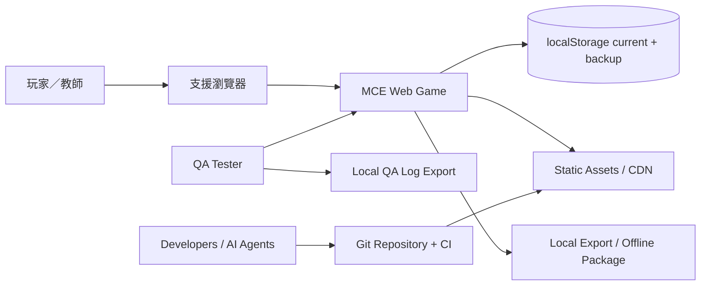
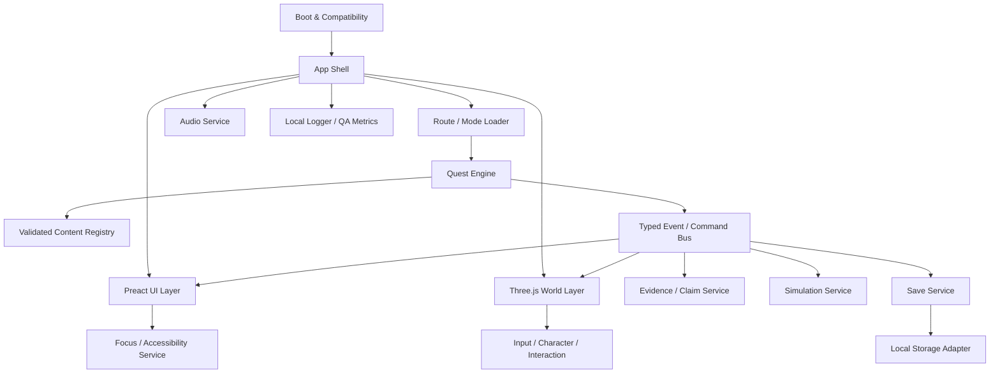
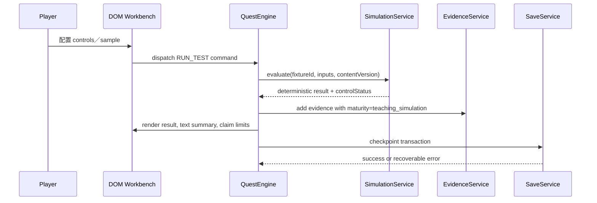
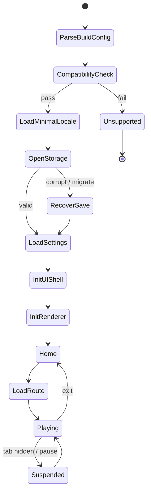
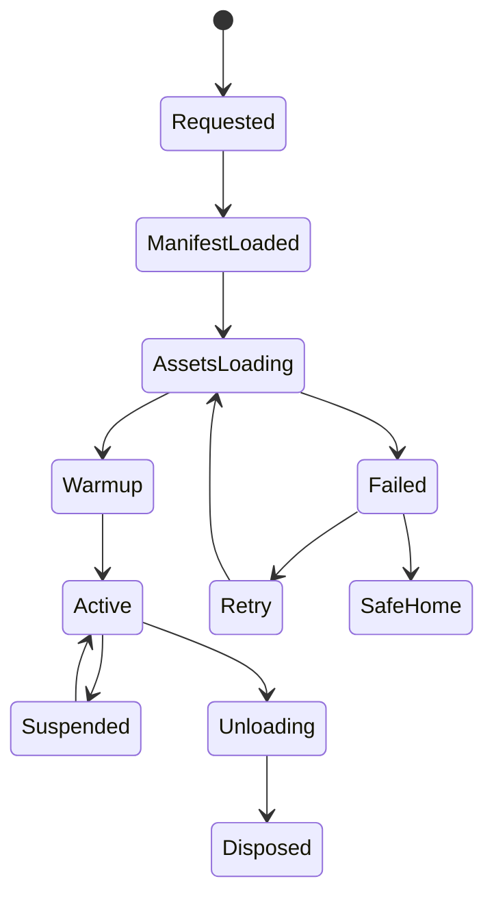
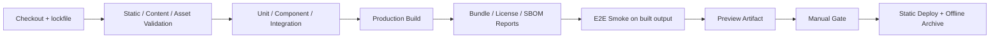

# 《微界工程師：生命迴路》Technical Design Document

> TDD｜版本 2.0｜狀態：固定斜俯視鏡頭與 C2–C8 技術契約已鎖定；Rapier／裝置效能仍須 spike

| 文件欄位 | 內容 |
|---|---|
| 專案代號 | `MCE-LC-2026` |
| Technical Owner | Technical Lead（待指派姓名） |
| 建立日期 | 2026-07-26 |
| 最後更新 | 2026-07-27（v2.0 邏輯／鏡頭／Future chapters 再審） |
| 對應 GDD | `02_GAME_DESIGN_DOCUMENT.md` v2.0 |
| 目標 Release | 2026 Public RC：Pre-Chapter＋Chapter 1＋Exhibition Mode |
| 架構原則 | 靜態、離線可用、資料驅動、DOM-first accessibility、無後端、可回退 |

## 修訂紀錄

| 版本 | 日期 | 作者 | 變更摘要 | 審核人 |
|---|---|---|---|---|
| 1.0 | 2026-07-26 | 文件整合草案 | 完成 stack、架構、schema、save、效能、測試、AI、部署及 ADR | — |
| 2.0 | 2026-07-27 | 邏輯／技術再審 | 鎖定 npm、Preact Signals、Zod、localStorage；改為固定斜俯視 camera pipeline；加入 C2–C8 content contracts 與終章時間鎖存狀態機 | 待 Tech／QA／Accessibility 簽核 |

## 核准紀錄

| 角色 | 姓名 | 決定 | 日期 | 備註 |
|---|---|---|---|---|
| Technical Lead | 待指派 | 待決定 | — | 首週 spike 後核准 |
| Lead Game Designer | 待指派 | 待決定 | — | 系統與 GDD 一致 |
| QA Lead | 待指派 | 待決定 | — | 測試與效能可驗證 |
| Science／Safety Reviewer | 待指派 | 待決定 | — | Content guardrails／claims |
| Security／Privacy Reviewer | 待指派 | 待決定 | — | 無後端、local data、AI data boundary |
| Operations Owner | 待指派 | 待決定 | — | hosting、offline、rollback |

---

## 1. 目的與範圍

### 1.1 技術目標

1. 在一般學校整合式顯示晶片上，以 30 FPS 為最低基線、60 FPS 為目標，可靠完成約 30 分鐘 P0。
2. 把 3D 世界、語義化 DOM UI、內容資料、任務狀態、科學模擬及存檔分離，讓 AI／學生開發者能處理小範圍任務而不破壞整體。
3. 讓前導、工作台、對話、設定與報告可由鍵盤、200% zoom、字幕及降低動態完成；3D 關鍵路徑有導航與重置 fallback。
4. 使用靜態部署與本機存檔，不建立帳號、後端、公開聊天或預設遙測。
5. 所有 content、simulation、save 和 event schema 可在 build／CI 驗證；不在 runtime 解析任意 Markdown。
6. 支援 deterministic fixtures、Playwright end-to-end、低階裝置 performance capture、離線包及 rollback。
7. 以 `AGENTS.md`、小任務、受保護路徑和人類 review 管理 Claude Code、Codex、OpenCode、Cursor 等 agent。

### 1.2 非目標

- 2026 不建立 multiplayer、backend API、cloud save、account、CMS、live ops、聊天、排行榜或遠端遙測平台。
- 不做一般用途的 visual scripting、完整 ECS、跨遊戲 engine 或大型 plugin framework。
- 不在 browser 內執行真實生物資訊計算、序列分析或濕實驗規劃。
- 不支援跳躍、動態剛體玩法、破壞、布料、群眾 AI、程序城市或即時全局光照。
- 不把 service worker、touch、Safari、完整英文或 Junior 3D 當 Alpha blocker。
- 不容許 agent 自動部署 production、改 science claim、加入 dependency 或合併 main。

### 1.3 假設與限制

| ID | 假設／限制 | 驗證方式 | 截止 | Owner | 未通過處置 |
|---|---|---|---:|---|---|
| TECH-A01 | 目標裝置支援 WebGL2 | 三台學校機 compatibility run | 2026-08-02 | Tech／QA | 不載入完整 3D；提供腳本／來源／預錄 walkthrough／靜態學習摘要，或改用受控演示；不稱為等價 2D 遊戲 |
| TECH-A02 | Preact＋Three.js 團隊可維護 | 兩天 spike＋code review | 2026-08-09 | Tech | UI 改原生 DOM；保留 contracts |
| TECH-A03 | Rapier kinematic controller 符合 startup／memory | physics spike | 2026-08-09 | Tech | 改 custom capsule/AABB；無動態物理 |
| TECH-A04 | P0 資產可壓在 35 MB cached | 每 sprint bundle report | Beta | Tech／Art | 移除／降解析度／延後 P1 |
| TECH-A05 | 無後端能滿足工作坊 | 教師／導師 workflow review | Alpha | Product | 只加本機匯出；不臨時建帳號 |
| TECH-A06 | zh-Hant 字型可自行託管並有授權 | license audit＋glyph test | Alpha | Art／Tech | 使用 OS font stack／較小 subset |
| TECH-A07 | PWA 可在 Beta 後安全啟用 | update／offline／rollback suite | Beta | Tech／QA | 2026 不啟用 SW，保留離線 zip |
| TECH-A08 | 所有 content 可轉成 JSON／TS data | PRE＋C1 content import review | 2026-08-16 | Content／Tech | 手工轉換；禁止 runtime Markdown parser |

### 1.4 相關文件

| 文件 | 版本 | 連結 | 關係 |
|---|---|---|---|
| GDD | 2.0 | [02_GAME_DESIGN_DOCUMENT.md](02_GAME_DESIGN_DOCUMENT.md) | 玩家體驗與功能要求 |
| Asset Guidelines | 1.0 | [04_ASSET_LIST_AND_PRODUCTION_GUIDELINES.md](04_ASSET_LIST_AND_PRODUCTION_GUIDELINES.md) | 模型、texture、audio、UI 預算 |
| QA Test Plan | 1.0 | [06_QA_TEST_PLAN.md](06_QA_TEST_PLAN.md) | 測試、矩陣與 release evidence |
| Project Management | 1.0 | [05_PROJECT_MANAGEMENT_PLAN.md](05_PROJECT_MANAGEMENT_PLAN.md) | gate、時間與變更控制 |
| AI Playbook | 1.1 | [19_AI_ASSISTED_DEVELOPMENT_PLAYBOOK.md](19_AI_ASSISTED_DEVELOPMENT_PLAYBOOK.md) | agent 使用、資料與 review 規則 |
| Source & Claim Register | 1.1 | [22_SOURCE_AND_CLAIM_REGISTER.md](22_SOURCE_AND_CLAIM_REGISTER.md) | content claim IDs、成熟度、禁止 wording、build lint |
| Continuity | 1.3 | [15_SCRIPT_SYSTEM_AND_CONTINUITY.md](15_SCRIPT_SYSTEM_AND_CONTINUITY.md) | flags、standalone、跨章 summary |

### 1.5 用詞與縮寫

| 用詞 | 定義 |
|---|---|
| World | Three.js renderer、scene、camera、3D objects |
| UI Shell | Preact DOM screens、HUD、dialog、workbenches、settings |
| Content | 經 schema 驗證的 locale、dialog、quest、evidence、simulation data |
| Runtime | 啟動、state、event、save、scene、UI、audio 服務 |
| Deterministic Fixture | 固定 input／seed／version 下輸出完全一致的測試資料 |
| Safe Anchor | 可作重置、checkpoint 和相機恢復的命名位置 |
| Protected Path | agent 未獲明確許可不可改的 science／script／release 檔案 |
| Build Variant | `dev`、`qa`、`preview`、`production`、`offline` 等編譯配置 |

## 2. 技術摘要

### 2.1 系統背景

產品是 client-only Web application。Browser 載入 shell 與 locale，再按入口 lazy-load 前導或第一章 chunk。Three.js 渲染小型 3D scene；Preact 提供所有語義化 UI。QuestEngine 讀取已驗證 content manifest，透過 typed commands 改變 World、UI、Evidence、Simulation 和 Save。公開 build 不需要 login 或網路 API。

### 2.2 技術棧

所有版本在 repository bootstrap 當日鎖入 `package-lock.json`；文件、CI、agent 指令及本機開發統一使用 **npm**，不混用 pnpm／yarn。版本以 exact pin／lockfile 為準，不依賴浮動 `latest`。

| 層級 | 技術 | 版本政策 | 用途 | 理由／限制 | License 檢查 |
|---|---|---|---|---|---|
| Runtime | Browser ES modules | target browsers | client runtime | 靜態部署；無 server runtime | N/A |
| Language | TypeScript `strict` | exact compiler | 全程式與 schema types | 降低多 agent 接口漂移 | Apache-2.0 |
| Package manager | npm | lockfile version pinned | install／scripts／CI | Node 隨附、學校／CI 可取得；單一工具降低操作分叉 | npm terms |
| Build | Vite | exact pinned | dev／build／chunk／assets | 快速、簡單、靜態輸出 | MIT |
| 3D | Three.js | exact pinned | renderer、scene、GLB | GCP 指定；生態成熟 | MIT |
| UI | Preact | exact pinned | DOM screens／components | 小 runtime；可測試；保留原生 DOM a11y | MIT |
| UI state | `@preact/signals` | exact pinned | reactive app／screen state | 與 Preact 一致；domain state 仍由 typed services／reducers 管理 | MIT |
| Physics | Rapier 3D compat | **spike gate** | kinematic collision only | 無 dynamic gameplay；WASM 成本未通過前不承諾 | Apache-2.0 |
| Content validation | Zod | exact pinned | authoring、build、import/save validation | TypeScript 同源 schema；錯誤訊息可定位 | MIT |
| Storage | `localStorage` adapter | browser API | settings、profile、backup | P0 payload 目標 <2 MB；無 IndexedDB 複雜度 | N/A |
| Unit／component | Vitest＋DOM Testing Library | pinned | pure logic／UI | 與 Vite 整合、a11y-oriented query | MIT |
| E2E | Playwright | pinned browser versions in CI | flows、save、offline、visual | multi-browser automation | Apache-2.0 |
| Accessibility | axe-core（自動）＋人工 | pinned | DOM rule checks | 自動結果不代替使用者測試 | MPL-2.0 |
| 3D pipeline | Blender→glTF/GLB | team-approved stable | source asset／export | 開放格式、可壓縮 | Blender／Khronos terms |
| Compression | glTF Transform pipeline | pinned CLI | Meshopt／KTX2 按 spike | 先測 decode／size；不預設 Draco | license audit |
| CI | GitHub Actions | workflow pinned by SHA／version | lint／test／build／artifact | repository baseline；若 host 改變需等價 gate ADR | GitHub terms |
| Hosting | HTTPS static host | decision register | production／preview | 無 backend；cache headers 可控 | terms review |

不允許 agent 在沒有 ADR、license、bundle impact 與 human approval 時新增 runtime dependency。基準技術選擇已決定；未通過 spike 的只有 Rapier、PWA 與目標裝置效能。

### 2.3 系統上下文



公開 build 不連接 analytics、database、LLM、email 或 account provider。

### 2.4 容器／模組圖



### 2.5 關鍵資料流



## 3. 目標環境與相容性

### 3.1 用戶端矩陣

| Tier | 裝置／OS | 瀏覽器 | 輸入 | 支援級別 | Release Gate |
|---|---|---|---|---|---|
| T0 | 團隊 reference desktop | Chromium pinned QA build | keyboard／mouse | 開發基準 | 每 commit smoke |
| T1 | Windows／ChromeOS school laptop | Chrome 最新兩 major | keyboard／trackpad | P0 正式支援 | RC must pass |
| T1 | Windows school laptop | Edge 最新兩 major | keyboard／mouse | P0 正式支援 | RC must pass |
| T2 | Windows／macOS desktop | Firefox current | keyboard／mouse | best effort | 無 blocker flow |
| T3 | iPadOS tablet | Safari／WebKit | touch | P1 | 獨立 gate |
| T3 | macOS Safari | Safari | keyboard／trackpad | P1 | 獨立 gate |
| Unsupported | phone portrait、小於 1024×600 | any | touch | 不支援 | 顯示明確提示／可看來源頁 |
| Unsupported | WebGL2 disabled／remote browser with no GPU | any | — | 不支援 3D | 顯示原因；提供來源／逐字稿／靜態學習摘要／預錄 walkthrough，或改用受控展示；不宣稱有等價自動 2D 遊戲 |

「最新兩 major」在 release checklist 以實際版本號鎖定，避免模糊測試。

### 3.2 硬體基線

| 級別 | CPU／GPU 代表 | RAM | 解像度 | 目標 | 用途 |
|---|---|---:|---|---|---|
| Low／School | 4-core mobile CPU、integrated GPU | 8 GB | 1280×720／1366×768 | ≥30 FPS；無 crash；memory ≤512 MB target | P0 最低基線 |
| Mid | 近年 6-core、integrated／entry GPU | 8–16 GB | 1920×1080 | 60 FPS target | 主要開發與展覽 |
| High | discrete GPU | 16 GB+ | 1920×1080+ | 60 FPS cap | 不可用作唯一驗收 |

真正機型由 `DEV-BASELINE-01..03` 記錄。若低階機無法達 30 FPS，先降 draw calls、shadow、resolution scale 和資產，而不是把最低要求悄悄提高。

### 3.3 網路條件

「學校網路」不能只靠主觀感覺驗收。CI／實驗室先用可重現的 shaping profile；每台真實學校設備再做一次不 shaping 的現場 run，並記錄 throughput、RTT、proxy／MIME、cache 狀態與失敗截圖。兩者都要通過，不能用快速家用網路取代。

| 情境 | 頻寬／狀態 | 預期行為 |
|---|---|---|
| 可重現 Lab baseline | `10 Mbps down／2 Mbps up／100 ms RTT`，cold cache | shell、PRE 與 C1 依 18.3 的 load target 驗收；顯示真實階段／進度；chapter chunk lazy load |
| 真實學校網路 | 不 shaping；在 `DEV-BASELINE-01..03` 現場量測 | 記錄實際 throughput／RTT／proxy／MIME；不得因環境較快而刪除 Lab baseline，也不得因環境較慢而隱藏 loading failure |
| 慢速／故障演練 | `1 Mbps／200 ms RTT`、斷線、重試 | 1 秒內顯示 loading 狀態；可取消／重試；已完成 save 不受影響；不顯示假百分比 |
| 中途離線 | 已載入 scene | 可完成目前章；不呼叫 server |
| 初次完全離線 | 無 cache／無 offline package | 顯示需要首次載入；提供離線包說明 |
| PWA cached（P1） | 無網路 | shell＋已 cache P0 可玩；清楚顯示版本 |
| Proxy／cache 舊版 | stale chunk | manifest hash mismatch 觸發完整 reload／rollback 提示 |

### 3.4 不支援環境

| 環境 | 原因 | 使用者提示 |
|---|---|---|
| Internet Explorer／舊 WebView | ES modules／WebGL2／a11y 不足 | 使用支援的 Chrome／Edge 或離線電腦 |
| 低於 1024×600 | DOM 工作台及 3D 視野不足 | 使用較大裝置；提供來源／影片頁 |
| 禁用 local storage | 無法可靠存檔 | 可用 session-only；提示不關閉頁面；提供 export |
| 無音訊 autoplay | 正常 browser policy | 首次互動後啟用；音訊非必要 |
| Screen reader only for full 3D spatial navigation | 無完整空間等價 | 提供 DOM interaction list／guided route；不宣稱完整支援 |

## 4. 儲存庫與工程規範

### 4.1 儲存庫結構

```text
/
├─ AGENTS.md
├─ README.md
├─ package.json
├─ package-lock.json
├─ vite.config.ts
├─ tsconfig*.json
├─ public/
│  ├─ manifest/
│  └─ static/
├─ src/
│  ├─ app/                        # boot, router, lifecycle
│  ├─ core/                       # event, command, result, clock, ids
│  ├─ world/                      # renderer, scene, isometric camera, interaction
│  ├─ character/                  # input, controller, anchors
│  ├─ quest/                      # state machine, conditions, effects
│  ├─ ui/                         # Preact screens/components
│  ├─ accessibility/              # focus, reduced motion, interaction list
│  ├─ evidence/                   # evidence, claims, reports
│  ├─ simulation/                 # deterministic educational models
│  ├─ save/                       # Zod schemas, migration, localStorage adapter
│  ├─ audio/
│  ├─ localization/
│  ├─ telemetry/                  # local QA log only
│  └─ content-generated/          # build output; never hand-edit
├─ content/
│  ├─ common/
│  ├─ prelude/
│  ├─ chapter-01/
│  ├─ expo/
│  ├─ future/
│  │  ├─ chapter-02/
│  │  ├─ chapter-03/
│  │  ├─ chapter-04/
│  │  ├─ chapter-05/
│  │  ├─ chapter-06/
│  │  ├─ chapter-07/
│  │  └─ chapter-08/
│  ├─ locales/zh-Hant/
│  └─ locales/en/
├─ assets-src/                    # source manifests, not necessarily binary in git
├─ assets-runtime/
│  ├─ p0/
│  └─ future/                     # never referenced by P0 manifest
├─ scripts/                       # content validation, asset report, build tools
├─ tests/
│  ├─ unit/
│  ├─ component/
│  ├─ integration/
│  ├─ e2e/
│  ├─ fixtures/
│  └─ performance/
├─ docs/
│  ├─ adr/
│  ├─ claims/
│  ├─ qa/
│  └─ licenses/
└─ dist/                          # generated; never commit unless release policy says
```

`content/future/**` 可在獨立的 `content:validate:future` job 做 ID／schema／locale 檢查，但 production manifest generator 必須使用 allowlist `prelude|chapter-01|expo`；CI 另有負向測試證明任何 Future content／asset ID 都不出現在 P0 chunks。大型 binary source 使用 Git LFS 或核准資產庫；不得把模型 weights、私人 playtest 媒體或 secrets 放入遊戲 repo。

### 4.2 分支與版本策略

| 項目 | 規則 |
|---|---|
| Main | protected、always releasable；PR＋green CI＋human approval |
| Branch | `feat/<ticket>-short-name`、`fix/...`、`content/...`、`asset/...` |
| Worktree | agent／parallel task 各用獨立 worktree；不得共用未提交 working tree |
| Version | SemVer for app；content schema 和 save schema 有獨立整數版本 |
| Release Tag | `v0.x-alpha.N`、`v0.x-beta.N`、`v1.0.0-rc.N`、`v1.0.0` |
| Hotfix | 從 release tag 分支；只修 blocker／security／data loss；回 merge main |
| Commit | Conventional Commit 子集；一個目的；禁止 `misc changes` |
| Merge | squash 或 rebase 由團隊固定一種；保留 ticket、AI-assist note、test evidence |

### 4.3 編碼規範

| 類別 | 規範／工具 | Gate |
|---|---|---|
| TypeScript | `strict`, no implicit any, exhaustive enum, branded IDs | typecheck |
| Format | Prettier 或單一 formatter | CI |
| Lint | ESLint flat config；no floating promises、no direct DOM query outside UI | CI |
| Imports | domain boundary／no circular deps | lint／dependency graph |
| Error | `Result` for expected error；throw only invariant／boot failure | review |
| Logging | structured code＋context；不記個資 | tests／privacy review |
| Tests | behaviour first；不得只 snapshot internal structure | PR |
| Comments | 解釋 why／science boundary；不重述 code | review |
| IDs | kebab／snake 依 schema 固定；不可重用已發行 ID | validator |
| Accessibility | semantic element before ARIA；focus tests | component／E2E |
| Content | no HTML from content；allowlisted rich text tokens | validator／security |

### 4.4 設定與環境變數

P0 無秘密環境變數。所有 public values 可被 browser 看見；不得把 API key 放入 Vite env。

| Key | 用途 | Build | Secret | 預設 |
|---|---|---|:---:|---|
| `VITE_BUILD_ID` | release hash／顯示版本 | all | 否 | CI inject |
| `VITE_DEFAULT_LOCALE` | 預設 locale | all | 否 | `zh-Hant` |
| `VITE_ENABLE_PWA` | PWA gate | preview／prod | 否 | `false` |
| `VITE_ENABLE_QA_LOG` | 本機 QA event | qa | 否 | `false` |
| `VITE_ENABLE_EXPO` | 展覽入口 | all | 否 | `true` |
| `VITE_CONTENT_MANIFEST` | manifest path／hash | all | 否 | generated |
| `VITE_ASSET_BASE` | static base path | deploy | 否 | `/` |

任何需要 secret 的功能都不應在 client build 實作；要另立 backend security design。

## 5. 應用程式架構

### 5.1 啟動生命週期



Boot shell 必須在重型 3D asset 前出現。任何錯誤頁顯示 build ID、錯誤代碼、資料狀態、重試和離線／支援建議；不顯示 raw stack 給一般玩家。

### 5.2 Game Loop

| 階段 | 責任 | 頻率 | Pause 行為 | 錯誤處理 |
|---|---|---|---|---|
| Input sample | 讀 keyboard／pointer／gamepad | per animation frame | modal 時 filtered | input reset on blur |
| Fixed physics | kinematic movement／collision | 60 Hz fixed，最多 3 catch-up | paused | overflow drops time／logs warning |
| Quest update | timers、conditions、commands | fixed or event-driven | narrative timers paused | invalid state -> safe checkpoint |
| World update | animation、interaction index | frame | reduced／paused | object failure isolated |
| Render | Three.js | frame／adaptive | workbench 可 15 FPS | context loss recovery |
| UI commit | Preact reactive updates | event-driven | continues for menu | error boundary |
| Audio | buses、ducking、resume | event-driven | pause or ambient policy | graceful no-audio |
| Save | transaction at checkpoint | event-driven／debounced | allowed | backup／retry／notify |

在 tab hidden 時停止 render、降低 timers、保存 checkpoint；返回時不得快速追趕造成角色位移。

### 5.3 模組登記

| Module ID | 模組 | 責任 | Public API | 禁止相依 |
|---|---|---|---|---|
| MOD-APP | AppLifecycle | boot／route／shutdown | `start`, `navigate`, `dispose` | content internals |
| MOD-EVENT | EventBus | typed events／commands | `publish`, `subscribe`, `dispatch` | DOM／Three |
| MOD-CONTENT | ContentRegistry | validated immutable data | `getQuest`, `getText`, `getAsset` | save mutation |
| MOD-QUEST | QuestEngine | state transitions | `load`, `dispatch`, `snapshot` | direct DOM／Three |
| MOD-WORLD | WorldService | scene／camera／objects | command handlers | UI components |
| MOD-INPUT | InputService | action abstraction | `getAction`, `setBinding` | quest content |
| MOD-INTERACT | InteractionService | candidates／focus／execute | `getCurrent`, `activate` | raw UI state |
| MOD-UI | UIShell | screens／focus／render | screen registry | direct save adapter |
| MOD-SIM | SimulationService | deterministic fixtures | `run(modelId, input)` | random global state |
| MOD-EVID | EvidenceService | evidence／claim／report | immutable queries／commands | renderer |
| MOD-SAVE | SaveService | validate／migrate／backup | `load`, `commit`, `export` | UI strings |
| MOD-AUDIO | AudioService | buses／cues | `play`, `setBus`, `resume` | quest mutation |
| MOD-LOG | LocalLogger | diagnostics／QA events | `info`, `warn`, `export` | personal data |

### 5.4 事件／訊息架構

Events are facts (`evidence.added`), commands are requests (`quest.advance`). IDs are namespaced and typed. Events do not carry translated strings; they carry stable IDs.

| Event ID | Producer | Payload 摘要 | Consumer | 持久化 |
|---|---|---|---|:---:|
| `app.route.loaded` | App | routeId, contentVersion | UI／Log | 否 |
| `world.anchor.reached` | Interaction | anchorId | Quest／Save | checkpoint only |
| `quest.objective.changed` | Quest | objectiveId | UI／Log | snapshot |
| `dialogue.choice.committed` | UI／Quest | nodeId, choiceId | Quest／Evidence | 是 |
| `circuit.configuration.changed` | Workbench | component IDs／slots | Quest／UI | draft |
| `simulation.run.completed` | Simulation | fixtureId, resultHash, status | Evidence／Quest／Save | 是 |
| `claim.revised` | Evidence | prior／new claimId, reasons | Report／Quest | 是 |
| `accessibility.settings.changed` | UI | safe settings object | UI／World／Save | 是 |
| `save.recovered` | Save | reason, backupVersion | UI／Log | audit only |
| `performance.budget.exceeded` | Perf | metric, value, scene | QA Log | QA only |

### 5.5 狀態管理

| State | Scope | Owner | Mutation | Persistence | Reset |
|---|---|---|---|---|---|
| Build config | application | App | immutable | build | reload |
| Settings | profile/global local | SettingsService | commands | local | explicit reset |
| Route／scene | session | App／World | route commands | checkpoint id | route exit |
| Quest state | chapter session | QuestEngine | transition reducer | save snapshot | chapter restart |
| UI ephemeral | screen | component | local actions | no | close screen |
| Workbench draft | task | domain service | domain commands | temp checkpoint | task reset |
| Evidence／claims | chapter | EvidenceService | append／revise | save | replay draft |
| Simulation fixture | content | ContentRegistry | immutable | content bundle | version update |
| QA log | session | Logger | append | local opt-in | export／clear |

State mutation is single-owner. Components request commands; they do not mutate store objects. Three.js `Object3D.userData` cannot become authoritative gameplay state.

### 5.6 相依注入與服務定位

Composition root in `src/app/createApp.ts` constructs explicit interfaces. Tests inject fake clock, storage, audio, renderer and content. Avoid global singleton except immutable build metadata. Agent-generated features must depend on interfaces, not import concrete browser adapters deep in domain code.

```ts
export interface AppServices {
  readonly content: ContentRegistry;
  readonly quest: QuestEngine;
  readonly evidence: EvidenceService;
  readonly simulation: SimulationService;
  readonly save: SaveService;
  readonly world: WorldService;
  readonly audio: AudioService;
  readonly logger: Logger;
  readonly clock: Clock;
}
```

## 6. 渲染系統

### 6.1 Renderer 設定

| 參數 | 基線 | Adaptive／Fallback | 理由 |
|---|---|---|---|
| API | WebGL2 | unsupported notice＋來源／逐字稿／靜態摘要／預錄 walkthrough；或受控展示 | target browser baseline；不承諾等價 2D runtime |
| Pixel ratio | `min(devicePixelRatio, 1.5)` | low tier 1.0；dynamic resolution | 控制 fill rate |
| Color | sRGB output；linear workflow | validated by asset check | 一致材質 |
| Tone mapping | simple／none per art test | disable on low | 避免成本及色彩誤讀 |
| Antialias | MSAA on mid | off＋FXAA optional low | performance gate |
| Shadows | one directional caster, limited map | low: blobs／baked | draw／memory budget |
| Clear／fog | zone config | simple linear fog | skyline／depth、隱藏遠景 |
| Resize | ResizeObserver | debounce／clamp | responsive canvas |
| Context loss | listen／pause／restore | reload scene from checkpoint | reliability |

### 6.2 Scene Graph 規則

- Root groups：`EnvironmentStatic`、`EnvironmentDynamic`、`Characters`、`Interactables`、`VFX`、`Debug`。
- Static geometry is merged／instanced by material where practical; interactables retain unique IDs.
- Gameplay lookup uses registry map `EntityId -> EntityHandle`; no repeated scene traversal by name.
- Asset node names are for debug only; content refers to stable exported IDs in manifest.
- All disposable resources implement `dispose()`; route unload must release geometry, material, texture, audio, listeners and physics handles.
- No runtime clone of entire scene for variants; use material／visibility／small prop set toggles.

### 6.3 Camera Pipeline

Production 只有一種探索構圖：`IsometricPerspectiveRig`。它採透視投影以保留深度，但 yaw／向下角固定，沒有肩後追尾、角色面向跟隨、自由環繞、玩家 zoom 或 camera boom collision。

| Camera／Rig | 用途 | Layer | 切換／限制 |
|---|---|---|---|
| `IsometricPerspectiveRig` | exploration／dialogue baseline | world | default；只平移 target，不改 yaw／pitch |
| `AuthoredZoneFocus` | station／NPC／scene beat | world | camera profile command；0.35–0.60 s；cancelable |
| `StaticAccessible` | reduced-motion focus | world | instant cut／short fade；同一可見資訊 |
| `DebugFreeCam` | collision／occlusion QA | debug | dev／qa flag；production tree-shaken／menu 不可達 |
| UI | DOM | browser | independent of 3D camera |

```ts
type ZoneCameraProfile = {
  id: ZoneCameraProfileId;
  yawDeg: 45;                    // fixed world diagonal
  downwardAngleDeg: 50;          // implementation pitch about -50°
  horizontalOffsetM: number;     // ground-plane offset; baseline 10
  heightM: number;               // baseline 12
  fovDeg: number;                // Three.js PerspectiveCamera vertical FOV; baseline 40; range 38–44
  targetScreenY: number;         // normalized viewport Y: 0=top, 1=bottom; baseline 0.58
  panHalfLifeS: number;          // baseline 0.20
  moveLookAheadM: number;        // 0–0.9; user may disable
  bounds: WorldRect;
  cutawayGroupIds: readonly CutawayGroupId[];
  occluderTag: 'CameraOccluder';
};
```

Runtime camera target = clamped blend of player ground position, optional movement look-ahead and active authored focus. The rig therefore tracks player **position** by translation, but character facing never changes camera orientation and no shoulder-follow orbit is used. `W／↑` maps to projected screen-up world vector derived from the fixed rig. Zone transition may translate target／offset inside the approved profile but cannot rotate or introduce a different control frame.

Occlusion strategy：

1. Level authoring keeps critical interactions visible from fixed angle；walkway target ≥1.8 m and no required object under permanent roof／high wall.
2. Roof／wall groups use explicit cutaway states at zone entry／quest trigger.
3. Tagged visual meshes may fade after 0.25 s occlusion; their player collision remains unchanged.
4. Camera does not ray-push toward player, change pitch or snap behind the avatar.
5. Focus command is cancelable by movement／back; reduced motion uses static cut／fade.

Camera state is not persisted per frame. Save stores only current zone／safe anchor and optional `movementLookAhead=false`; on load the rig reconstructs from the zone profile.

### 6.4 Lighting 與 Shadow

| 場景 | Light Budget | Shadow | Bake／Realtime | Fallback |
|---|---:|---:|---|---|
| Harbor | hemisphere／ambient＋1 directional＋≤2 local | one caster; player/NPC simplified | mostly realtime simple | unshadowed＋blob |
| Lab | ambient＋1 directional/area approximation＋emissive props | no local dynamic shadows | baked AO／light texture optional | unlit accents |
| Civic | ambient＋1 directional＋≤1 local | optional player blob | simple | none |

Max 4 active lights affecting a material; avoid many point lights. Important devices use emissive color but also icon／label.

### 6.5 Material 與 Shader

- Standard／toon-like materials with limited variants; no custom shader unless profiling and fallback exist.
- Reporter signal shader may animate intensity but must expose low／high through geometry, label and DOM summary.
- Water is simple opaque／semi-transparent plane with low-cost normal or vertex animation; never mirror reflection.
- Hazard zones use decal／mesh signage, not expensive full-screen post-process.
- Shader compile is warmed during loading for scene-critical materials.

### 6.6 LOD、Culling 與 Instancing

- Frustum culling on; large combined meshes split by zone cell.
- LOD for characters／large props only when measurable benefit; avoid excessive LOD authoring.
- Repeat barriers, chairs, crates, signs and vegetation use instancing.
- Visible triangle target ≤450k typical, hard warning 500k; draw calls ≤200 typical, warning 250.
- Occlusion handled by layout／zone, not runtime GPU occlusion system for P0.

### 6.7 Post-processing

P0 default no post-processing chain. Optional low-cost outline／FXAA only if performance and accessibility pass. No bloom-only information, motion blur, vignette, chromatic aberration or depth-of-field. Reduced-motion／high-contrast modes disable optional effects.

## 7. 場景與內容載入

### 7.1 場景生命週期



Scene load is transactional: current scene remains available until new scene has required assets and validated anchor. If load fails, save remains intact and user can retry／return home.

### 7.2 Bundle／Chunk 策略

| Chunk | 內容 | 壓縮目標 |
|---|---|---:|
| Shell | app runtime、minimal locale、home、settings、error | ≤3 MB |
| Prelude | DOM cards、small lab background、shared UI/audio | incremental ≤5 MB |
| C1 Shared | player／NPC shared rigs、common props、systems | counted once |
| C1 Harbor | environment／audio／VFX | chunk target ≤10 MB |
| C1 Lab／Civic | environments／devices／UI data | combined incremental ≤15 MB |
| Expo | route data only；reuse cached P0 | ≤0.5 MB |
| English Expo | locale／fonts delta | budget separately |
| P0 cached total | all required runtime＋assets | ≤35 MB |

Exact output measured by CI, not source file size. Dynamic imports are route-based; no Future chapter asset or content in P0 production manifest.

### 7.3 Asset Loader API

```ts
export interface AssetRequest<T extends AssetKind> {
  readonly id: AssetId<T>;
  readonly priority: 'critical' | 'near' | 'deferred';
  readonly signal?: AbortSignal;
}

export interface AssetLoader {
  preload(ids: readonly AssetId[]): Promise<LoadReport>;
  acquire<T extends AssetKind>(request: AssetRequest<T>): Promise<AssetHandle<T>>;
  release(id: AssetId): void;
  getProgress(scope: LoadScope): Readonly<LoadProgress>;
}
```

Handles are reference-counted／owned by scene. Missing optional asset uses documented placeholder; missing critical content fails scene with user-facing error.

### 7.4 Loading、Timeout 與 Retry

- Loading screen shows named stage (`載入文字`、`載入河港`、`準備互動`) and determinate progress where possible.
- Per asset timeout 20 s on normal web, total critical scene 45 s before offering retry; offline package uses shorter disk timeout.
- Retry uses exponential backoff for network asset only, max 2 automatic attempts; user controls further retry.
- Aborted route cancels fetch／decode where supported.
- Save commit occurs before route transition; failure to save asks whether continue session-only.

### 7.5 Cache 與版本失效

Without PWA, filenames are content-hashed; HTML／manifest uses no-cache or short cache, assets immutable. With PWA P1, cache key includes app build＋content schema. On incompatible version, service worker must not mix chunks; it activates only after user confirmation or safe restart. Keep last known good offline build archive for rollback.

## 8. 輸入、角色與物理

### 8.1 Input Abstraction

Actions rather than keys：`move_x/y`、`interact`、`cycle_target_next/prev`、`back`、`open_evidence`、`hint`、`reset_anchor`、`pause`。P0 沒有 `camera_x/y`、zoom、pitch、yaw 或 invert-camera action。Pointer may select an already registered interaction target, but does not issue click-to-move／pathfinding. Input sources produce normalized values; UI modal captures relevant actions and prevents world movement. Binding conflicts are detected and explained.

### 8.2 Character Controller

P0 uses a kinematic capsule controller behind `CharacterMotor` interface. No jump, crouch, sprint, pushing dynamic objects or moving platforms. Ground snap、slope limit、step height、wall slide and safe anchor are deterministic enough for replay tests. Movement input is converted from fixed screen axes into world XZ using the active isometric profile; the avatar turns toward movement, while the camera orientation stays fixed.

```ts
export interface CharacterMotor {
  setDesiredScreenMove(input: Vec2): void;
  fixedUpdate(dt: number): CharacterFrame;
  teleport(anchor: SafeAnchor): void;
  setEnabled(enabled: boolean): void;
}
```

Rapier is selected only after startup、memory and corner-case spike. Fallback implementation may use capsule sweeps／AABB against simplified collision meshes; content cannot depend on Rapier-specific behavior.

### 8.3 Collision Layer

| Layer | Collides With | Query | Notes |
|---|---|---|---|
| Player | WorldStatic、WorldBarrier | interaction nearby | kinematic capsule |
| WorldStatic | Player | visibility／ground queries | simplified collision mesh |
| WorldBarrier | Player | hazard trigger | visual boundary aligned |
| Interactable | none physical or WorldStatic | sphere／screen projection | no small collider blocking path |
| NPC | optional Player soft avoidance | interaction | no crowd simulation |
| `CameraOccluder` | **none additional** | visibility ray／screen test | visual fade／cutaway only; not a camera collider |
| Trigger | none | overlap | quest／anchor／hazard |

### 8.4 Physics Step

Fixed 1/60 s, accumulator capped at 3 steps/frame. Dynamic bodies disabled or sleeping; animations do not drive physics except rootless transform commands. On severe frame drop, movement slows rather than simulating large timestep. Physics debug visible only QA build.

### 8.5 防卡死與重置

- Track last valid grounded transform and named anchor.
- Detect y below zone floor, penetration unresolved, no motion despite input for configurable duration.
- `Reset to safe point` available in Pause and long-press key; announces data retained.
- After reset, isometric camera target and interaction registry rebuild; quest state unchanged unless current interaction transaction incomplete, in which case rollback to task start.
- QA has forced stuck test points for every zone.

## 9. 互動、任務與對話

### 9.1 Interaction Contract

```ts
export interface InteractionDefinition {
  readonly id: InteractionId;
  readonly entityId: EntityId;
  readonly action: InputAction;
  readonly labelKey: TextKey;
  readonly enabledWhen: ConditionExpr;
  readonly disabledReasonKey?: TextKey;
  readonly command: GameCommand;
  readonly priority: number;
}
```

Every interaction has visible label、keyboard focus equivalent where critical、disabled reason and command. World object does not execute arbitrary callback from content.

### 9.2 Interaction Resolution

Candidate score combines world distance、projected screen-space proximity、quest priority、visibility／reachability and accessibility target lock. Character facing and camera view cone are not required. One current interaction at a time; when multiple objects overlap, UI shows cycle controls. Critical interactions are also selectable from an accessible interaction list in Guided Mode and keyboard-only mode.

### 9.3 Quest Data Schema

```ts
type QuestNode = {
  id: QuestNodeId;
  kind: 'scene' | 'objective' | 'dialogue' | 'workbench' | 'choice' | 'checkpoint';
  enterWhen?: ConditionExpr;
  objectives?: readonly ObjectiveDef[];
  interactions?: readonly InteractionId[];
  onEnter?: readonly EffectDef[];
  transitions: readonly QuestTransition[];
  hintSetId?: HintSetId;
  scienceClaims?: readonly ClaimId[];
  acceptanceIds: readonly TestCaseId[];
};

type QuestTransition = {
  id: TransitionId;
  when: ConditionExpr;
  to: QuestNodeId;
  effects?: readonly EffectDef[];
  consequenceId?: ConsequenceId;
};
```

Condition language is allowlisted, declarative and side-effect free. No eval、embedded JS or arbitrary expression from content.

### 9.4 Quest State Machine

QuestEngine uses pure reducer where possible. Current node、completed objectives、flags and transaction draft form snapshot. Invalid transition returns typed error and keeps prior valid state. Checkpoint save occurs after transition effects complete; effects must be idempotent or carry effect ID ledger.

### 9.5 Dialogue Data Schema

```ts
type DialogueNode = {
  id: DialogueNodeId;
  speakerId: CharacterId;
  textKey: TextKey;
  optionalDetailKey?: TextKey;
  choices?: readonly DialogueChoice[];
  autoAdvance?: never; // Critical Path does not auto-advance
  scienceClaims?: readonly ClaimId[];
};

type DialogueChoice = {
  id: ChoiceId;
  textKey: TextKey;
  claimId?: ClaimId;
  gapTags?: readonly ('scope'|'control'|'authority'|'stakeholder'|'uncertainty')[];
  next: DialogueNodeId;
  effects?: readonly EffectDef[];
};
```

Rich text permits emphasis、term link、sub/superscript and icon tokens only. Content is escaped; no raw HTML.

### 9.6 條件與效果

Condition operators: flag equality、set contains、count compare、mode、route、evidence exists、control status、task completion. Effects: set flag、add evidence、update claim、increment bounded counter、show screen、world command、audio cue、checkpoint. Every effect schema has bounded values and migration policy.

### 9.7 Content Validation

CI validates: unique IDs、all references resolve、no unreachable required nodes、no transition cycle without exit、all locale keys exist、claim IDs registered、simulation fixture exists、P0 node has acceptance tests、forbidden raw terms／HTML absent、dialogue length warnings、maturity labels present、standalone defaults defined。Validator outputs human-readable file／path／ID；production build fails on error。Future validator additionally checks camera profile、profile write schema、chapter science family and production-manifest exclusion。

### 9.8 第二至第八章技術契約（Future Content Only）

本節讓 C2–C8 現在即可資料化、審查與拆 issue，但不會進入 2026 production build。逐句對白、Choice ID 與 canonical flag 名稱來自下列腳本；任何 schema／GDD／TDD 差異都必須使 content validation 失敗。

| Chapter | `scriptSource` | Route namespace | Production rule |
|---|---|---|---|
| C2 | `08_CHAPTER_02_FULL_SCRIPT.md` | `future/c2/**` | future only |
| C3 | `09_CHAPTER_03_FULL_SCRIPT.md` | `future/c3/**` | future only |
| C4 | `10_CHAPTER_04_FULL_SCRIPT.md` | `future/c4/**` | future only |
| C5 | `11_CHAPTER_05_FULL_SCRIPT.md` | `future/c5/**` | future only |
| C6 | `12_CHAPTER_06_FULL_SCRIPT.md` | `future/c6/**` | future only |
| C7 | `13_CHAPTER_07_FULL_SCRIPT.md` | `future/c7/**` | future only |
| C8 | `14_FINAL_CHAPTER_FULL_SCRIPT.md` | `future/c8/**` | future only |

```ts
type FutureChapterPackage = {
  chapterId: 'c2'|'c3'|'c4'|'c5'|'c6'|'c7'|'c8';
  contentVersion: number;
  scriptSource: ScriptSourceId;
  sceneIds: readonly QuestNodeId[];
  zoneCameraProfiles: readonly ZoneCameraProfileId[];
  simulationFixtureIds: readonly SimulationFixtureId[];
  profileWrites: readonly ProfileSummaryKey[];
  scienceClaimFamilies: readonly ClaimFamilyId[];
  productionTier: 'future';
};
```

共用 invariants：

- 每個 Scene 必須有 entry condition、critical interaction、evidence output、near-miss consequence、revision path、checkpoint、claim maturity 及 acceptance IDs。
- `IsometricPerspectiveRig` profile 必須在 scene manifest 顯式引用；camera yaw／pitch 不能被 content command 改寫。
- Future content 只可使用 declarative rules／fixtures；不得在 content file 注入 JS。
- Profile summary 只在章末 transaction 成功後寫入；standalone 使用中性 defaults，不偽造前章決策。
- Science／Safety claim family 未核准時只可作 dev placeholder；public preview／production fail closed。
- `future-preview` 只能由非 production build-time flag 註冊。Production route allowlist 只含 PRE、C1、Expo；CI 必須檢查 Future route、asset、locale chunk 與 fixture 不在 production manifest、bundle graph 或 P0 E2E enumeration 中。

#### C2 contract：品質與供應

| Scene | Route／system | Canonical flags／fixture | Technical invariant |
|---|---|---|---|
| S00 | `future/c2/factory-line/incident` | no new flag；Q-17 `isolated=true` fixture invariant | 隔離發生於 entry 前；content 不提供「繼續生產」合法 transition |
| S01 | product-layer station | `c2_cells_product_separated` | schema 分開 host cells、intermediate／target、impurities、final product |
| S02 | process-order workbench | `c2_process_order_valid` | order validator 不把單一歷史製程寫成唯一方法；必須保留 expression 後 stages |
| S03 | quality-evidence workbench | `c2_quality_identity`、`c2_quality_purity`、`c2_quality_function`、`c2_quality_consistency`；`SIM-C2-BATCH-Q17-V1` | 四類是 pedagogy labels；UI 永久顯示「非完整法規規格」；一 gate 不抵銷另一 gate |
| S04 | deviation reducer | `c2_batch_decision`、`c2_root_cause_valid` | only `validated_rework|reject_restart`；purity failure 不可由 identity／function pass 抵銷 |
| S05 | public statement builder | `c2_statement_valid` | required cards cover platform≠product、post-expression processing／quality、independent batch control |
| S06 | supply graph＋Q-18 fixture | `c2_access_plan`；`SIM-C2-BATCH-Q18-V1` | Q-18 pass 不 retroactively release Q-17；access choice 不降低品質 gate |
| S07 | independent release transaction | writes `p_c2_batch`、`p_c2_access` | player command 只提交 recommendation；authorised quality role completes teaching release |

#### C3 contract：LacI 開關診斷

| Scene | Route／system | Canonical flags／fixture | Technical invariant |
|---|---|---|---|
| S00 | `future/c3/exhibit-incident` | no new flag | incident context contains input removal timestamp、signal trace、maintenance record |
| S01 | expected-state editor | `c3_expected_behavior` | stores OFF／ON／recovery trend and response window, not instant zero |
| S02 | `future/c3/cell-city` spatial trace | no new flag | trace evidence feeds S03; replacing reporter appearance alone cannot satisfy diagnosis |
| S03 | fault graph | `c3_fault_repressor`、`c3_fault_reporter_leak`；`SIM-C3-LACI-FAULTS-V1` | both fault families required; at least two states observed before diagnosis |
| S04 | repair strategy reducer | `c3_repair_strategy` | enum `restore_laci|replace_module`; both retain validation-cost／cross-talk metadata |
| S05 | temporal test bench | `c3_truth_table_valid`；`SIM-C3-LACI-VALIDATION-V1` | after inducer removal, new production/output **begins to decline** and returns toward low over validated response window; never absolute instant OFF |
| S06 | public failure record | `c3_failure_reported`；writes `p_c3_repair` | initial failure、repair、limits and monitoring persist for C4 consumer |

#### C4 contract：資料與可重現性

| Scene | Route／system | Canonical flags／fixture | Technical invariant |
|---|---|---|---|
| S00 | `future/c4/data-theatre` loader | `c4_prior_repair_loaded` | C3 summary or standalone neutral condition mapped before comparison; does not predetermine winner |
| S01 | question lock | `c4_question` | lock timestamp precedes result reveal |
| S02 | design allocator | `c4_controls_valid`、`c4_replication_valid`、optional `c4_followup_plan_locked`；derived `c4_followup_complete` | three reference controls required；replication is separate；robustness follow-up locked before reveal |
| S03 | overview plot＋optional batch room | `SIM-C4-PROMOTER-DATA-V1` | all raw points accessible in overview；walking never required for every point |
| S04 | outlier ledger | `c4_outlier_handled` | preserve raw value；removal requires defensible rule；include sensitivity view |
| S05 | claim builder | `c4_conclusion_valid` | claim constrained by preselected question、conditions and observed variation |
| S06 | package exporter | `c4_data_package_complete`；writes `p_c4_question` | package includes raw points、controls、versions、decisions、exclusions and limits |

#### C5 contract：PET 生命週期與封閉

| Scene | Route／system | Canonical flags／fixture | Technical invariant |
|---|---|---|---|
| S00 | `future/c5/recycling-centre/release-claim` | `c5_release_rejected` | direct environmental release is rejected display branch, never valid completion |
| S01 | material taxonomy | `c5_claim_scope_valid` | stores actual composition／context；`polyester` label or appearance alone cannot imply PET applicability |
| S02 | exposure graph | `c5_pathways_mapped`；`SIM-C5-EXPOSURE-PATHS-V1` | live cells、DNA、enzyme、products、effluent、materials、receptors represented；HGT is conditional possibility, never deterministic event |
| S03 | strategy comparator | `c5_contained_strategy` | enum `enzyme_only|closed_whole_cell`；each retains distinct separation、waste and monitoring burden |
| S04 | maturity ladder | `c5_evidence_ladder_valid` | no skip from bench evidence to public deployment claim |
| S05 | lifecycle choice | `c5_lifecycle_choice` | enum `local_pilot|shared_facility`；requires stop、monitor、incident、appeal、waste／transport owners |
| S06 | public statement | `c5_public_statement_valid`；writes `p_c5_containment`、`p_c5_pilot` | statement covers potential、material scope、maturity、alternative and stop conditions |

#### C6 contract：青蒿素供應與公平

```ts
type C6SupplyEntity =
  | 'artemisia_crop'
  | 'artemisinic_acid_precursor'
  | 'artemisinin'
  | 'derivative'
  | 'partner_drug'
  | 'ACT_product'
  | 'quality_release'
  | 'procurement'
  | 'distribution'
  | 'patient_access';
```

| Scene | Route／system | Canonical flags／fixture | Technical invariant |
|---|---|---|---|
| S00 | `future/c6/supply-network/stakeholders` | `c6_missing_people_found` | farmer、quality、regional distribution and patient access nodes cannot be omitted |
| S01 | dual-chain builder | `c6_chain_valid` | schema uses `artemisinic_acid_precursor` rather than ambiguous `artemisinic_acid` entity；both chains reach quality、procurement、distribution；no precursor／monotherapy shortcut to ACT |
| S02 | shock simulation | `c6_shock_response_valid`；`SIM-C6-SUPPLY-SHOCKS-V1` | climate、plant outage、demand shock all tested；buffer and at least two sources required |
| S03 | multi-metric dashboard | `c6_access_metrics` | reports availability、quality、price、resilience、equity separately；no hidden single score |
| S04 | strategy branch | `c6_strategy` | enum `dual_source_buffer|regional_partnership`; both expose assumptions／failure modes |
| S05 | stakeholder consent transaction | `c6_transition_plan` | exact package written only after cooperative confirmation event；player cannot synthesize consent |
| S06 | last-mile／statement | `c6_statement_valid`；writes `p_c6_supply`、`p_c6_transition` | increased upstream output cannot auto-mark patient access success；public claim does not overstate substitution |

#### C7 contract：分級資訊與程序公平

| Scene | Route／system | Canonical flags／fixture | Technical invariant |
|---|---|---|---|
| S00 | `future/c7/access-centre` case loader | no new flag | three cases are immutable fixture inputs; applicant identity is not risk score |
| S01 | risk-dimension editor | `c7_risk_dimensions_valid` | schema forbids nationality、ethnicity、demographic identity、appearance or anonymity as scoring features/proxies |
| S02 | open education package | `c7_case_education`=`open` | low-risk material includes limits、safety context、source and accessible format |
| S03 | controlled collaboration | `c7_case_environment`=`controlled_collaboration`、`c7_access_controls_valid` | requires authority／qualification verification、least privilege、audit、milestones、expiry／revocation、stop and appeal |
| S04 | unverified request | `c7_case_unverified`=`hold_escalate` | high-consequence request＋missing verification causes hold；UI must not call applicant malicious |
| S05 | incident state machine | `c7_incident_response_valid` | contain→preserve→notify→assess→remediate→review／appeal；log deletion and broad disclosure prohibited |
| S06 | public explanation | `c7_public_summary_valid`；writes `p_c7_access` | rationale contains evidence、information minimization、appeal and update path；no identity-based rationale |

#### C8 contract：條件、連續時間與鎖存

```ts
type LatchedTimeState = {
  conditionActive: boolean;      // T
  continuousElapsedS: number;
  durationSatisfied: boolean;    // derived D; never player-authored
  latched: boolean;              // L
};

function updateLatchedTime(
  s: LatchedTimeState,
  dt: number,
  thresholdS: number,
): LatchedTimeState {
  if (!Number.isFinite(dt) || dt < 0 || !Number.isFinite(thresholdS) || thresholdS <= 0) {
    throw new RangeError('Invalid teaching-simulation time input');
  }
  const elapsed = s.conditionActive ? s.continuousElapsedS + dt : 0;
  const durationSatisfied = elapsed >= thresholdS;
  return {
    conditionActive: s.conditionActive,
    continuousElapsedS: elapsed,
    durationSatisfied,
    latched: s.latched || durationSatisfied,
  };
}
```

Rules：

- `D` 是 `T` 連續成立時間的派生狀態，不是獨立玩家輸入。`T=0,D=1` 只可在 QA fault-injection route 測 invalid-state recovery。
- Runtime uses monotonic fixed simulation step／accumulator，not wall-clock `Date.now()`；pause、tab suspension and save/load cannot accidentally advance exposure time。
- Game threshold 是教學單位，不使用真實 food-safety time／temperature values；任何對外 screenshot 保留 `TEACHING SIMULATION`。
- `latched` 一旦為 true，正常降溫不清除；reset 只由新 fixture／明確 test reset command 執行。

| Scene | Route／system | Canonical flags／fixture | Technical invariant |
|---|---|---|---|
| S00 | `future/c8/food-bank/problem` | `f_problem_statement_valid` | observe workflow before candidate design；problem、users、non-goals、success metrics required |
| S01 | stakeholder confirmation | `f_stakeholder_conditions_confirmed` | named stakeholder events precede comparison；player cannot author consent |
| S02 | comparison planner | `f_comparison_plan_valid` | baseline and candidate use same prelocked metrics；architecture remains `unset` |
| S03 | `SIM-C8-LATCHED-TIME-V1` | `f_latched_state_valid` | uses validated derived-duration reducer and monotonic simulation step |
| S04 | controls fixture | `f_controls_valid` | blank、single-condition、continuous-condition、package control all represented |
| S05 | edge-case fixture | `f_edge_cases_valid` | known-ON false negative stops batch；damaged package invalidates tag regardless of signal；boundary remains uncertain |
| S06 | quality／lifecycle | `f_quality_release_valid` | batch、package、readability、version、failure isolation and recovery all required |
| S07 | access／open package | `f_access_choice`、`f_open_package_valid` | no food-recipient identity collected or used；public and controlled information separated |
| S08 | independent decision gate | `f_solution_architecture`、`f_pilot_plan_valid`、`f_final_statement_valid`；writes `p_final_architecture`、`p_final_access` | gate requires problem＋stakeholder conditions＋comparison＋logic＋controls＋edge cases＋quality＋access＋information boundary；`workflow_baseline` no-pilot is valid |

C8 public statement must be architecture-specific：`workflow_baseline` 說明改善既有流程及不啟動候選 pilot 的理由；`cell_free_hybrid` 說明候選的有限邏輯、受限 pilot 和持續 baseline 比較。兩者都包含限制、負責角色與 review date。

## 10. 教學模擬系統

### 10.1 模型邊界

SimulationService does not model molecular kinetics or claim predictive accuracy. It returns versioned pedagogical fixtures that preserve canonical qualitative relationships and test logic. UI labels them teaching simulations. Any future team experimental data is a separate source class and cannot silently replace fixtures.

### 10.2 Domain Data Schema

```ts
type SimulationFixture = {
  id: SimulationFixtureId;
  version: number;
  model: 'prelude-control' | 'merR-qualitative' | 'c1-screening' | 'safety-failure' |
    'c2-batch-quality' | 'c3-laci-temporal' | 'c4-data-design' |
    'c5-exposure-lifecycle' | 'c6-supply-shock' | 'c7-access-risk' | 'c8-latched-time';
  maturity: 'teaching_simulation';
  seedPolicy: 'fixed' | 'derived';
  inputs: Record<string, ScalarOrEnum>;
  expected: ExpectedInvariant[];
  display: DisplaySpec;
  claimLimits: readonly ClaimLimitId[];
};

type SimulationResult = {
  fixtureId: SimulationFixtureId;
  fixtureVersion: number;
  resultHash: string;
  controlStatus: 'pass' | 'fail' | 'not-applicable';
  observations: readonly Observation[];
  allowedClaimIds: readonly ClaimId[];
  blockedClaimIds: readonly ClaimId[];
};
```

### 10.3 計算流程

1. Validate fixture and input IDs.
2. Normalize display-only units; no real concentration unit unless approved source.
3. Evaluate fixed pedagogical rules.
4. Check invariants (e.g., failed known-high => strong unknown claim blocked).
5. Produce text-summary tokens and result hash.
6. Add evidence with source and maturity.
7. Persist fixture version so later content update can explain differences.

### 10.4 決定性與 Random Seed

P0 canonical runs use fixed fixtures. If visual jitter is added to show repeat variation, seed derives from fixture ID＋run index and remains reproducible. Never use `Math.random()` directly in domain simulation. Rerun with same fixture／seed yields same data for test and classroom discussion.

### 10.5 數值驗證

- Property tests ensure control failure always blocks defined claims.
- Snapshot of public output is allowed only for data tables, not whole UI.
- Invariants are reviewed by Science／Education and stored in `docs/claims`.
- Numeric display has no fake significant figures; arbitrary normalized units marked `a.u.` only if Science approves, otherwise use qualitative low／high and position.
- Threshold is a teaching decision boundary and cannot be labeled LOD.

### 10.6 科學內容版本

Content manifest includes `scienceContentVersion`, `claimRegisterVersion`, `simulationVersion`. Save records these. When a science correction changes meaning, migration marks prior report as created under old content and reruns only if user chooses; it does not silently rewrite history.

## 11. UI 架構

### 11.1 UI 技術與分層

Preact renders into a single app root plus managed modal／live-region portals. Layers：App Shell、Route Screen、HUD、Modal、Toast／Live Region、Debug (QA only). All critical workbenches are DOM. UI communicates with domain via typed commands and selectors; no direct Three.js object mutation.

### 11.2 Screen Registry

```ts
type ScreenDefinition = {
  id: ScreenId;
  component: ComponentType;
  modality: 'route' | 'overlay' | 'modal';
  pausesWorld: boolean;
  initialFocus: FocusTarget;
  restoreFocus: 'trigger' | 'hud' | FocusTarget;
  allowedRoutes: readonly RouteId[];
};
```

Registry ensures one modal at a time、consistent pause and focus restore. Unknown screen fails to recoverable error page.

### 11.3 Focus 與 Navigation

- Semantic buttons／forms／lists／tables; ARIA only where native semantics insufficient.
- On modal open, focus goes to heading／first meaningful control; trap only true modal.
- On close, restore to trigger or stable fallback.
- Arrow-key spatial navigation only inside explicit grids／card slots; Tab order follows DOM reading order.
- Drag has keyboard alternative; selected card state announced in polite live region.
- 3D current interaction mirrored as DOM button in Guided／accessibility interaction list.
- Automated focus tests plus keyboard-only manual script.

### 11.4 Responsive Breakpoints

| Width／Height | Layout |
|---|---|
| ≥1440×800 | world＋side panels; max text width |
| 1024–1439 | overlays／full-height panels; primary P0 |
| 768–1023 | tablet candidate; workbench full screen; P1 |
| <768 or height <600 | unsupported for gameplay; informational page |
| 200% zoom | layout treated as narrow; no horizontal scroll for primary reading; tables become cards／scroll region with label |

### 11.5 Error／Empty／Loading State

Each screen defines empty、loading、recoverable error、fatal error. Messages include code, user action and data status. Example：「測試結果尚未建立。你的迴路草稿已保存；返回測試台加入 known-high control。」 Error details downloadable in QA build only.

## 12. 音訊系統

### 12.1 Audio Graph

Web Audio graph: Master → Music／SFX／UI／Voice. HTMLAudio fallback is acceptable if Web Audio initialization fails. Audio assets lazy-load by scene; no audio blocks progress.

### 12.2 Bus 與 Ducking

| Trigger | Music | SFX | Voice |
|---|---:|---:|---:|
| Dialogue | -6 dB | -2 dB | 0 dB |
| Public announcement | -9 dB | -4 dB | 0 dB |
| Pause | -12 dB or paused | muted except UI | paused |
| Focus lost | paused after short fade | paused | paused |
| Reduced sensory setting | user-defined lower default | critical only | unchanged with captions |

### 12.3 Audio Loading

Compressed OGG＋M4A／AAC fallback as browser support requires. Music streamed or decoded based on memory profile; SFX small buffers. Asset manifest includes duration、loop points、loudness target、caption／visual equivalent ID.

### 12.4 Autoplay 與 Resume

Boot starts silent. First explicit user action calls `audio.resume()`. If blocked, game continues and shows non-blocking audio button. Audio context suspended on hidden tab and resumed only after user interaction if required.

## 13. 存檔與資料

### 13.1 Save Schema

```ts
type SaveEnvelope = {
  appVersion: string;
  saveSchemaVersion: number;
  contentVersion: string;
  createdAt: string;
  updatedAt: string;
  checksum: string;
  payload: SavePayload;
};

type SavePayload = {
  profileId: string; // random local ID, not identity
  locale: LocaleCode;
  settings: AccessibilitySettings;
  routes: Record<RouteId, RouteProgress>;
  chapterSummaries: Record<ChapterId, ChapterSummary>;
  knowledgeUnlocks: readonly KnowledgeId[];
};

type RouteProgress = {
  checkpointId: CheckpointId;
  questSnapshot: QuestSnapshot;
  evidence: readonly EvidenceRecord[];
  claims: readonly ClaimRecord[];
  support: SupportSummary;
};
```

Timestamps are operational, not analytics. No name、email、school、health or location fields are allowed in schema.

### 13.2 儲存策略

- P0 使用 `localStorage` 儲存小型 JSON；正常 profile payload 目標 <2 MB，QA ring buffer 與可匯出 log 不寫入 profile。若實測超過限制，先縮減／正規化資料；改用 IndexedDB 必須另立 ADR、migration 與 browser test，不在 P0 自動切換。
- Transaction: serialize → validate → checksum → write `next` → read verify → rotate current to backup → promote next.
- Checkpoint saves immediately after high-value transition; settings save debounced 300 ms.
- Browser quota error keeps in-memory session and offers export／clear old QA log.
- Never save every frame or camera transform.

### 13.3 Migration

Migrations are pure sequential functions `vN -> vN+1`, covered by fixtures. No skipping untested versions. If content ID renamed, migration map is explicit. Unsupported future save is never overwritten; user can export and return to newer build.

### 13.4 Corruption Recovery

On checksum／schema failure: preserve raw corrupt blob under timestamp, try backup, then minimal profile recovery. User message states what was recovered. QA log records error code without save content. Do not send save to server automatically.

### 13.5 Import／Export

Export `.mce-save.json` with schema and checksum, or short code only if length remains practical. Import validates size、JSON、schema、version、ID allowlist and checksum; no code execution or HTML. User previews profile summary before overwrite. Exhibition mode disables import unless facilitator unlocks local setting.

## 14. 本地化與可及性實作

### 14.1 Localization Pipeline

Source locale `zh-Hant`. Content files reference keys; build compiles locale bundles per route and validates missing／unused keys. Pseudolocale expands 35–50%, adds glyph markers and tests mirrored punctuation without claiming RTL support. Translator notes include context、speaker、claim maturity and character limit.

### 14.2 Text Key Convention

`<route>.<screen-or-node>.<element>`, e.g. `c1.s04.claim.b_source_limited`. Stable keys do not include Chinese text. Renames require alias／migration if saved choice references key (prefer stable choice ID instead).

### 14.3 Font 與 Glyph

Use licensed self-hosted CJK font only if size budget permits; otherwise documented system font stack. Font subset must include Traditional Chinese、Latin、Greek symbols needed、superscript ² and punctuation. `Hg²⁺` must render consistently; fallback visual test in each browser. No essential text in image.

### 14.4 Accessibility Setting

```ts
type AccessibilitySettings = {
  textScale: 1 | 1.25 | 1.5 | 2;
  subtitleSize: 'm' | 'l' | 'xl';
  highContrast: boolean;
  colorVisionSymbols: boolean;
  reducedMotion: boolean;
  cameraShake: false; // invariant; no production shake
  movementLookAhead: boolean;
  focusTransitions: 'animated' | 'cut-fade';
  interactionList: boolean;
  audioDescriptions: 'off' | 'text-cues';
  holdToConfirm: boolean;
};
```

Settings apply live where safe and persist globally; reset available. No setting changes canonical science or success.

### 14.5 Assistive Technology

- Landmarks、headings、live regions and visible focus audited.
- Canvas has concise accessible name and changing objective outside it; not a giant hidden DOM duplicate of 3D.
- Workbench slots use listbox／grid only if interaction model is correctly implemented; otherwise buttons with explicit selection workflow.
- Dynamic result table has caption、headers and text summary; focus moves to result heading only after user-triggered run.
- QA tests screen reader smoke on at least one Windows combination; limitations documented honestly.

## 15. Backend 與 API

### 15.1 服務清單

**P0 backend services：none.** Static host serves immutable assets and HTML. No login、database、remote LLM、analytics endpoint or content API.

### 15.2 API Contract

Only browser-internal TypeScript interfaces and static JSON manifests. Hosting must support HTTPS、correct MIME、range／compression where available、cache headers and fallback to `index.html` for chosen routing strategy. Prefer hash router or static route mapping to avoid server rewrite dependency.

### 15.3 Offline／Degraded Mode

- Standard production: once route assets loaded, play continues offline.
- Offline package: self-contained local static server package; document that opening `file://` may break modules／WASM, so include launcher instructions.
- PWA P1: cache only versioned P0 assets; no background data sync.
- If audio／optional prop fails, use fallback and continue; if content／collision critical fails, stop scene safely.

### 15.4 Data Retention

Local save retained until user clears browser or chooses delete. QA logs default session-only or 14-day local maximum, configurable in QA build; public build QA log off. No central retention because no server. Playtest research uses separate approved storage and schedule, outside app.

## 16. Security、Privacy 與兒童保障

### 16.1 Threat Model

| Threat | Asset／harm | Control |
|---|---|---|
| Malicious imported save | XSS／memory／state corruption | JSON only、size limit、schema、allowlist、no eval／raw HTML |
| Compromised dependency | code execution／supply chain | lockfile、minimal deps、audit、Renovate/manual review、SBOM |
| Stale PWA cache | wrong content／data loss | P1 gate、atomic version、rollback、last-good archive |
| URL/query injection | route／locale abuse | allowlisted parser、length limit、no HTML |
| Public source exposes secrets | account／service compromise | no client secrets；secret scanning；protected environments |
| Hosted AI receives sensitive data | minors／unpublished data leakage | data classification、redaction、approved accounts、no raw participant data |
| Agent executes untrusted script | workstation compromise | sandbox/worktree、review commands、no auto-run downloads、least privilege |
| User mistakes simulation for real result | educational/public harm | permanent watermarks、source page、claim maturity、science review |

### 16.2 Trust Boundary

Untrusted：URL、imported save、content added by contributor until validation、third-party assets／scripts、AI output、browser storage、service worker old data. Trusted only after CI＋human review：signed release manifest、validated content、approved dependencies、claim register. The browser client itself is not a secure secret environment.

### 16.3 Input Validation

- URL route／locale／mode from enum; ignore unknown.
- Save max size、JSON parse depth、schema and checksum.
- Content generated at build; production never fetches arbitrary user URL.
- Text rendered as text nodes or allowlisted token renderer; no `dangerouslySetInnerHTML`.
- File import via explicit MIME／extension plus content validation; extension alone insufficient.
- Numeric settings clamped; counters bounded; no prototype pollution keys.

### 16.4 Dependency Security

- Pin direct and transitive via lockfile; CI runs audit／license report.
- Runtime dependency requires ADR with purpose、alternatives、size、license、maintenance and security owner.
- No agent may run `npm install <package>` and commit without approval.
- Monthly or milestone update window; avoid last-week major upgrades.
- Generate SBOM or dependency manifest for RC; archive source／license notices.

### 16.5 Privacy Controls

- No personal data fields、fingerprinting、third-party analytics、ad pixels or social embeds.
- CSP restricts scripts／connect／frame; preferably `connect-src 'self'` and no external runtime calls.
- Referrer policy、permissions policy disable unnecessary camera、microphone、geolocation.
- Playtest consent form and observations are outside product repo.
- Error report export is user-initiated, reviewed before sharing, and contains technical events only.

## 17. 分析、日誌與可觀測性

### 17.1 Event Schema

Local QA event:

```ts
type QaEvent = {
  schemaVersion: 1;
  timestampMs: number;        // relative session time preferred
  sessionId: string;          // random local per session
  buildId: string;
  routeId: RouteId;
  eventId: QaEventId;
  properties: Record<string, string | number | boolean>;
};
```

Properties are allowlisted per event. No free-text dialogue、save blob、name、school、health or IP.

### 17.2 Client Logging

Levels：debug (dev only)、info、warn、error. Each log has stable code、module、route、safe context. Production console is quiet except fatal warning; user-facing error maps code to localized message. Rate-limit repeated errors.

### 17.3 Error Reporting

No automatic remote reporting P0. QA build stores ring buffer (e.g. last 1,000 events) and offers download. Fatal error screen can copy build ID／error code. If future remote reporting is considered, it needs separate privacy／child review and opt-in.

### 17.4 Operational Metric

CI／QA metrics：bundle bytes、asset count、draw calls／triangles per scene report、automated pass rate、Lighthouse-like web metrics where meaningful、save migration pass、content validation errors、license issues. Player learning metrics come from approved research, not production telemetry by default.

## 18. 效能預算

### 18.1 Runtime Budget

| Metric | Target | Warning／Fail |
|---|---:|---|
| FPS school baseline | 30 sustained | fail if p95 frame >33.3 ms in Critical Path |
| FPS mid | 60 target | warning if p95 >20 ms |
| JS main-thread long task | <50 ms during play | fail repeated >100 ms outside load |
| Visible triangles | typical ≤450k | warning >500k |
| Draw calls | typical ≤200 | warning >250 |
| Active lights | ≤4 affecting visible material | fail unprofiled excess |
| Shadow casters | player＋≤2 important | warning scene-wide many casters |
| Texture GPU estimate | ≤180 MB scene | warning >220 MB |
| Browser memory | target ≤512 MB | fail crash／sustained growth; device-specific |
| Audio decoded memory | ≤40 MB | stream music／release scene buffers |
| Scene unload | return near baseline within 10 s | fail leak across 5 route cycles |

### 18.2 Network Budget

| Bundle | Brotli／gzip transfer target |
|---|---:|
| Shell JS＋CSS＋minimal locale | ≤3 MB |
| Prelude incremental | ≤5 MB |
| C1 incremental | ≤25 MB |
| P0 total cached | ≤35 MB |
| Individual critical asset | preferably ≤4 MB |
| Optional audio／P1 | separate lazy chunk |

CI reports compressed and raw. A 5% budget regression requires ticket note; >10% fails unless Tech Lead approves ADR.

### 18.3 Loading Budget

| Scenario | Target |
|---|---:|
| First meaningful shell on Lab baseline（3.3） | ≤3 s target；≤5 s acceptable |
| Home interactive after shell | ≤5 s target |
| Prelude start after selection | ≤5 s cached／≤10 s cold |
| C1 first cold route（≤25 MB incremental） | ≤30 s acceptable；1 s 內出現具名 loading stage；可取消／重試；可在 PRE 後經使用者同意預載 |
| C1 zone transition cached | ≤4 s target／≤8 s acceptable |
| Save commit | ≤100 ms typical；never freeze UI >50 ms |
| Workbench open | ≤300 ms after assets ready |

同一 build 必須在 3.3 的可重現 Lab baseline 和 `DEV-BASELINE-01..03` 真實學校設備／網路上量測；Lighthouse desktop 模擬、開發機 localhost 或 warm cache 不能單獨作驗收證據。Cold-load 紀錄必須包含 transferred bytes、cache state、RTT、stage timestamps 與失敗／重試結果。

### 18.4 Performance Tier

At boot, optional conservative tier uses measured capability／user override, not fingerprinting. Low disables shadow、caps pixel ratio 1.0、reduces animated props and VFX; Mid defaults; High only raises resolution／shadow modestly. Gameplay, evidence and science content identical. User can choose low graphics manually.

## 19. 測試策略

### 19.1 Test Pyramid

| 層級 | 目標 | 例子 |
|---|---|---|
| Static | every change | type、lint、content／license／asset validation |
| Unit | domain rules | condition reducer、claims、control failure、migration |
| Component | DOM behavior | workbench keyboard、focus、result summary、settings |
| Integration | service contracts | quest→simulation→evidence→save transaction |
| E2E | Critical Path／browser | PRE、C1 scene checkpoints、refresh、offline、expo reset |
| Manual／device | 3D、a11y、science、usability | camera、motion、screen reader、school GPU、playtest |

### 19.2 測試環境

- CI Chromium for PR smoke; scheduled Chromium／Firefox／WebKit where stable.
- Pinned browser versions and a current-browser manual run before RC.
- Physical school devices `DEV-BASELINE-01..03` at Alpha、Beta、RC.
- QA build with deterministic fixtures、debug HUD、forced error／control fail、safe anchor teleport and local log.
- Production build tested separately to catch tree-shaking、base path、CSP、service worker differences.

### 19.3 Deterministic Fixture

Fixtures are immutable under released ID; correction creates new version. Tests store invariants and result hash. Clock and random injected. Save fixtures include empty、mid-PRE、mid-C1、completed、v1 legacy、corrupt、future version、storage quota failure.

### 19.4 Browser Automation

Playwright uses semantic locators; no brittle CSS classes. WebGL world can use test hooks for anchor teleport and interaction registry, but at least one full smoke uses real keyboard movement. Visual regression limited to stable UI and selected scene snapshots with tolerance; it cannot replace a11y or science review.

### 19.5 測試指令

Target contract after repository bootstrap:

```bash
npm ci
npm run format:check
npm run lint
npm run typecheck
npm run content:validate
npm run content:validate:future
npm run assets:validate
npm run test:unit
npm run test:component
npm run test:integration
npm run test:e2e:smoke
npm run build
npm run test:production-smoke
npm run test:future-exclusion
npm run report:bundle
npm run report:licenses
```

所有文件、CI 與 agent command 統一使用 npm。`test:future-exclusion` 驗證 P0 manifest／chunks 不含 `content/future/**` 或 `assets-runtime/future/**`。

## 20. Build、Release 與部署

### 20.1 Build Pipeline



Build embeds commit、build ID、content／save／claim versions. Artifacts are immutable and retained through Jamboree contingency period.

### 20.2 Build Variant

| Variant | 特性 |
|---|---|
| `dev` | source maps、debug UI、hot reload、no PWA |
| `qa` | deterministic controls、local log export、test routes、no remote data |
| `preview` | production optimization、preview banner、no indexing |
| `production` | P0 routes only、debug removed、CSP／source page、PWA flag per gate |
| `offline` | same content＋launcher／server instructions、no external runtime URLs |
| `expo` | production＋session reset default＋quick route；can be same bundle config |

### 20.3 CI/CD Gate

| Gate | Required |
|---|---|
| PR | format、lint、type、content、unit、component、build; changed-domain tests |
| Main | integration、smoke、bundle／license report、preview artifact |
| Alpha | all PRE／C1 greybox E2E、school device smoke、save／a11y baseline |
| Beta | full regression、science signoff draft、performance、localization、offline |
| RC | no Blocker／High、release checklist、SBOM／licenses、rollback、human sign-off |

Agents cannot bypass CI or mark a flaky failing test skipped without issue and QA approval.

### 20.4 Deployment

HTTPS static hosting with immutable hashed assets、short-cache HTML／manifest、correct `application/wasm` and GLB MIME、compression and custom 404／fallback. Use staging and production environments. Production deployment requires manual approval and deploys exact tested artifact, not rebuild from main.

### 20.5 Release／Rollback

- Keep prior two RC artifacts and deployment manifests.
- Smoke production URL after deploy：boot、PRE start、C1 load、save、source／privacy.
- On blocker, roll back host pointer to last-known-good; do not hot-edit files on server.
- PWA if enabled has separate rollback runbook and cache version notice.
- Offline zip checksum and version are published beside archive; demo laptops keep last-good copy and video backup.

## 21. 遷移、相容與維護

### 21.1 Compatibility Policy

P0 supports browser matrix at release date, not indefinite future. Critical security／browser breakage receives best-effort maintenance through at least post-Jamboree review. Save schema aims forward migration within 1.x; older app must not open newer save destructively.

### 21.2 Deprecation

Content／event／save IDs once released are not reused. Deprecated fields remain readable for at least one migration window and generate warnings in validation. Dependency major upgrades only in scheduled window, not after content freeze unless security requires.

### 21.3 Maintenance Window

- Before Beta：weekly dependency／browser review.
- Beta to RC：only low-risk fixes; no major dependencies.
- 2026-10-22 to 11-01：RC stabilization, presentation capture.
- 11-02 to 11-16：blocker-only changes; keep demonstration frozen build.
- Post-Jamboree：retrospective、archive、decide maintenance／future chapters.

## 22. 技術風險與開放問題

### 22.1 Risk Register

| ID | Risk | P/I | Trigger | Mitigation／Fallback |
|---|---|---|---|---|
| TR-01 | Rapier WASM startup／memory too high | M/H | spike exceeds budgets | custom kinematic collision；no dynamic bodies |
| TR-02 | Preact／Three focus conflicts | M/H | keyboard lost after canvas interaction | central FocusService、DOM mirror、integration tests |
| TR-03 | GLB asset explosion | H/H | bundle >35 MB／draw calls >250 | asset gate、instancing、atlas、remove variants |
| TR-04 | PWA stale cache | M/H | mixed build／save incompatibility | P1、atomic cache、disable SW、offline zip |
| TR-05 | Save corruption／quota | M/H | failed verify／storage error | backup、export、minimal recovery |
| TR-06 | AI architecture drift | H/H | duplicate services／inconsistent patterns | small tasks、AGENTS、ADR、independent review |
| TR-07 | Content schema too flexible | M/H | arbitrary JS／unreachable nodes | declarative allowlist、validator、protected content |
| TR-08 | CJK font exceeds budget | M/M | >4 MB delta／missing glyph | subset or system font stack |
| TR-09 | Browser WebGL context loss | L/H | test／device crash | restore from checkpoint、low graphics、clear message |
| TR-10 | 3D route memory leak | M/H | memory rises over 5 cycles | ownership／dispose audit、soak test |
| TR-11 | School network blocks assets／WASM | M/H | MIME／proxy failure | same-origin assets、附 local static-server launcher 的 offline package；Rapier 或 custom collision 由 spike／ADR 在 RC 前固定成 build 選擇，不在 runtime 臨時猜測 |
| TR-12 | Science correction after content freeze | M/H | claim withdrawn | content version、protected claims、remove rather than patch silently |

### 22.2 已決定與仍開放的技術問題

| ID | 狀態 | 決定／問題 | Due／Default |
|---|---|---|---|
| TQ-01 | Resolved baseline | package manager = npm；commit `package-lock.json` | v2.0 |
| TQ-02 | Resolved baseline | Preact UI state = `@preact/signals`；domain state 仍用 typed reducer／service | v2.0 |
| TQ-03 | Open spike | Rapier 是否通過 startup、memory、stairs／corner tests？ | G1；fail 即 custom kinematic |
| TQ-04 | Resolved baseline | content／save validation = Zod | v2.0 |
| TQ-05 | Resolved baseline | P0 storage = localStorage；正常 payload <2 MB | v2.0；超出先縮減，IndexedDB 需新 ADR |
| TQ-06 | Open | PWA 是否啟用？ | Beta；預設不啟用 |
| TQ-07 | Open | Hosting／base path／routing？ | G2；hash／static-safe route |
| TQ-08 | Open | 英文 font／locale chunk budget？ | Alpha；只保留 Expo English |
| TQ-09 | Open validation | 固定斜俯視 profile 在三台學校機、720p、200% UI 下是否無遮擋／暈動問題？ | G1–Alpha；不通過先改 level/cutaway，不開放自由鏡頭 |

### 22.3 Technical Debt

Debt register must record owner、reason、impact、expiry and test. Acceptable temporary debt：placeholder art、single locale、manual scene manifest. Unacceptable：disabled typecheck、unchecked `any` across domain、science strings hardcoded in code、skipped save migration、raw HTML、test-only backdoor in production、agent-generated dependency without license.

## 23. 驗收與完成定義

A technical feature is Done only when：

1. GDD requirement／ticket／acceptance IDs linked；
2. public interface and data schema documented；
3. types、lint、content validation and relevant tests pass；
4. keyboard／focus／reduced-motion implications addressed；
5. error、loading、empty、reset and save behavior implemented；
6. performance／bundle impact measured；
7. no new dependency or asset without license／source；
8. science／safety content changes have appropriate approval；
9. different reviewer or review agent examines diff，human approves；
10. preview build demonstrates behavior and no unrelated files changed。

P0 RC additionally requires the 12 GDD acceptance criteria and QA Release Recommendation.

## 附錄 A：Architecture Decision Records

### ADR-001：Three.js 世界＋Preact DOM UI

| 欄位 | 內容 |
|---|---|
| Status | Baseline v2.0；具名 Tech／Product 簽核待完成；G1 spike 只決定維持 Preact 或啟用原生 DOM fallback |
| Context | GCP 指定 Three.js；前導、文字、工作台需要可縮放與鍵盤／screen reader |
| Decision | 3D 只負責世界；Preact 負責所有 critical UI；typed commands 連接 |
| Alternatives | 全 canvas UI；原生 DOM；較大型 framework |
| Consequences | 多一個 UI dependency，但可測試、可及、避免 scene／DOM 混合耦合 |
| Fallback | 改原生 DOM components，保留 registry／service contracts |

### ADR-002：P0 無跳躍、只用 Kinematic Character

| 欄位 | 內容 |
|---|---|
| Status | Baseline v2.0；具名 Owner 簽核待完成 |
| Context | 腳本沒有平台需求；跳躍增加動畫、碰撞、相機、可及性與 QA |
| Decision | 步行、坡道、step、reset；無 jump／dynamic physics |
| Consequence | 關卡必須按 walkable path 設計；大幅降低風險 |

### ADR-003：Rapier 為可替換 adapter，不是內容相依

| 欄位 | 內容 |
|---|---|
| Status | Proposed，G1 Gate |
| Decision | 先 spike Rapier kinematic；通過才採用；domain 依 `CharacterMotor` |
| Fallback | Custom capsule／AABB against simple collision |

### ADR-004：內容資料 build-time 驗證，production 不解析 Markdown

| 欄位 | 內容 |
|---|---|
| Status | Baseline v2.0；具名 Owner 簽核待完成 |
| Context | 腳本是 Markdown，但 runtime 需要安全、可本地化、可驗證 schema |
| Decision | 手工／工具轉換成 JSON／TS data；CI 驗證；generated types／manifest |
| Consequence | 需內容匯入流程；避免 raw HTML、broken IDs 和 runtime parser 成本 |

### ADR-005：無後端、本機存檔、無預設遙測

| 欄位 | 內容 |
|---|---|
| Status | Baseline v2.0；具名 Product／Privacy／Tech 簽核待完成 |
| Context | 未成年人、短開發期、工作坊、無 account 需求 |
| Decision | static client、local save／export、local QA log |
| Consequence | 無跨裝置 sync；大幅降低 privacy／ops；未來 backend 必須另設計 |

### ADR-006：PWA 延至 Beta Gate

| 欄位 | 內容 |
|---|---|
| Status | Baseline v2.0；具名 Owner 簽核待完成 |
| Decision | Alpha service worker off；先完成 static／offline zip；Beta 通過 update suite 才開 |
| Consequence | 早期測試較單純；離線體驗仍有包裝方案 |

### ADR-007：固定斜俯視透視鏡頭

| 欄位 | 內容 |
|---|---|
| Status | Baseline v2.0；具名 Owner 簽核待完成 |
| Context | 產品意圖是 Hades／Diablo 類固定斜俯視構圖，不是肩後第三人稱；原 v1 文件同時出現自由 yaw／pitch、camera boom 與可調靈敏度，會破壞關卡、可及性與 QA 一致性 |
| Decision | `IsometricPerspectiveRig`：yaw 45°、向下約 50°、FOV 40°；只平移取景；玩家不能旋轉／俯仰／縮放；遮擋以 cutaway／occluder fade 解決 |
| Consequences | 關卡須從固定角度製作；screen-relative movement 穩定；移除 camera collision／sensitivity／invert；降低測試矩陣 |
| Fallback | 先修改 zone layout、camera offset／FOV profile、cutaway；不得以臨時自由鏡頭掩蓋遮擋問題 |

### ADR-008：Future Chapters 內容可驗證但不進 P0 Build

| 欄位 | 內容 |
|---|---|
| Status | Baseline v2.0；具名 Owner 簽核待完成 |
| Decision | C2–C8 置於 `content/future/**`，執行獨立 schema／ID／science-family validation；production manifest 只 allowlist PRE／C1／Expo |
| Consequences | 未來腳本可提早拆 issue／review；不增加 2026 bundle、runtime route 或 P0 QA surface；任何啟用需新 scope gate |

## 附錄 B：API／Schema 索引

| Domain | 核心 interface／schema |
|---|---|
| App | `AppServices`, `AppLifecycle`, `RouteId` |
| Event | `GameEventMap`, `GameCommandMap`, `Result` |
| Content | `ContentManifest`, `QuestNode`, `DialogueNode`, `ClaimDef` |
| World | `WorldService`, `EntityHandle`, `SceneManifest`, `SafeAnchor`, `ZoneCameraProfile` |
| Character | `InputAction`, `CharacterMotor`, `CharacterFrame` |
| Interaction | `InteractionDefinition`, `InteractionService` |
| Simulation | `SimulationFixture`, `SimulationResult`, `LatchedTimeState` |
| Evidence | `EvidenceRecord`, `ClaimRecord`, `ChapterReport` |
| Save | `SaveEnvelope`, `SavePayload`, migration functions |
| UI／A11y | `ScreenDefinition`, `AccessibilitySettings`, `FocusTarget` |
| Audio | `AudioCue`, `AudioBus`, `AudioAssetMeta` |
| QA | `QaEvent`, performance sample、fixture IDs |

## 附錄 C：第三方套件登記最低欄位

| 欄位 | 說明 |
|---|---|
| Package／Version | exact version from lockfile |
| Purpose | why required in runtime／dev |
| License／Notice | SPDX＋notice path |
| Source | official registry／repository |
| Bundle Impact | compressed bytes／WASM／workers |
| Security Owner | role responsible for advisories |
| Update Window | next planned review |
| Alternative／Exit | how to remove or replace |
| AI Added | whether first proposed by AI and human approver |

