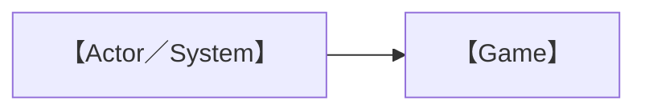
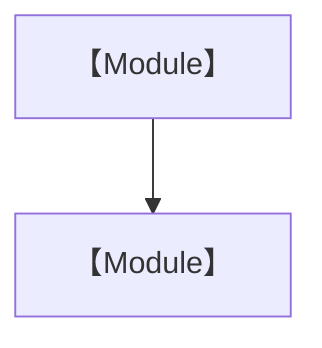
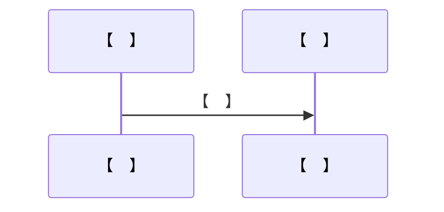
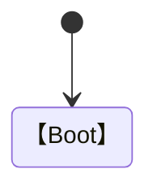
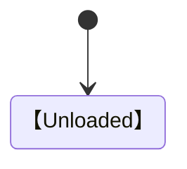
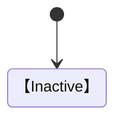
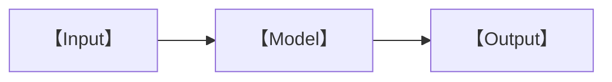
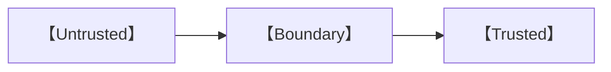
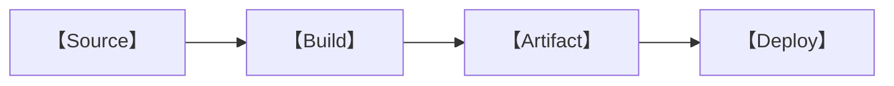

# 【遊戲名稱】Technical Design Document

> TDD｜版本【　】｜狀態【　】

| 文件欄位 | 內容 |
|---|---|
| 專案代號 | 【　】 |
| Technical Owner | 【　】 |
| 建立日期 | 【　】 |
| 最後更新 | 【　】 |
| 對應 GDD 版本 | 【　】 |
| 目標 Release | 【　】 |

## 修訂紀錄

| 版本 | 日期 | 作者 | 變更摘要 | 審核人 |
|---|---|---|---|---|
|  |  |  |  |  |

## 核准紀錄

| 角色 | 姓名 | 決定 | 日期 | 備註 |
|---|---|---|---|---|
| Technical Lead |  |  |  |  |
| Lead Game Designer |  |  |  |  |
| QA Lead |  |  |  |  |
| Security / Privacy Reviewer |  |  |  |  |
| Operations Owner |  |  |  |  |

---

## 1. 目的與範圍

### 1.1 技術目標

【　】

### 1.2 非目標

【　】

### 1.3 假設與限制

| ID | 假設／限制 | 驗證方式 | 截止日期 | Owner | 狀態 |
|---|---|---|---|---|---|
|  |  |  |  |  |  |

### 1.4 相關文件

| 文件 | 版本 | 連結 | 關係 |
|---|---|---|---|
|  |  |  |  |

### 1.5 用詞與縮寫

| 用詞／縮寫 | 定義 |
|---|---|
|  |  |

## 2. 技術摘要

### 2.1 系統背景

【　】

### 2.2 技術棧

| 層級 | 技術 | 版本 | 用途 | 選擇理由 | License |
|---|---|---|---|---|---|
|  |  |  |  |  |  |

### 2.3 系統上下文



### 2.4 容器／模組圖



### 2.5 關鍵資料流



## 3. 目標環境與相容性

### 3.1 用戶端矩陣

| 裝置類型 | OS | 瀏覽器／Runtime | 最低版本 | 輸入 | 支援級別 |
|---|---|---|---|---|---|
|  |  |  |  |  |  |

### 3.2 硬體基線

| 級別 | CPU | GPU | RAM | VRAM | 解像度 | 目標 FPS |
|---|---|---|---:|---:|---|---:|
|  |  |  |  |  |  |  |

### 3.3 網路條件

| 情境 | 頻寬 | 延遲 | 離線 | 預期行為 |
|---|---:|---:|---|---|
|  |  |  |  |  |

### 3.4 不支援環境

| 環境 | 原因 | 使用者提示 |
|---|---|---|
|  |  |  |

## 4. 儲存庫與工程規範

### 4.1 儲存庫結構

```text
【　】
```

### 4.2 分支與版本策略

| 項目 | 規則 |
|---|---|
| Branching |  |
| Versioning |  |
| Release Tag |  |
| Hotfix |  |

### 4.3 編碼規範

| 類別 | 規範／工具 | 執行位置 |
|---|---|---|
| Language |  |  |
| Format |  |  |
| Lint |  |  |
| Type Check |  |  |
| Test |  |  |
| Commit |  |  |

### 4.4 設定與環境變數

| Key | 用途 | 環境 | 必須 | Secret | 預設 |
|---|---|---|:---:|:---:|---|
|  |  |  |  |  |  |

## 5. 應用程式架構

### 5.1 啟動生命週期



### 5.2 Game Loop

| 階段 | 責任 | 頻率 | 可暫停 | 錯誤處理 |
|---|---|---|---|---|
|  |  |  |  |  |

### 5.3 模組登記

| Module ID | 模組 | 責任 | Public API | 相依 | Owner |
|---|---|---|---|---|---|
|  |  |  |  |  |  |

### 5.4 事件／訊息架構

| Event ID | Producer | Payload | Consumer | 順序保證 | 持久化 |
|---|---|---|---|---|---|
|  |  |  |  |  |  |

### 5.5 狀態管理

| State | Scope | Owner | Mutation | Persistence | Reset |
|---|---|---|---|---|---|
|  |  |  |  |  |  |

### 5.6 相依注入與服務定位

【　】

## 6. 渲染系統

### 6.1 Renderer 設定

| 參數 | 值 | 平台差異 | 理由 |
|---|---|---|---|
|  |  |  |  |

### 6.2 Scene Graph 規則

【　】

### 6.3 Camera Pipeline

| Camera | 用途 | Layer | Post-process | 切換規則 |
|---|---|---|---|---|
|  |  |  |  |  |

### 6.4 Lighting 與 Shadow

| 場景級別 | Light Budget | Shadow Budget | Bake／Realtime | Fallback |
|---|---:|---:|---|---|
|  |  |  |  |  |

### 6.5 Material 與 Shader

| Shader／Material | 用途 | Uniform | Variant | Fallback | Owner |
|---|---|---|---|---|---|
|  |  |  |  |  |  |

### 6.6 LOD、Culling 與 Instancing

| 系統 | 閾值／規則 | 指標 | 驗證場景 |
|---|---|---|---|
|  |  |  |  |

### 6.7 Post-processing

| Effect | 場景 | 品質級別 | 成本 | 可及性開關 |
|---|---|---|---|---|
|  |  |  |  |  |

## 7. 場景與內容載入

### 7.1 場景生命週期



### 7.2 Bundle／Chunk 策略

| Bundle | 內容 | 進入條件 | 預載 | 快取 | 卸載 |
|---|---|---|---|---|---|
|  |  |  |  |  |  |

### 7.3 Asset Loader API

```ts
// 【介面定義】
```

### 7.4 Loading、Timeout 與 Retry

| 情境 | Timeout | Retry | UI | Recovery | Telemetry |
|---|---:|---:|---|---|---|
|  |  |  |  |  |  |

### 7.5 Cache 與版本失效

| 資源類型 | Cache | Key | TTL | Version Bust | Offline |
|---|---|---|---|---|---|
|  |  |  |  |  |  |

## 8. 輸入、角色與物理

### 8.1 Input Abstraction

| Action ID | Device Binding | Context | Repeat | Rebind | Conflict |
|---|---|---|---|---|---|
|  |  |  |  |  |  |

### 8.2 Character Controller

| 項目 | 實作 | 參數來源 | 邊界情況 | 測試 ID |
|---|---|---|---|---|
|  |  |  |  |  |

### 8.3 Collision Layer

| Layer | Collides With | Trigger With | Query | 說明 |
|---|---|---|---|---|
|  |  |  |  |  |

### 8.4 Physics Step

| 參數 | 值 | 理由 | 平台差異 |
|---|---|---|---|
|  |  |  |  |

### 8.5 防卡死與重置

| 偵測 | 閾值 | 恢復 | 玩家提示 | Log |
|---|---|---|---|---|
|  |  |  |  |  |

## 9. 互動、任務與對話

### 9.1 Interaction Contract

```ts
// 【介面定義】
```

### 9.2 Interaction Resolution

| 條件 | 優先級 | Tie-break | UI | 執行 |
|---|---:|---|---|---|
|  |  |  |  |  |

### 9.3 Quest Data Schema

```json
{
  "【key】": "【value】"
}
```

### 9.4 Quest State Machine



### 9.5 Dialogue Data Schema

```json
{
  "【key】": "【value】"
}
```

### 9.6 條件與效果

| ID | 類型 | 參數 | 驗證 | 錯誤行為 |
|---|---|---|---|---|
|  |  |  |  |  |

### 9.7 Content Validation

| 規則 ID | 驗證內容 | Severity | Auto-fix | Owner |
|---|---|---|---|---|
|  |  |  |  |  |

## 10. 教學模擬系統

### 10.1 模型邊界

【　】

### 10.2 Domain Data Schema

```json
{
  "【key】": "【value】"
}
```

### 10.3 計算流程



### 10.4 決定性與 Random Seed

| 模式 | Seed 來源 | 可重現 | 存檔 | QA Override |
|---|---|---|---|---|
|  |  |  |  |  |

### 10.5 數值驗證

| Case ID | Input | Expected | Tolerance | Source | Reviewer |
|---|---|---|---|---|---|
|  |  |  |  |  |  |

### 10.6 科學內容版本

| Content ID | Version | Source | Approved By | Effective Date | Deprecated |
|---|---|---|---|---|---|
|  |  |  |  |  |  |

## 11. UI 架構

### 11.1 UI 技術與分層

【　】

### 11.2 Screen Registry

| Screen ID | Route／State | Mount | Input Context | Data Source | Owner |
|---|---|---|---|---|---|
|  |  |  |  |  |  |

### 11.3 Focus 與 Navigation

| Container | Initial Focus | Tab Order | Escape | Focus Trap |
|---|---|---|---|---|
|  |  |  |  |  |

### 11.4 Responsive Breakpoints

| Breakpoint | Width／Input | Layout | Unsupported Content |
|---|---|---|---|
|  |  |  |  |

### 11.5 Error／Empty／Loading State

| Component | Loading | Empty | Error | Retry | Offline |
|---|---|---|---|---|---|
|  |  |  |  |  |  |

## 12. 音訊系統

### 12.1 Audio Graph

【　】

### 12.2 Bus 與 Ducking

| Bus | Parent | Default dB | Duck Trigger | Persist Setting |
|---|---|---:|---|---|
|  |  |  |  |  |

### 12.3 Audio Loading

| 類型 | 格式 | Stream／Buffer | Preload | Fallback |
|---|---|---|---|---|
|  |  |  |  |  |

### 12.4 Autoplay 與 Resume

【　】

## 13. 存檔與資料

### 13.1 Save Schema

```json
{
  "version": "【　】"
}
```

### 13.2 儲存策略

| Store | 資料 | 寫入時機 | 容量 | Encryption | Clear |
|---|---|---|---:|---|---|
|  |  |  |  |  |  |

### 13.3 Migration

| From | To | Transform | Failure | Test Fixture |
|---|---|---|---|---|
|  |  |  |  |  |

### 13.4 Corruption Recovery

| Failure | Detect | Backup | Recovery | User Message |
|---|---|---|---|---|
|  |  |  |  |  |

### 13.5 Import／Export

| Format | Validation | Size Limit | Privacy | Version |
|---|---|---:|---|---|
|  |  |  |  |  |

## 14. 本地化與可及性實作

### 14.1 Localization Pipeline

| 階段 | Input | Tool | Output | Validation | Owner |
|---|---|---|---|---|---|
|  |  |  |  |  |  |

### 14.2 Text Key Convention

【　】

### 14.3 Font 與 Glyph

| Font | Language | Weight | Format | Subset | Fallback |
|---|---|---|---|---|---|
|  |  |  |  |  |  |

### 14.4 Accessibility Setting

| Setting ID | Default | Runtime Effect | Persistence | Test |
|---|---|---|---|---|
|  |  |  |  |  |

### 14.5 Assistive Technology

| 技術 | 支援 | 範圍 | 限制 | 測試環境 |
|---|---|---|---|---|
|  |  |  |  |  |

## 15. Backend 與 API

### 15.1 服務清單

| Service | 責任 | Runtime | Region | Owner | SLA |
|---|---|---|---|---|---|
|  |  |  |  |  |  |

### 15.2 API Contract

| Method | Path | Auth | Request | Response | Error | Rate Limit |
|---|---|---|---|---|---|---|
|  |  |  |  |  |  |  |

### 15.3 Offline／Degraded Mode

| Service Failure | Client Behavior | Queue | Retry | User Notice |
|---|---|---|---|---|
|  |  |  |  |  |

### 15.4 Data Retention

| Data | Purpose | Location | Retention | Deletion | Legal Basis |
|---|---|---|---|---|---|
|  |  |  |  |  |  |

## 16. Security、Privacy 與兒童保障

### 16.1 Threat Model

| ID | Asset | Threat | Entry Point | Impact | Mitigation | Residual Risk |
|---|---|---|---|---|---|---|
| THR-001 |  |  |  |  |  |  |

### 16.2 Trust Boundary



### 16.3 Input Validation

| Input | Source | Validation | Limit | Failure |
|---|---|---|---:|---|
|  |  |  |  |  |

### 16.4 Dependency Security

| Control | Tool／Process | Frequency | Owner | Failure Action |
|---|---|---|---|---|
|  |  |  |  |  |

### 16.5 Privacy Controls

| Control | Data | Implementation | Verification | Owner |
|---|---|---|---|---|
|  |  |  |  |  |

## 17. 分析、日誌與可觀測性

### 17.1 Event Schema

| Event | Trigger | Properties | PII | Sampling | Retention |
|---|---|---|:---:|---:|---|
|  |  |  |  |  |  |

### 17.2 Client Logging

| Level | 使用條件 | Production | Redaction | Destination |
|---|---|---|---|---|
|  |  |  |  |  |

### 17.3 Error Reporting

| Error 類別 | Capture | Context | User ID | Alert | Owner |
|---|---|---|---|---|---|
|  |  |  |  |  |  |

### 17.4 Operational Metric

| Metric | Definition | Target | Alert | Dashboard |
|---|---|---:|---|---|
|  |  |  |  |  |

## 18. 效能預算

### 18.1 Runtime Budget

| 指標 | Baseline | Target | Hard Limit | 測試場景 |
|---|---:|---:|---:|---|
| Frame Time |  |  |  |  |
| Draw Calls |  |  |  |  |
| Triangles |  |  |  |  |
| JS Heap |  |  |  |  |
| GPU Memory |  |  |  |  |

### 18.2 Network Budget

| Bundle／Asset Type | Initial | Per Chapter | Cached | Hard Limit |
|---|---:|---:|---:|---:|
|  |  |  |  |  |

### 18.3 Loading Budget

| Scenario | Device | Network | Target | Hard Limit |
|---|---|---|---:|---:|
|  |  |  |  |  |

### 18.4 Performance Tier

| Tier | Detection | Render Scale | Effects | Shadows | LOD |
|---|---|---:|---|---|---|
|  |  |  |  |  |  |

## 19. 測試策略

### 19.1 Test Pyramid

| Level | Scope | Tool | Trigger | Gate | Owner |
|---|---|---|---|---|---|
|  |  |  |  |  |  |

### 19.2 測試環境

| Environment | 用途 | Data | Build | Access | Reset |
|---|---|---|---|---|---|
|  |  |  |  |  |  |

### 19.3 Deterministic Fixture

| Fixture | Scope | Seed／Data | Expected | Maintenance |
|---|---|---|---|---|
|  |  |  |  |  |

### 19.4 Browser Automation

| Flow ID | Flow | Viewports | Browsers | Assertions | Screenshot |
|---|---|---|---|---|---|
|  |  |  |  |  |  |

### 19.5 測試指令

```powershell
# 【　】
```

## 20. Build、Release 與部署

### 20.1 Build Pipeline



### 20.2 Build Variant

| Variant | Flags | Source Map | Analytics | Content | Distribution |
|---|---|---|---|---|---|
|  |  |  |  |  |  |

### 20.3 CI/CD Gate

| Gate | Branch | Check | Required | Owner |
|---|---|---|:---:|---|
|  |  |  |  |  |

### 20.4 Deployment

| Environment | URL | Trigger | Approval | Rollback | Cache Invalidation |
|---|---|---|---|---|---|
|  |  |  |  |  |  |

### 20.5 Release／Rollback

| Step | Command／Action | Verify | Owner | Failure Action |
|---|---|---|---|---|
|  |  |  |  |  |

## 21. 遷移、相容與維護

### 21.1 Compatibility Policy

【　】

### 21.2 Deprecation

| Item | Announce | Remove | Migration | Owner |
|---|---|---|---|---|
|  |  |  |  |  |

### 21.3 Maintenance Window

| 類型 | 頻率 | 影響 | 通知 | Owner |
|---|---|---|---|---|
|  |  |  |  |  |

## 22. 技術風險與開放問題

### 22.1 Risk Register

| ID | 風險 | 機率 | 影響 | 緩解 | Contingency | Owner | 狀態 |
|---|---|---|---|---|---|---|---|
|  |  |  |  |  |  |  |  |

### 22.2 Open Question

| ID | 問題 | 選項 | 決策人 | Due | 狀態 | 結果 |
|---|---|---|---|---|---|---|
|  |  |  |  |  |  |  |

### 22.3 Technical Debt

| ID | 項目 | 影響 | 償還條件 | Target | Owner |
|---|---|---|---|---|---|
|  |  |  |  |  |  |

## 23. 驗收與完成定義

| ID | 技術需求 | 測量方式 | Target | Gate | 證據 | 核准 |
|---|---|---|---|---|---|---|
|  |  |  |  |  |  |  |

## 附錄 A：Architecture Decision Record

### ADR-【　】：【標題】

| 欄位 | 內容 |
|---|---|
| 狀態 |  |
| 日期 |  |
| Context |  |
| Options |  |
| Decision |  |
| Consequences |  |
| Follow-up |  |

## 附錄 B：API／Schema 索引

| ID | 名稱 | 類型 | Source | Version | Owner |
|---|---|---|---|---|---|
|  |  |  |  |  |  |

## 附錄 C：第三方套件

| Package | Version | Purpose | License | Source | Review Date | Owner |
|---|---|---|---|---|---|---|
|  |  |  |  |  |  |  |
