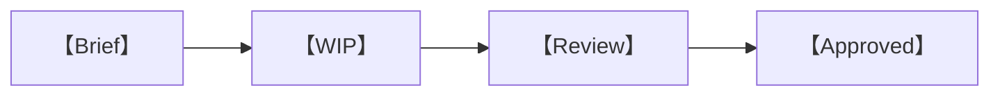

# 【遊戲名稱】Asset List & Production Guidelines

> 資產清單與製作規範｜版本【　】｜狀態【　】

| 文件欄位 | 內容 |
|---|---|
| Art Owner | 【　】 |
| Technical Art Owner | 【　】 |
| Audio Owner | 【　】 |
| 建立日期 | 【　】 |
| 最後更新 | 【　】 |
| 對應 Build | 【　】 |

## 修訂與核准

| 版本 | 日期 | 作者 | 變更摘要 | 核准人 |
|---|---|---|---|---|
|  |  |  |  |  |

---

## 1. 文件用途與範圍

【　】

## 2. 資產狀態與優先級

### 2.1 狀態定義

| 狀態 | 進入條件 | 退出條件 | Owner |
|---|---|---|---|
|  |  |  |  |

### 2.2 優先級定義

| 優先級 | 定義 | 目標版本 |
|---|---|---|
|  |  |  |

### 2.3 核准流程



## 3. 全域美術規範

### 3.1 視覺支柱

| 支柱 | 定義 | Must | Avoid | Reference |
|---|---|---|---|---|
|  |  |  |  |  |

### 3.2 形狀語言

| 類別 | 輪廓 | 比例 | 細節密度 | 禁用元素 |
|---|---|---|---|---|
|  |  |  |  |  |

### 3.3 色彩系統

| Token | HEX／RGB | 用途 | 對比要求 | 禁用情境 |
|---|---|---|---|---|
|  |  |  |  |  |

### 3.4 材質語言

| Material Family | 表面 | Roughness | Metallic | Texture Style | 使用範圍 |
|---|---|---:|---:|---|---|
|  |  |  |  |  |  |

### 3.5 尺度與單位

| 項目 | 規範 | 驗證方式 |
|---|---|---|
| World Unit |  |  |
| Character Height |  |  |
| Door／Stair |  |  |
| Origin |  |  |
| Up Axis |  |  |

### 3.6 可讀性與可及性

| 項目 | 要求 | 測試 |
|---|---|---|
| Silhouette |  |  |
| Color Independence |  |  |
| UI Contrast |  |  |
| Motion |  |  |
| Photosensitivity |  |  |

## 4. 命名與目錄規範

### 4.1 Asset ID 格式

```text
【　】
```

### 4.2 類型代碼

| 類型 | Prefix | 範例格式 |
|---|---|---|
|  |  |  |

### 4.3 檔案命名

| 元素 | 規則 |
|---|---|
| Character Set |  |
| Separator |  |
| Version |  |
| Variant |  |
| LOD |  |

### 4.4 目錄結構

```text
【　】
```

### 4.5 Source 與 Runtime 檔案

| 類型 | Source | Runtime | Repository | 備份 |
|---|---|---|---|---|
|  |  |  |  |  |

## 5. 3D 模型規範

### 5.1 幾何預算

| 類別 | LOD0 | LOD1 | LOD2 | Collision | Instances |
|---|---:|---:|---:|---:|---:|
|  |  |  |  |  |  |

### 5.2 拓撲

| 項目 | 規則 | 驗證 |
|---|---|---|
| Normals |  |  |
| Non-manifold |  |  |
| N-gons |  |  |
| Hidden Faces |  |  |
| UV Seams |  |  |

### 5.3 Pivot、Transform 與 Axis

| 類別 | Pivot | Position | Rotation | Scale |
|---|---|---|---|---|
|  |  |  |  |  |

### 5.4 LOD 規則

| LOD | Screen Size／Distance | Geometry | Material | Transition |
|---|---|---|---|---|
|  |  |  |  |  |

### 5.5 Collision Mesh

| 類別 | 方法 | Triangle Limit | Naming | Layer |
|---|---|---:|---|---|
|  |  |  |  |  |

### 5.6 Export

| Setting | Value | 備註 |
|---|---|---|
| Format |  |  |
| Axis |  |  |
| Transform |  |  |
| Animation |  |  |
| Compression |  |  |

## 6. 角色與 Rig 規範

### 6.1 角色比例

| 類型 | Height | Head Ratio | Hand／Foot | Gameplay Bounds |
|---|---:|---:|---|---|
|  |  |  |  |  |

### 6.2 Skeleton

| Bone | Parent | Required | Constraint | Naming |
|---|---|---|---|---|
|  |  |  |  |  |

### 6.3 Skinning

| 項目 | Budget／Rule | Validation |
|---|---|---|
| Influences per Vertex |  |  |
| Total Bones |  |  |
| Deformation Test |  |  |

### 6.4 角色變體

| Slot | Compatibility | Material | Clipping Rule | Thumbnail |
|---|---|---|---|---|
|  |  |  |  |  |

## 7. 動畫規範

### 7.1 Animation Clip

| 類型 | FPS | Root Motion | Loop | Start／End Pose | Compression |
|---|---:|---|---|---|---|
|  |  |  |  |  |  |

### 7.2 Event Marker

| Event | Naming | Frame Rule | Payload | Owner |
|---|---|---|---|---|
|  |  |  |  |  |

### 7.3 Retargeting

| Source Rig | Target Rig | Tool | Exceptions | QA Clip |
|---|---|---|---|---|
|  |  |  |  |  |

### 7.4 動畫檢查

- [ ] 【　】
- [ ] 【　】
- [ ] 【　】

## 8. Texture 與 Material 規範

### 8.1 Texture Budget

| 類別 | 尺寸 | Channels | Format | Compression | Mipmaps |
|---|---:|---|---|---|---|
|  |  |  |  |  |  |

### 8.2 Channel Packing

| Map | R | G | B | A | Color Space |
|---|---|---|---|---|---|
|  |  |  |  |  |  |

### 8.3 UV 與 Texel Density

| 類別 | Texel Density | Padding | Overlap | UDIM |
|---|---:|---:|---|---|
|  |  |  |  |  |

### 8.4 Material Variant

| Base Material | Variant | Parameter | Keyword | Draw Call Impact |
|---|---|---|---|---|
|  |  |  |  |  |

## 9. 環境與關卡資產規範

### 9.1 Modular Kit

| Kit | Grid | Snap | Pivot | Variants | End Caps |
|---|---:|---:|---|---|---|
|  |  |  |  |  |  |

### 9.2 Set Dressing Density

| 區域類型 | Hero Assets | Props | Decals | Vegetation | VFX |
|---|---:|---:|---:|---:|---:|
|  |  |  |  |  |  |

### 9.3 Navigation Clearance

| 項目 | Minimum | Preferred | Test |
|---|---:|---:|---|
|  |  |  |  |

### 9.4 Lighting Asset

| Type | Range | Shadow | Count Budget | Bake／Realtime |
|---|---:|---|---:|---|
|  |  |  |  |  |

## 10. VFX 規範

### 10.1 VFX Budget

| Tier | Particles | Overdraw | Texture | Lights | Duration |
|---|---:|---:|---:|---:|---:|
|  |  |  |  |  |  |

### 10.2 VFX 可讀性

| Gameplay Meaning | Shape | Color | Motion | Audio／Text Alternative |
|---|---|---|---|---|
|  |  |  |  |  |

### 10.3 VFX Checklist

- [ ] 【　】
- [ ] 【　】
- [ ] 【　】

## 11. UI 資產規範

### 11.1 UI Grid 與尺寸

| Token | Value | Usage |
|---|---:|---|
|  |  |  |

### 11.2 Typography

| Style | Font | Weight | Size | Line Height | Usage |
|---|---|---:|---:|---:|---|
|  |  |  |  |  |  |

### 11.3 Icon

| 類型 | Canvas | Stroke | Padding | States | Export |
|---|---:|---:|---:|---|---|
|  |  |  |  |  |  |

### 11.4 Component State

| Component | Default | Hover | Focus | Pressed | Disabled | Error |
|---|---|---|---|---|---|---|
|  |  |  |  |  |  |  |

### 11.5 Responsive Export

| Asset | 1x | 2x | Vector | Nine-slice | Localization |
|---|---|---|---|---|---|
|  |  |  |  |  |  |

## 12. 音訊資產規範

### 12.1 Audio Format

| 類型 | Source | Runtime | Sample Rate | Channels | Loudness |
|---|---|---|---:|---:|---:|
|  |  |  |  |  |  |

### 12.2 Loop 與 Tail

| 類型 | Loop Point | Crossfade | Tail | Pre-roll |
|---|---:|---:|---:|---:|
|  |  |  |  |  |

### 12.3 Voice

| Language | Format | Naming | Noise Floor | Delivery | Subtitle Key |
|---|---|---|---:|---|---|
|  |  |  |  |  |  |

## 13. 資產主清單

| Asset ID | 名稱 | 類別 | 章節／場景 | Brief | Source File | Runtime File | Owner | Priority | Status | Due | Review |
|---|---|---|---|---|---|---|---|---|---|---|---|
|  |  |  |  |  |  |  |  |  |  |  |  |

## 14. 3D 資產清單

| Asset ID | 類型 | LOD | Triangles | Materials | Textures | Rig | Collision | File Size | Status |
|---|---|---:|---:|---:|---:|---|---|---:|---|
|  |  |  |  |  |  |  |  |  |  |

## 15. 動畫資產清單

| Asset ID | Character／Object | Clip | Length | Loop | Root Motion | Events | Status |
|---|---|---|---:|---|---|---|---|
|  |  |  |  |  |  |  |  |

## 16. Texture／Material 清單

| Asset ID | Model／UI | Resolution | Channels | Color Space | Compression | Size | Status |
|---|---|---:|---|---|---|---:|---|
|  |  |  |  |  |  |  |  |

## 17. VFX 資產清單

| Asset ID | Effect | Trigger | Tier | Particles | Texture | Duration | Status |
|---|---|---|---|---:|---|---:|---|
|  |  |  |  |  |  |  |  |

## 18. UI 資產清單

| Asset ID | Screen／Component | Type | Dimensions | States | Localization | Source | Status |
|---|---|---|---|---|---|---|---|
|  |  |  |  |  |  |  |  |

## 19. Audio 資產清單

| Asset ID | Type | Event／Scene | Duration | Loop | Variants | Runtime Format | Status |
|---|---|---|---:|---|---:|---|---|
|  |  |  |  |  |  |  |  |

## 20. 文案與本地化資產清單

| String ID | Context | Source Language | Character Limit | Variables | Languages | Review | Status |
|---|---|---|---:|---|---|---|---|
|  |  |  |  |  |  |  |  |

## 21. 外部資產、授權與來源

| Asset ID | Creator | Source URL | License | Modification | Attribution | Proof | Approved By |
|---|---|---|---|---|---|---|---|
|  |  |  |  |  |  |  |  |

## 22. Import 與驗證

### 22.1 Import Setting

| 類型 | Tool／Preset | Validation | Runtime Output |
|---|---|---|---|
|  |  |  |  |

### 22.2 自動檢查

| Check ID | Asset Type | Rule | Severity | Auto-fix |
|---|---|---|---|---|
|  |  |  |  |  |

### 22.3 人工審核

- [ ] 【　】
- [ ] 【　】
- [ ] 【　】

## 23. 資產變更與棄用

| Asset ID | Change | Reason | Impact | Replacement | Version | Owner |
|---|---|---|---|---|---|---|
|  |  |  |  |  |  |  |

## 附錄 A：單一資產 Brief

### 【Asset ID／名稱】

| 欄位 | 內容 |
|---|---|
| 目的 |  |
| 使用場景 |  |
| 玩家距離 |  |
| 視覺需求 |  |
| 技術限制 |  |
| 動畫／互動 |  |
| 參考 |  |
| 禁用 |  |
| 交付物 |  |
| 截止日期 |  |
| 審核人 |  |

## 附錄 B：外判交付清單

| Deliverable | Source | Runtime | Preview | License | Naming | Validation |
|---|---|---|---|---|---|---|
|  |  |  |  |  |  |  |
