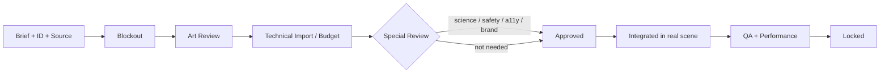

# 《微界工程師：生命迴路》Asset List & Production Guidelines

> 版本 1.0｜狀態：P0 資產基線候選｜日期：2026-07-26

| 文件欄位 | 內容 |
|---|---|
| 專案代號 | `MCE-LC-2026` |
| Asset Owner | Art Lead（待指派姓名） |
| 對應 GDD／TDD | GDD 2.0／TDD 2.0 |
| P0 場景 | 前導／研究站、河港、公民會議；展覽重用 |
| 主要原則 | 可讀、低負載、可重用、可本地化、有授權、有 provenance |

## 修訂與核准

| 版本 | 日期 | 變更 | Art | Tech | Science／A11y | QA |
|---|---|---|---|---|---|---|
| 1.0 | 2026-07-26 | 完成 P0 master list、budgets、pipeline、license、AI guidelines | 待簽 | 待簽 | 待簽 | 待簽 |

## 1. 文件用途與範圍

本文件是所有 3D、動畫、材質、VFX、UI、音訊、文字、字型及外部資產的製作契約。資產只有在擁有 Asset ID、brief、priority、budget、source／license、runtime path、review evidence 和 status 時才可進入 production build。P0 資產服務前導章、第一章及展覽快速路徑；Future chapters 不得把資產帶入 P0 manifest。

本清單是**最小代表性資產集**，不是美術願望清單。當功能、效能或排程衝突時，先保留互動可讀性、科學層級、角色功能和可及性，再保留氛圍；背景裝飾、變體、配音和遠景首先被砍。

## 2. 資產狀態與優先級

### 2.1 狀態定義

| Status | 定義 | 可進 build |
|---|---|:---:|
| Brief Needed | 尚未有用途、預算或來源 | 否 |
| Spec Ready | 本文件已有規格，尚未製作 | 否 |
| Blockout | 尺度、pivot、collision 可測 | QA／greybox only |
| WIP | 正在製作；未完成 review | preview only |
| Review | 已 export，等 Art／Tech／A11y／Science | preview only |
| Approved | 通過功能、技術、授權與內容 review | 是 |
| Integrated | 已在實際 scene／screen 驗證 | 是 |
| Locked | Content Freeze 後只可修 blocker | 是 |
| Deprecated | 不可新引用；保留 migration／替代記錄 | 否 |

表中「規格完成／未製作」等同 Spec Ready，不代表資產已存在。

### 2.2 優先級定義

| Priority | 定義 | 砍掉後果 |
|---|---|---|
| P0 | Critical Path、可及性、科學或 release 必需 | 不能發行 |
| P1 | 核心穩定後提升展示、語言或裝置 | 可砍且不破壞 P0 |
| R&D | 只用來驗證未知；不能建立 final art 承諾 | 不進 production manifest |
| Future | 其他章節或完整配音 | 2026 不製作 |

### 2.3 核准流程



任何 asset 由 AI 產生概念、mesh、texture、icon、音訊或文案，仍須經相同流程；「AI 生成」不是來源或授權欄的免填理由。

## 3. 全域美術規範

### 3.1 視覺支柱

1. **低多邊形但不玩具化科學：** 大形狀、乾淨輪廓、有限材質；科學因果由資訊設計而非寫實設備堆砌。
2. **功能層級一致：** environment input、DNA、cell、protein、evidence、claim 和 safety layer 各有固定形狀語言。
3. **公共空間可信且溫暖：** 危機有警示，但不使用恐怖、黏液、異形或「邪惡細菌」意象。
4. **資訊不是顏色謎題：** 形狀、icon、label、pattern、動畫冗餘；紅色 reporter 與 system error 不混用同一表現。
5. **重用優先：** 一個研究站房間以 station／lighting／prop variant 支援前導、實驗與會議轉場。

### 3.2 形狀語言

| 概念 | 形狀／空間 | 禁止混淆 |
|---|---|---|
| Environment input | 外部圓點／環境 port | 不放在 DNA rail |
| Promoter | 方向箭頭／起始楔形 | 不畫成 protein |
| Gene／DNA instruction | 長條／編碼區 | 不直接變成可拿取蛋白 |
| Regulator protein | 圓角幾何／binding icon | 不與 gene card 同形 |
| Reporter protein／signal | cell output capsule＋光／bar | 不把河水染紅 |
| Evidence | 文件／tag；有 source notch | 不等同 claim |
| Claim | speech／statement card | 必須連 evidence／limit |
| Safety layer | shield-like 但四種 pattern | 不用一個鎖 icon表示零風險 |
| Unknown | open outline／question marker | 不以紅叉當錯誤 |

### 3.3 色彩系統

色票由 Art Lead 在 prototype 後鎖定；以下是功能角色而非最終品牌值：

- Environment：海藍、自然綠、暖灰；
- Interactive：青綠／高對比外框；
- Warning：黃＋黑 pattern；
- Pollution concern：橙，不把河水染成橙紅；
- Reporter：dTomato red，只用於 reporter state；
- Error：紅＋錯誤 icon／文字；與 reporter 用不同形狀／位置；
- Pass：綠＋check；Fail：琥珀／紅＋warning；Unknown：灰藍＋問號。

顏色不得是唯一訊息。所有 palette 在常見色覺差異模擬、高對比與投影機洗色環境測試。

### 3.4 材質語言

- Environment 採簡化 PBR 或 toon-like，roughness 偏高、低鏡面；
- 科學裝置使用清楚 panel、emissive accent、large label；
- 不使用玻璃反射展示培養物細節；封閉匣只作概念外觀；
- Water 使用低成本材質，不做反射 probe／SSR；
- UI icon／text 不烘焙進 3D texture，需本地化的標誌使用 decal slot 或 DOM world label；
- 僅經 profiling 批准 custom shader；每個 shader 有 low-tier fallback。

### 3.5 尺度與單位

| 項目 | 規則 |
|---|---|
| 單位 | 1 Blender unit = 1 meter |
| Up／Forward | Y-up runtime；Blender export 使用已核准 glTF axis；front convention寫入 exporter preset |
| 玩家 | 約 1.7 m visual height；capsule 依 TDD |
| 門 | clear width ≥1.2 m；height ≥2.2 m |
| Critical path | clear walking width ≥1.5 m；轉角 ≥1.8 m |
| 可互動物 | 0.8–1.4 m 操作高度；大輪廓 |
| Step／small prop | 不超過 controller step height 或從 path 移除 |
| Scene origin | 每 zone 近世界原點；避免極大座標 |

所有 transform 在 export 前 apply；runtime scale = 1，rotation = identity unless animation requires。

### 3.6 可讀性與可及性

- 重要 interactive silhouette 在 10 m 可辨，2.2 m 內有明確 focus。
- 不使用快速閃爍、strobe、>3 Hz 高對比 pulse；所有 VFX 有 reduced-motion variant。
- 字幕、圖表、卡牌與主要文字由 DOM／SVG 繪製，不在 texture。
- 3D labels 需在 200% UI zoom／低解析度下有替代 panel。
- 人物衣著、年齡、身形與角色職責要多樣，但不以刻板族群外觀表示科學／無知／危險。
- 汞污染不以寫實受傷或病變表現；公共衛生資訊用標誌、對話與服務設施。

## 4. 命名與目錄規範

### 4.1 Asset ID 格式

`<TYPE>-<ROUTE_OR_DOMAIN>-<DESCRIPTOR>[-<VARIANT>]`

例：`PROP-C1-CONTAINED-CARTRIDGE`、`UI-PRE-CARD-ROLE-REPORTER`、`SFX-UI-CONTROL-FAIL`。ID 發行後不可重用；檔名可更新，ID 保持穩定。

### 4.2 類型代碼

| Code | 類型 | Code | 類型 |
|---|---|---|---|
| ENV | environment／scene kit | PROP | 3D prop |
| CHAR | character | ANIM | animation |
| MAT | material | TEX | texture |
| VFX | visual effect | UI | UI／icon／card |
| MUS | music | SFX | sound effect／ambience |
| VO | voice | TXT | content／localization |
| FONT | font | DOC | license／provenance／brief |

### 4.3 檔案命名

```text
<asset-id-lowercase>__<variant>__v###.<ext>
char-player-base__source__v003.blend
char-player-base__runtime__v003.glb
ui-icon-core-set__source__v002.svg
sfx-control-fail__master__v004.wav
```

不使用 `final_final2`、人名、日期作唯一版本；版本、commit 和 Asset DB 對應。

### 4.4 目錄結構

```text
assets-src/
├─ 3d/environment/<zone>/<asset-id>/
├─ 3d/characters/<asset-id>/
├─ animation/shared/<asset-id>/
├─ ui/<screen-or-system>/<asset-id>/
├─ audio/music|sfx|voice/<asset-id>/
└─ licenses/<asset-id>.yml

assets-runtime/
├─ glb/<zone>/
├─ textures/<atlas-or-asset>/
├─ ui/
├─ audio/
└─ manifests/
```

### 4.5 Source 與 Runtime 檔案

- Source：`.blend`、layered image／vector、`.wav` master、DAW project、editable text；可在 LFS／asset store。
- Runtime：optimized `.glb`、`.webp/.ktx2`、`.svg/.png`、`.ogg/.m4a`、compiled locale。
- Runtime 不可成為唯一 source；修改須回 source 再 export。
- 每次 export 寫入 tool version、preset、source hash、runtime hash。

### 4.6 Runtime 包體預算（與 TDD／QA 同一基線）

以壓縮後傳輸／可快取產物計算：app shell ≤3 MB、前導章新增 ≤5 MB、第一章新增 ≤25 MB、2026 P0 總 cached footprint ≤35 MB。Asset review 必須記錄各場景、音訊、字型與貼圖的實際增量；任何單一資產不得靠「稍後再優化」越過總額，超額時先降貼圖、音訊、材質與非必要變體，而不是提高預算。

## 5. 3D 模型規範

### 5.1 幾何預算

| Asset 類型 | LOD0 triangles | LOD1／distance | Material slots | 備註 |
|---|---:|---:|---:|---|
| 玩家／主要 NPC | ≤25k／22k | 45–55% | ≤3 | shared skeleton |
| 背景 NPC | ≤12k | ≤6k | ≤2 | limited animation |
| Hero station | ≤10k | optional ≤5k | ≤3 | UI 在 DOM |
| Large modular piece | ≤8k | optional | ≤2 | repeated pieces instanced |
| Medium prop | ≤3k | ≤1.5k | ≤2 | collision simple |
| Small prop | ≤1k | none | 1 | avoid blocking path |
| Harbor complete visible | typical ≤180k environment | — | — | total scene visible budget governed by TDD |
| Entire frame | typical ≤450k | warning >500k | draw calls ≤200 typical | characters／VFX included |

Budget is ceiling, not target. Silhouette and readability outrank hidden detail.

### 5.2 拓撲

- Clean manifold where appropriate; no unseen internal faces／duplicate vertices。
- Deformation loops only where skeleton needs; rigid low-poly surfaces not subdivided without visible benefit。
- Normals and hard edges deliberate; weighted normals allowed if exporter supports。
- Avoid tiny geometry below a few pixels; bake／texture／remove。
- Mesh names stable and semantic; no default Cube.001 in approved source。
- Character topology tested across shared poses; no severe shoulder／hip collapse at gameplay distance。

### 5.3 Pivot、Transform 與 Axis

- Props pivot at logical placement／interaction base；doors not required P0。
- Character root at ground between feet, forward convention fixed。
- Apply scale／rotation；negative scale forbidden in runtime。
- Static modular pieces snap to agreed grid (0.5 m or 1 m) and have matching connector points。
- Scene exports contain named anchors／spawn markers in separate non-render collection or manifest，不把 helper mesh 渲染。

### 5.4 LOD 規則

LOD only when profiler shows benefit. Preserve silhouette and interactive markers; never remove hazard sign or state icon in distant LOD. Transition uses hysteresis／crossfade only if cheap; otherwise distance swap outside close view. Characters may use LOD1 beyond 12–15 m; background NPC can be hidden by zone.

### 5.5 Collision Mesh

- Separate low-poly collision named `COL_<asset-id>` or generated manifest；not render mesh by default。
- Walkable surfaces simple、closed、aligned with visuals；no thin decorative collision。
- Small props no collision unless needed；use blocking volumes for walls／rails。
- 不建立 camera blocker／boom collision。需遮擋鏡頭的 visual mesh 標記 `CameraOccluder`，只作淡出／cutaway；player collision 另行定義。
- Every zone has QA collision overlay screenshot and stuck-point checklist。

### 5.6 Export

- glTF／GLB approved preset；embed only runtime data，不嵌入 unused cameras／lights／source metadata。
- Compression choice (Meshopt／Draco／KTX2) follows technical spike and decode profiling。
- Animations exported as named clips, rootless unless explicitly specified。
- Validate scale、bounds、materials、texture dimensions、animations、node IDs、license manifest before merge。
- Runtime GLB loaded in dedicated viewer and actual game scene；Blender preview alone不算通過。

## 6. 角色與 Rig 規範

### 6.1 角色比例

原創方塊／低模比例，頭身約 1:5–1:6；不得直接複製既有遊戲角色輪廓、皮膚、服裝或 icon。角色在 720p、中景與投影環境仍可由輪廓、服裝功能與 name label 分辨。

### 6.2 Skeleton

- 一個 shared humanoid skeleton；角色 variant 不能任意改 bone names／hierarchy。
- Bones target ≤65；不做 finger／facial bones unless later P1 proof。
- Root、hips、spine、head、arms、legs、feet、simple hand bones足夠。
- Animation retarget test on player、Lin、Chan 三種身形。

### 6.3 Skinning

≤4 weights per vertex；normalize；no stray weights。肩、肘、髖、膝、腳在 idle／walk／point／interact 檢查。Clipping at close-up dialogue must be acceptable or camera reframed；不以高成本 cloth simulation修正。

### 6.4 角色變體

Variant 優先使用材質、頭髮／帽子 mesh、服裝配件；不建立每個 NPC 完全獨立 rig。玩家 P0 只有 3 種服裝色調。角色多樣性由整體 cast 評估，不以隨機換色代替代表性。

## 7. 動畫規範

### 7.1 Animation Clip

| 規則 | 值 |
|---|---|
| Frame rate | source 30 fps；runtime interpolation |
| Root motion | P0 locomotion rootless；controller authoritative |
| Loop | first／last pose continuity；no duplicated hitch |
| Naming | `anim-hum-walk`, `anim-hum-talk-a` |
| Length | movement clips compact；long dialogue uses reusable loops |
| Curves | remove unused／constant tracks |

### 7.2 Event Marker

Events for footstep、interaction contact、gesture emphasis only；quest progression never depends solely on animation event。Marker IDs typed and validated。Reduced-motion may shorten／skip clips without losing state。

### 7.3 Retargeting

Shared skeleton is canonical. Any source mocap／library must have license and be cleaned／retargeted；do not ship source character。Retarget result reviewed for accessibility (no excessive swaying), tone and cultural gesture。

### 7.4 動畫檢查

- No foot sliding at standard speed；
- no mesh inversion／major clipping；
- transition <0.25 s where appropriate；
- clip works at 30 FPS and low graphics；
- interaction reaches approximate prop zone but game logic not tied to exact hand pose；
- no jump／combat／injury animation enters P0；
- reduced-motion variant／skip works。

## 8. Texture 與 Material 規範

### 8.1 Texture Budget

| 類型 | Typical | Max／例外 |
|---|---:|---:|
| Character atlas | 1024² | 2048² only one shared atlas with proof |
| Hero station | 1024² | 2048² if reused and compressed |
| Environment modular atlas | 1024²–2048² | one/few atlases per zone |
| Medium prop | 512²–1024² | atlas preferred |
| Small prop／icon texture | 256²–512² | SVG for UI preferred |
| Lightmap／AO | 512²–1024² | only if measurable benefit |
| UI raster | 1x/2x as needed | essential icons SVG |

Scene GPU texture estimate ≤180 MB target。Source resolution可較高，但 runtime 按實際畫面尺寸輸出。

### 8.2 Channel Packing

Where pipeline stable：ORM packed；alpha only when needed；avoid separate grayscale maps for tiny props。Document channel convention in material manifest。KTX2／WebP choice based on browser and quality test；retain fallback if required。

### 8.3 UV 與 Texel Density

Consistent within asset class；no visible severe stretching at gameplay camera。Modular pieces share trim sheet／atlas。Hidden surfaces may lower density。Lightmap UV only if used。Padding accounts for mipmaps／compression。

### 8.4 Material Variant

Use variant IDs, not duplicated full materials。Three player colors share shader／textures。State changes (reporter low/high、barrier active) use parameter／small overlay, not a new material per object。Material count is a draw-call budget concern and appears in asset report。

## 9. 環境與關卡資產規範

### 9.1 Modular Kit

- Harbor：straight／corner dock、rail、stairs/ramp、barrier sockets、shoreline、background façade。
- Lab／Civic：wall、floor、ceiling、door frame、window、station bay、furniture。
- Grid and pivots standard；kit demo scene included。
- Final room size follows gameplay greybox；美術不可在未經 level approval 改窄 critical path。

### 9.2 Set Dressing Density

Critical route clear；每 5 m 不超過一組視覺 cluster，避免每個 prop 都可互動。背景 props uses instancing。Set dressing不得暗示不在故事內的危險化學操作、廢物棄置或工程細胞外露。

### 9.3 Navigation Clearance

All walking routes test with controller capsule＋固定斜俯視 camera profile。Critical corridors target ≥1.8 m；avoid permanent roof／high-wall occlusion、narrow chair aisles、small floor clutter。NPC interaction zones have ≥1.5 m clear semicircle；required object visible from authored angle or listed in interaction list。Reset anchor visible／safe。

### 9.4 Lighting Asset

Lighting profiles stored as scene config, not baked into arbitrary models。Use simple directional／ambient，few emissive props。No flickering fluorescent effect。High-contrast mode and projector test ensure signs remain readable。

## 10. VFX 規範

### 10.1 VFX Budget

| 類別 | Budget |
|---|---|
| Concurrent systems | typical ≤6，peak ≤10 |
| Particles | peak ≤20k/s entire frame；reporter effect far lower |
| Draw calls | ≤2 per major effect；total VFX target ≤20 |
| Overdraw | small bounded screen area；no full-screen transparency |
| Duration | confirmation ≤1.2 s；loops subtle／pauseable |

### 10.2 VFX 可讀性

VFX never owns meaning alone。Reporter high has label、bar、icon and audio cue；control fail has warning text；scanner highlights have interaction list。Reduced motion uses static highlight／fade。Red signal appears inside controlled interface／cartridge, not river。

### 10.3 VFX Checklist

- 30 FPS low device、720p、projector、high contrast、reduced motion；
- no flashes >3 Hz；
- no particle clipping through UI／camera；
- disposes on route exit；
- deterministic enough for screenshots／QA；
- science／safety interpretation reviewed。

## 11. UI 資產規範

### 11.1 UI Grid 與尺寸

Use 8 px base spacing；touch candidate target ≥44 CSS px，desktop critical controls ≥36 px。Text column max ~70–80 CJK characters equivalent per line block；workbench slots large enough at 1024×600 and 200% zoom alternate layout。SVG icons align to 24／32 px grid。

### 11.2 Typography

- Semantic HTML headings；font size by rem，not fixed pixels；
- body default ≥16 px desktop；subtitle adjustable；
- line height 1.5–1.7 for Chinese；
- no all-caps long English；
- superscript and scientific notation tested；
- fallback stack documented；font license stored。

### 11.3 Icon

Every icon has Asset ID、meaning、state、accessible name、monochrome test。Avoid common icon ambiguity：flask does not mean all science；shield does not mean zero risk；red glow does not mean mercury。Core icons use original vector shapes or clearly licensed source。

### 11.4 Component State

Required：default、hover、focus-visible、pressed、selected、disabled-with-reason、loading、error、success、high-contrast、reduced-motion where relevant。Focus outline cannot be replaced by subtle color shift。

### 11.5 Responsive Export

UI assets are SVG／CSS where possible。Raster exports include 1x／2x but avoid fixed screenshots。All text localizable。Pseudolocale and 200% zoom screenshot set is part of UI asset approval。

## 12. 音訊資產規範

### 12.1 Audio Format

Source WAV 48 kHz／24-bit preferred；runtime OGG＋M4A/AAC fallback according to browser test。Music stereo；UI／SFX mono/stereo as appropriate。No MP3-only asset if gapless loop quality fails。

### 12.2 Loop 與 Tail

Music／ambience loop points documented and tested after compression。SFX tail not cut；silence trimmed；no DC click。Runtime metadata includes duration、loop、bus、caption/visual equivalent。

### 12.3 Voice

P0 no full VO。Any key barks require actor consent、usage、territory／term、credit、raw file handling and subtitle。Synthetic voice requires explicit team policy、voice rights、disclosure decision and cannot imitate a real person without permission。Voice never replaces text。

## 13. 資產主清單

下表是 2026 基線；新增 P0 asset 必須經 Change Control，並說明可替換／可砍 asset。

| Asset ID | 名稱 | 類型 | Zone | 優先級 | 預算／數量 | 狀態 | Owner Role | 備註 |
|---|---|---|---|---|---|---|---|---|
| ENV-PRE-LAB-ROOM | 前導／研究站共用主室 | 3D Environment | PRE/C1-LAB | P0 | ≤80k tri；≤45 draw calls | 可作三個 station variant | Art／對應角色 |  |
| ENV-C1-HARBOR-KIT | 河港模組套件 | 3D Environment | C1-HARBOR | P0 | 全場 ≤180k tri | 棧道、欄杆、岸線、背景建築 | Art／對應角色 |  |
| ENV-C1-CIVIC-ROOM | 公民會議室 | 3D Environment | C1-CIVIC | P0 | ≤70k tri；≤35 draw calls | 可重用研究站牆體 | Art／對應角色 |  |
| ENV-C1-HARBOR-ENDING | 河港重開 variant | Scene Variant | C1-HARBOR | P0 | 新增 ≤15k tri | 標誌、封堵、清理完成，不改水色 | Art／對應角色 |  |
| ENV-EXPO-PRESET | 展覽快速路徑 preset | Scene Config | EXPO | P0 | 0 new geometry | 只重用既有場景／checkpoint | Art／對應角色 |  |
| ENV-JR-GREYBOX | Junior 共用灰盒 | Greybox | JR | R&D | primitive only | 通過 gate 前不做 final art | Art／對應角色 |  |
| PROP-BARRIER-SET | 封鎖欄／警示帶套件 | 3D Prop | C1-HARBOR | P0 | ≤3k tri/variant | 規格完成／未製作 | 3D Artist | 不可只靠顏色 |
| PROP-SIGN-SAFETY | 安全與替代用水標誌 | 3D Prop | C1-HARBOR | P0 | ≤1k tri | 規格完成／未製作 | 3D Artist | 文字用 DOM/decal 可本地化 |
| PROP-SAMPLE-POINT-A | 採樣候選點 A marker | 3D Prop | C1-HARBOR | P0 | ≤800 tri | 規格完成／未製作 | 3D Artist | A–D 使用形狀差異 |
| PROP-SAMPLE-POINT-B | 採樣候選點 B marker | 3D Prop | C1-HARBOR | P0 | ≤800 tri | 規格完成／未製作 | 3D Artist |  |
| PROP-SAMPLE-POINT-C | 採樣候選點 C marker | 3D Prop | C1-HARBOR | P0 | ≤800 tri | 規格完成／未製作 | 3D Artist |  |
| PROP-SAMPLE-POINT-D | 採樣候選點 D marker | 3D Prop | C1-HARBOR | P0 | ≤800 tri | 規格完成／未製作 | 3D Artist |  |
| PROP-WATER-FLOW-MARKER | 水流方向 marker | 3D Prop | C1-HARBOR | P0 | ≤500 tri instanced | 規格完成／未製作 | 3D Artist | 箭頭＋動畫／文字 |
| PROP-DOCK-CRATE-SET | 碼頭箱／桶／繩 props | 3D Prop | C1-HARBOR | P1 | ≤1.5k each | 規格完成／未製作 | 3D Artist | 不可像化學處理教學 |
| PROP-REMOTE-SAMPLER | 專業遙控採樣設備 | 3D Prop | C1-HARBOR | P0 | ≤8k tri | 規格完成／未製作 | 3D Artist | 強調玩家不直接採樣 |
| PROP-RESPONSE-VEHICLE | 應變隊車輛背景 | 3D Prop | C1-HARBOR | P1 | ≤15k tri | 規格完成／未製作 | 3D Artist | 靜態 |
| PROP-CIRCUIT-BENCH | 迴路工作台裝置 | 3D Prop | PRE/C1-LAB | P0 | ≤10k tri | 規格完成／未製作 | 3D Artist | 主要操作在 DOM |
| PROP-TEST-BENCH | 測試台裝置 | 3D Prop | C1-LAB | P0 | ≤10k tri | 規格完成／未製作 | 3D Artist | 不仿真濕實驗設備操作 |
| PROP-SAFETY-BENCH | 安全設計台 | 3D Prop | C1-CIVIC | P0 | ≤8k tri | 規格完成／未製作 | 3D Artist | 四層 icon |
| PROP-EVIDENCE-BOARD | 證據／公共聲明板 | 3D Prop | C1-CIVIC | P0 | ≤5k tri | 規格完成／未製作 | 3D Artist | 內容在 DOM |
| PROP-CONTAINED-CARTRIDGE | 封閉測試匣概念模型 | 3D Prop | C1-LAB | P0 | ≤5k tri | 規格完成／未製作 | 3D Artist | 不顯示 protocol／可開啟培養物 |
| PROP-PUBLIC-WATER-STATION | 替代用水站 | 3D Prop | C1-HARBOR | P0 | ≤5k tri | 規格完成／未製作 | 3D Artist | 公共支援先於技術展示 |
| PROP-LAB-FURNITURE-KIT | 研究站家具 kit | 3D Prop | PRE/C1-LAB | P0 | ≤30k total | 規格完成／未製作 | 3D Artist | 桌椅櫃 modular／instanced |
| PROP-CIVIC-FURNITURE-KIT | 會議室家具 kit | 3D Prop | C1-CIVIC | P0 | ≤25k total | 規格完成／未製作 | 3D Artist | 椅子 instanced |
| PROP-INFO-KIOSK | 來源／私隱資訊 kiosk | 3D Prop | HOME/LAB | P1 | ≤3k tri | 規格完成／未製作 | 3D Artist | 亦可只用 UI |
| PROP-CITY-BACKDROP | 澄灣低模遠景 | 3D Prop | ALL 3D | P1 | ≤40k tri | 規格完成／未製作 | 3D Artist | 不可擴成可探索城市 |
| CHAR-PLAYER-BASE | 玩家中性 avatar | Character | ALL | P0 | ≤25k LOD0；≤12k LOD1 | 規格完成／未製作 | Character Artist | 單 skeleton；3 色材質 variant |
| CHAR-NPC-LIN | 林博士 | Character | ALL | P0 | ≤22k LOD0 | 規格完成／未製作 | Character Artist | 共用 skeleton／服裝材質差異 |
| CHAR-NPC-FONG | 方雅 | Character | ALL | P0 | ≤22k LOD0 | 規格完成／未製作 | Character Artist | 安全主任輪廓清楚 |
| CHAR-NPC-CHAN | 陳姨 | Character | ALL | P0 | ≤22k LOD0 | 規格完成／未製作 | Character Artist | 不以刻板外觀表達無知 |
| CHAR-NPC-JAT | 阿哲 | Character | ALL | P0 | ≤22k LOD0 | 規格完成／未製作 | Character Artist | 學生記者 |
| CHAR-NPC-PH | 公共衛生人員 | Character | ALL | P0 | ≤22k LOD0 | 規格完成／未製作 | Character Artist | 專業角色、不用醫療診斷 icon |
| CHAR-NPC-RESPONSE | 應變隊代表 | Character | ALL | P1 | ≤22k LOD0 | 規格完成／未製作 | Character Artist | 可用 generic NPC variant |
| CHAR-CROWD-VARIANTS | 背景居民 3 variants | Character | ALL | P1 | ≤12k each／instanced-like reuse | 規格完成／未製作 | Character Artist | 無獨立對話 rig |
| ANIM-HUM-IDLE-A | 共用 idle A | Animation | SHARED | P0 | 2–4 s loop | 規格完成／未製作 | Animator | 無 jump／combat／facial rig |
| ANIM-HUM-IDLE-B | 共用 idle B | Animation | SHARED | P1 | 3–5 s loop | 規格完成／未製作 | Animator | 無 jump／combat／facial rig |
| ANIM-HUM-WALK | 步行 | Animation | SHARED | P0 | 1 s loop；rootless | 規格完成／未製作 | Animator | 無 jump／combat／facial rig |
| ANIM-HUM-START | 起步 | Animation | SHARED | P1 | ≤0.35 s | 規格完成／未製作 | Animator | 無 jump／combat／facial rig |
| ANIM-HUM-STOP | 停止 | Animation | SHARED | P1 | ≤0.35 s | 規格完成／未製作 | Animator | 無 jump／combat／facial rig |
| ANIM-HUM-TURN-LR | 原地轉向 | Animation | SHARED | P0 | 左右 mirror 可接受 | 規格完成／未製作 | Animator | 無 jump／combat／facial rig |
| ANIM-HUM-INTERACT | 操作裝置 | Animation | SHARED | P0 | 1–2 s | 規格完成／未製作 | Animator | 無 jump／combat／facial rig |
| ANIM-HUM-POINT | 指向證據／地標 | Animation | SHARED | P0 | 1–2 s | 規格完成／未製作 | Animator | 無 jump／combat／facial rig |
| ANIM-HUM-TALK-A | 交談手勢 A | Animation | SHARED | P0 | 2–3 s loop | 規格完成／未製作 | Animator | 無 jump／combat／facial rig |
| ANIM-HUM-TALK-B | 交談手勢 B | Animation | SHARED | P1 | 2–3 s loop | 規格完成／未製作 | Animator | 無 jump／combat／facial rig |
| ANIM-HUM-CONCERN | 擔憂／思考 | Animation | SHARED | P0 | 1.5–2.5 s | 規格完成／未製作 | Animator | 無 jump／combat／facial rig |
| ANIM-HUM-ACK | 確認／點頭 | Animation | SHARED | P0 | ≤1.5 s | 規格完成／未製作 | Animator | 無 jump／combat／facial rig |
| VFX-SCAN-SWEEP | 掃描器 sweep | VFX | UI/WORLD | P0 | ≤20k particles/s peak；≤2 draw calls | 規格完成／未製作 | VFX/UI Artist |  |
| VFX-INTERACT-FOCUS | 互動輪廓／focus | VFX | UI/WORLD | P0 | screen-safe；reduced-motion variant | 規格完成／未製作 | VFX/UI Artist |  |
| VFX-REPORTER-LOW | dTomato 低背景狀態 | VFX | UI/WORLD | P0 | static shape＋subtle pulse | 規格完成／未製作 | VFX/UI Artist |  |
| VFX-REPORTER-HIGH | dTomato 高輸出狀態 | VFX | UI/WORLD | P0 | ≤200 particles；text/icon redundant | 規格完成／未製作 | VFX/UI Artist |  |
| VFX-CONTROL-PASS | control pass | VFX | UI/WORLD | P0 | ≤0.8 s | 規格完成／未製作 | VFX/UI Artist |  |
| VFX-CONTROL-FAIL | control fail | VFX | UI/WORLD | P0 | ≤1.2 s；不閃爍 >3 Hz | 規格完成／未製作 | VFX/UI Artist |  |
| VFX-EVIDENCE-LINK | evidence-to-claim link | VFX | UI/WORLD | P0 | DOM/SVG 優先 | 規格完成／未製作 | VFX/UI Artist |  |
| VFX-SAFETY-LAYER | 安全層啟用 | VFX | UI/WORLD | P0 | 4 layer motifs | 規格完成／未製作 | VFX/UI Artist |  |
| VFX-RESIDUAL-RISK | 殘餘風險 pattern | VFX | UI/WORLD | P0 | pattern＋label | 規格完成／未製作 | VFX/UI Artist |  |
| VFX-SCENE-TRANSITION | 轉場 fade／map line | VFX | UI/WORLD | P0 | reduced motion = cut/fade | 規格完成／未製作 | VFX/UI Artist |  |
| UI-SCREEN-BOOT | 啟動／相容性畫面 | UI | DOM | P0 | responsive DOM | 規格完成／未製作 | UI/UX Designer |  |
| UI-SCREEN-SETUP | 語言／模式／可及性 | UI | DOM | P0 | keyboard first | 規格完成／未製作 | UI/UX Designer |  |
| UI-SCREEN-HOME | 首頁／Continue／Story／Expo | UI | DOM | P0 |  | 規格完成／未製作 | UI/UX Designer |  |
| UI-HUD-OBJECTIVE | 任務 HUD | UI | DOM | P0 | 200% zoom alternate | 規格完成／未製作 | UI/UX Designer |  |
| UI-HUD-INTERACTION | 互動提示 | UI | DOM | P0 | 顯示 rebind key | 規格完成／未製作 | UI/UX Designer |  |
| UI-DIALOGUE-PANEL | 對話／選項／history | UI | DOM | P0 | speaker＋subtitle | 規格完成／未製作 | UI/UX Designer |  |
| UI-EVIDENCE-BOOK | 證據簿 | UI | DOM | P0 | source／maturity／unknown | 規格完成／未製作 | UI/UX Designer |  |
| UI-CIRCUIT-WORKBENCH | 前導／C1 迴路工作台 | UI | DOM | P0 | drag alternative | 規格完成／未製作 | UI/UX Designer |  |
| UI-TEST-WORKBENCH | 測試台／圖表 | UI | DOM | P0 | text summary／sim watermark | 規格完成／未製作 | UI/UX Designer |  |
| UI-SAFETY-WORKBENCH | 安全設計台 | UI | DOM | P0 | failure path＋layers | 規格完成／未製作 | UI/UX Designer |  |
| UI-PUBLIC-CLAIM | Use／Limit／Next 聲明 | UI | DOM | P0 | near-miss feedback | 規格完成／未製作 | UI/UX Designer |  |
| UI-CHAPTER-REPORT | 章末四維報告 | UI | DOM | P0 | 無總分 | 規格完成／未製作 | UI/UX Designer |  |
| UI-PAUSE-SETTINGS | 暫停／設定／reset | UI | DOM | P0 | focus restore | 規格完成／未製作 | UI/UX Designer |  |
| UI-SOURCES-PRIVACY | 來源／模擬／私隱 | UI | DOM | P0 | 可從首頁到達 | 規格完成／未製作 | UI/UX Designer |  |
| UI-LOADING-ERROR | 載入／錯誤／重試 | UI | DOM | P0 | data status | 規格完成／未製作 | UI/UX Designer |  |
| UI-EXPO-CONTROL | 展覽 reset／quick route | UI | DOM | P0 | facilitator lock optional | 規格完成／未製作 | UI/UX Designer |  |
| UI-ICON-CORE-SET | 核心 icon 套件 | UI | DOM | P0 | 約 36 icons；SVG | 規格完成／未製作 | UI/UX Designer |  |
| UI-CARD-ROLE-SET | generic role cards | UI | DOM | P0 | 約 12 cards | 規格完成／未製作 | UI/UX Designer |  |
| UI-CARD-NAMED-C1 | MerR/Pmer named cards | UI | DOM | P0 | 約 10 cards | 規格完成／未製作 | UI/UX Designer |  |
| UI-GRAPH-COMPONENTS | 控制／重複／閾值圖表元件 | UI | DOM | P0 | SVG/DOM；no canvas text | 規格完成／未製作 | UI/UX Designer |  |
| UI-TEACHER-SUMMARY | 教師摘要／列印 | UI | DOM | P1 | 不收個資 | 規格完成／未製作 | UI/UX Designer |  |
| MUS-HOME | 首頁／研究站音樂 | Music | AUDIO | P0 | 60–90 s loop | 規格完成／未製作 | Audio Lead | integrated loudness review；visual equivalent |
| MUS-HARBOR | 河港調查音樂 | Music | AUDIO | P0 | 60–90 s loop／2 layers | 規格完成／未製作 | Audio Lead | integrated loudness review；visual equivalent |
| MUS-LAB | 迴路／測試音樂 | Music | AUDIO | P0 | 60–90 s loop | 規格完成／未製作 | Audio Lead | integrated loudness review；visual equivalent |
| MUS-CIVIC | 公眾會議／結局音樂 | Music | AUDIO | P0 | 60–90 s loop／2 layers | 規格完成／未製作 | Audio Lead | integrated loudness review；visual equivalent |
| SFX-UI-SET | UI focus/select/back/error | SFX Set | AUDIO | P0 | 8–12 clips | 規格完成／未製作 | Audio Lead | integrated loudness review；visual equivalent |
| SFX-EVIDENCE-ADD | 新增證據 | SFX | AUDIO | P0 | ≤1 s | 規格完成／未製作 | Audio Lead | integrated loudness review；visual equivalent |
| SFX-SCAN | 掃描器 | SFX | AUDIO | P0 | ≤2 s | 規格完成／未製作 | Audio Lead | integrated loudness review；visual equivalent |
| SFX-CARD-SNAP | 卡牌放置 | SFX | AUDIO | P0 | ≤0.5 s | 規格完成／未製作 | Audio Lead | integrated loudness review；visual equivalent |
| SFX-CARD-INVALID | 錯誤放置 | SFX | AUDIO | P0 | ≤0.8 s；非懲罰 | 規格完成／未製作 | Audio Lead | integrated loudness review；visual equivalent |
| SFX-CONTROL-PASS | control pass | SFX | AUDIO | P0 | ≤0.8 s | 規格完成／未製作 | Audio Lead | integrated loudness review；visual equivalent |
| SFX-CONTROL-FAIL | control fail | SFX | AUDIO | P0 | ≤1.2 s | 規格完成／未製作 | Audio Lead | integrated loudness review；visual equivalent |
| SFX-REPORTER-HIGH | reporter high cue | SFX | AUDIO | P0 | ≤1 s；非唯一資訊 | 規格完成／未製作 | Audio Lead | integrated loudness review；visual equivalent |
| SFX-SAVE | 存檔確認 | SFX | AUDIO | P0 | ≤0.5 s | 規格完成／未製作 | Audio Lead | integrated loudness review；visual equivalent |
| SFX-TRANSITION | 場景轉場 | SFX | AUDIO | P0 | ≤1.5 s | 規格完成／未製作 | Audio Lead | integrated loudness review；visual equivalent |
| SFX-AMBIENCE-HARBOR | 河港 ambience | Ambience | AUDIO | P0 | 60 s loop | 規格完成／未製作 | Audio Lead | integrated loudness review；visual equivalent |
| SFX-AMBIENCE-LAB | 研究站 ambience | Ambience | AUDIO | P0 | 60 s loop | 規格完成／未製作 | Audio Lead | integrated loudness review；visual equivalent |
| VO-KEY-BARKS-ZH | 繁中關鍵短語／非語義 barks | Voice | AUDIO | P1 | 8–12 clips；有字幕 | 規格完成／未製作 | Audio Lead | integrated loudness review；visual equivalent |
| VO-FULL | 完整配音 | Voice | AUDIO | Future | 不列入 2026 P0 | 規格完成／未製作 | Audio Lead | integrated loudness review；visual equivalent |
| TXT-ZH-UI | 繁中核心 UI | Text | CONTENT | P0 | all screens | 規格完成／內容轉換未開始 | Content/Localization | 來源：GDD/TDD |
| TXT-ZH-PRE | 繁中前導內容 | Text | CONTENT | P0 | S00–S05 | 規格完成／內容轉換未開始 | Content/Localization | 來源：07A script |
| TXT-ZH-C1 | 繁中第一章內容 | Text | CONTENT | P0 | S00–S08 | 規格完成／內容轉換未開始 | Content/Localization | 來源：07 script |
| TXT-ZH-SOURCES | 繁中來源／模擬／私隱頁 | Text | CONTENT | P0 | legal/science review | 規格完成／內容轉換未開始 | Content/Localization | 不可由 agent自行擴寫 claim |
| TXT-EN-CORE | 英文核心 UI | Text | CONTENT | P0 | expo/core only | 規格完成／內容轉換未開始 | Content/Localization | human LQA |
| TXT-EN-EXPO | 英文展覽路徑 | Text | CONTENT | P0 | 3–5 min | 規格完成／內容轉換未開始 | Content/Localization | science review |
| TXT-EN-C1 | 英文完整第一章 | Text | CONTENT | P1 | capacity gate | 規格完成／內容轉換未開始 | Content/Localization | not committed |
| FONT-ZH-RUNTIME | 繁中字型／system stack | Font | CONTENT | P0 | budget ≤4 MB if self-hosted | 規格完成／內容轉換未開始 | Content/Localization | license required |
| DOC-ASSET-LICENSES | 資產授權登記 | Document | CONTENT | P0 | 100% imported assets | 規格完成／內容轉換未開始 | Content/Localization | release gate |
| DOC-AI-PROVENANCE | AI 協助資產 provenance | Document | CONTENT | P0 | all AI-assisted assets | 規格完成／內容轉換未開始 | Content/Localization | prompt/source/model/date/human edits |


## 14. 3D 資產清單

| Asset ID | 名稱 | 優先級 | 預算／數量 | 狀態 | 備註 |
|---|---|---|---|---|---|
| ENV-PRE-LAB-ROOM | 前導／研究站共用主室 | P0 | ≤80k tri；≤45 draw calls | 可作三個 station variant |  |
| ENV-C1-HARBOR-KIT | 河港模組套件 | P0 | 全場 ≤180k tri | 棧道、欄杆、岸線、背景建築 |  |
| ENV-C1-CIVIC-ROOM | 公民會議室 | P0 | ≤70k tri；≤35 draw calls | 可重用研究站牆體 |  |
| ENV-C1-HARBOR-ENDING | 河港重開 variant | P0 | 新增 ≤15k tri | 標誌、封堵、清理完成，不改水色 |  |
| ENV-JR-GREYBOX | Junior 共用灰盒 | R&D | primitive only | 通過 gate 前不做 final art |  |
| PROP-BARRIER-SET | 封鎖欄／警示帶套件 | P0 | ≤3k tri/variant | 規格完成／未製作 | 不可只靠顏色 |
| PROP-SIGN-SAFETY | 安全與替代用水標誌 | P0 | ≤1k tri | 規格完成／未製作 | 文字用 DOM/decal 可本地化 |
| PROP-SAMPLE-POINT-A | 採樣候選點 A marker | P0 | ≤800 tri | 規格完成／未製作 | A–D 使用形狀差異 |
| PROP-SAMPLE-POINT-B | 採樣候選點 B marker | P0 | ≤800 tri | 規格完成／未製作 |  |
| PROP-SAMPLE-POINT-C | 採樣候選點 C marker | P0 | ≤800 tri | 規格完成／未製作 |  |
| PROP-SAMPLE-POINT-D | 採樣候選點 D marker | P0 | ≤800 tri | 規格完成／未製作 |  |
| PROP-WATER-FLOW-MARKER | 水流方向 marker | P0 | ≤500 tri instanced | 規格完成／未製作 | 箭頭＋動畫／文字 |
| PROP-DOCK-CRATE-SET | 碼頭箱／桶／繩 props | P1 | ≤1.5k each | 規格完成／未製作 | 不可像化學處理教學 |
| PROP-REMOTE-SAMPLER | 專業遙控採樣設備 | P0 | ≤8k tri | 規格完成／未製作 | 強調玩家不直接採樣 |
| PROP-RESPONSE-VEHICLE | 應變隊車輛背景 | P1 | ≤15k tri | 規格完成／未製作 | 靜態 |
| PROP-CIRCUIT-BENCH | 迴路工作台裝置 | P0 | ≤10k tri | 規格完成／未製作 | 主要操作在 DOM |
| PROP-TEST-BENCH | 測試台裝置 | P0 | ≤10k tri | 規格完成／未製作 | 不仿真濕實驗設備操作 |
| PROP-SAFETY-BENCH | 安全設計台 | P0 | ≤8k tri | 規格完成／未製作 | 四層 icon |
| PROP-EVIDENCE-BOARD | 證據／公共聲明板 | P0 | ≤5k tri | 規格完成／未製作 | 內容在 DOM |
| PROP-CONTAINED-CARTRIDGE | 封閉測試匣概念模型 | P0 | ≤5k tri | 規格完成／未製作 | 不顯示 protocol／可開啟培養物 |
| PROP-PUBLIC-WATER-STATION | 替代用水站 | P0 | ≤5k tri | 規格完成／未製作 | 公共支援先於技術展示 |
| PROP-LAB-FURNITURE-KIT | 研究站家具 kit | P0 | ≤30k total | 規格完成／未製作 | 桌椅櫃 modular／instanced |
| PROP-CIVIC-FURNITURE-KIT | 會議室家具 kit | P0 | ≤25k total | 規格完成／未製作 | 椅子 instanced |
| PROP-INFO-KIOSK | 來源／私隱資訊 kiosk | P1 | ≤3k tri | 規格完成／未製作 | 亦可只用 UI |
| PROP-CITY-BACKDROP | 澄灣低模遠景 | P1 | ≤40k tri | 規格完成／未製作 | 不可擴成可探索城市 |
| CHAR-PLAYER-BASE | 玩家中性 avatar | P0 | ≤25k LOD0；≤12k LOD1 | 規格完成／未製作 | 單 skeleton；3 色材質 variant |
| CHAR-NPC-LIN | 林博士 | P0 | ≤22k LOD0 | 規格完成／未製作 | 共用 skeleton／服裝材質差異 |
| CHAR-NPC-FONG | 方雅 | P0 | ≤22k LOD0 | 規格完成／未製作 | 安全主任輪廓清楚 |
| CHAR-NPC-CHAN | 陳姨 | P0 | ≤22k LOD0 | 規格完成／未製作 | 不以刻板外觀表達無知 |
| CHAR-NPC-JAT | 阿哲 | P0 | ≤22k LOD0 | 規格完成／未製作 | 學生記者 |
| CHAR-NPC-PH | 公共衛生人員 | P0 | ≤22k LOD0 | 規格完成／未製作 | 專業角色、不用醫療診斷 icon |
| CHAR-NPC-RESPONSE | 應變隊代表 | P1 | ≤22k LOD0 | 規格完成／未製作 | 可用 generic NPC variant |
| CHAR-CROWD-VARIANTS | 背景居民 3 variants | P1 | ≤12k each／instanced-like reuse | 規格完成／未製作 | 無獨立對話 rig |


## 15. 動畫資產清單

| Asset ID | 名稱 | 優先級 | 預算／數量 | 狀態 | 備註 |
|---|---|---|---|---|---|
| ANIM-HUM-IDLE-A | 共用 idle A | P0 | 2–4 s loop | 規格完成／未製作 | 無 jump／combat／facial rig |
| ANIM-HUM-IDLE-B | 共用 idle B | P1 | 3–5 s loop | 規格完成／未製作 | 無 jump／combat／facial rig |
| ANIM-HUM-WALK | 步行 | P0 | 1 s loop；rootless | 規格完成／未製作 | 無 jump／combat／facial rig |
| ANIM-HUM-START | 起步 | P1 | ≤0.35 s | 規格完成／未製作 | 無 jump／combat／facial rig |
| ANIM-HUM-STOP | 停止 | P1 | ≤0.35 s | 規格完成／未製作 | 無 jump／combat／facial rig |
| ANIM-HUM-TURN-LR | 原地轉向 | P0 | 左右 mirror 可接受 | 規格完成／未製作 | 無 jump／combat／facial rig |
| ANIM-HUM-INTERACT | 操作裝置 | P0 | 1–2 s | 規格完成／未製作 | 無 jump／combat／facial rig |
| ANIM-HUM-POINT | 指向證據／地標 | P0 | 1–2 s | 規格完成／未製作 | 無 jump／combat／facial rig |
| ANIM-HUM-TALK-A | 交談手勢 A | P0 | 2–3 s loop | 規格完成／未製作 | 無 jump／combat／facial rig |
| ANIM-HUM-TALK-B | 交談手勢 B | P1 | 2–3 s loop | 規格完成／未製作 | 無 jump／combat／facial rig |
| ANIM-HUM-CONCERN | 擔憂／思考 | P0 | 1.5–2.5 s | 規格完成／未製作 | 無 jump／combat／facial rig |
| ANIM-HUM-ACK | 確認／點頭 | P0 | ≤1.5 s | 規格完成／未製作 | 無 jump／combat／facial rig |


## 16. Texture／Material 清單

Texture／material 以 atlas／profile 管理，避免每個 prop 建一列不可控檔案。最低 master entries：

| Asset ID | 內容 | Priority | Budget／規則 |
|---|---|---|---|
| MAT-SHARED-ENV | 共用環境材質家族 | P0 | ≤8 runtime variants；rough／toon-like |
| MAT-SHARED-CHAR | 共用角色材質 | P0 | ≤3 slots／character；atlas |
| MAT-C1-REPORTER | reporter low/high parameter material | P0 | science／a11y review；low-tier fallback |
| MAT-C1-WATER | 河水簡化材質 | P0 | no reflection；不因污染變紅 |
| TEX-HARBOR-ATLAS | 河港 modular atlas | P0 | 1024²–2048² compressed |
| TEX-LAB-ATLAS | Lab／Civic modular atlas | P0 | 1024²–2048² compressed |
| TEX-CHAR-ATLAS | Shared character atlas | P0 | 1024² typical |
| TEX-SIGNAGE-SYMBOLS | warning／public service symbols | P0 | text separate／SVG where possible |
| FONT-ZH-RUNTIME | zh-Hant glyph／system stack | P0 | license＋≤4 MB if self-hosted |

## 17. VFX 資產清單

| Asset ID | 名稱 | 優先級 | 預算／數量 | 狀態 | 備註 |
|---|---|---|---|---|---|
| VFX-SCAN-SWEEP | 掃描器 sweep | P0 | ≤20k particles/s peak；≤2 draw calls | 規格完成／未製作 |  |
| VFX-INTERACT-FOCUS | 互動輪廓／focus | P0 | screen-safe；reduced-motion variant | 規格完成／未製作 |  |
| VFX-REPORTER-LOW | dTomato 低背景狀態 | P0 | static shape＋subtle pulse | 規格完成／未製作 |  |
| VFX-REPORTER-HIGH | dTomato 高輸出狀態 | P0 | ≤200 particles；text/icon redundant | 規格完成／未製作 |  |
| VFX-CONTROL-PASS | control pass | P0 | ≤0.8 s | 規格完成／未製作 |  |
| VFX-CONTROL-FAIL | control fail | P0 | ≤1.2 s；不閃爍 >3 Hz | 規格完成／未製作 |  |
| VFX-EVIDENCE-LINK | evidence-to-claim link | P0 | DOM/SVG 優先 | 規格完成／未製作 |  |
| VFX-SAFETY-LAYER | 安全層啟用 | P0 | 4 layer motifs | 規格完成／未製作 |  |
| VFX-RESIDUAL-RISK | 殘餘風險 pattern | P0 | pattern＋label | 規格完成／未製作 |  |
| VFX-SCENE-TRANSITION | 轉場 fade／map line | P0 | reduced motion = cut/fade | 規格完成／未製作 |  |


## 18. UI 資產清單

| Asset ID | 名稱 | 優先級 | 預算／數量 | 狀態 | 備註 |
|---|---|---|---|---|---|
| UI-SCREEN-BOOT | 啟動／相容性畫面 | P0 | responsive DOM | 規格完成／未製作 |  |
| UI-SCREEN-SETUP | 語言／模式／可及性 | P0 | keyboard first | 規格完成／未製作 |  |
| UI-SCREEN-HOME | 首頁／Continue／Story／Expo | P0 |  | 規格完成／未製作 |  |
| UI-HUD-OBJECTIVE | 任務 HUD | P0 | 200% zoom alternate | 規格完成／未製作 |  |
| UI-HUD-INTERACTION | 互動提示 | P0 | 顯示 rebind key | 規格完成／未製作 |  |
| UI-DIALOGUE-PANEL | 對話／選項／history | P0 | speaker＋subtitle | 規格完成／未製作 |  |
| UI-EVIDENCE-BOOK | 證據簿 | P0 | source／maturity／unknown | 規格完成／未製作 |  |
| UI-CIRCUIT-WORKBENCH | 前導／C1 迴路工作台 | P0 | drag alternative | 規格完成／未製作 |  |
| UI-TEST-WORKBENCH | 測試台／圖表 | P0 | text summary／sim watermark | 規格完成／未製作 |  |
| UI-SAFETY-WORKBENCH | 安全設計台 | P0 | failure path＋layers | 規格完成／未製作 |  |
| UI-PUBLIC-CLAIM | Use／Limit／Next 聲明 | P0 | near-miss feedback | 規格完成／未製作 |  |
| UI-CHAPTER-REPORT | 章末四維報告 | P0 | 無總分 | 規格完成／未製作 |  |
| UI-PAUSE-SETTINGS | 暫停／設定／reset | P0 | focus restore | 規格完成／未製作 |  |
| UI-SOURCES-PRIVACY | 來源／模擬／私隱 | P0 | 可從首頁到達 | 規格完成／未製作 |  |
| UI-LOADING-ERROR | 載入／錯誤／重試 | P0 | data status | 規格完成／未製作 |  |
| UI-EXPO-CONTROL | 展覽 reset／quick route | P0 | facilitator lock optional | 規格完成／未製作 |  |
| UI-ICON-CORE-SET | 核心 icon 套件 | P0 | 約 36 icons；SVG | 規格完成／未製作 |  |
| UI-CARD-ROLE-SET | generic role cards | P0 | 約 12 cards | 規格完成／未製作 |  |
| UI-CARD-NAMED-C1 | MerR/Pmer named cards | P0 | 約 10 cards | 規格完成／未製作 |  |
| UI-GRAPH-COMPONENTS | 控制／重複／閾值圖表元件 | P0 | SVG/DOM；no canvas text | 規格完成／未製作 |  |
| UI-TEACHER-SUMMARY | 教師摘要／列印 | P1 | 不收個資 | 規格完成／未製作 |  |


## 19. Audio 資產清單

| Asset ID | 名稱 | 優先級 | 預算／數量 | 狀態 | 備註 |
|---|---|---|---|---|---|
| MUS-HOME | 首頁／研究站音樂 | P0 | 60–90 s loop | 規格完成／未製作 | integrated loudness review；visual equivalent |
| MUS-HARBOR | 河港調查音樂 | P0 | 60–90 s loop／2 layers | 規格完成／未製作 | integrated loudness review；visual equivalent |
| MUS-LAB | 迴路／測試音樂 | P0 | 60–90 s loop | 規格完成／未製作 | integrated loudness review；visual equivalent |
| MUS-CIVIC | 公眾會議／結局音樂 | P0 | 60–90 s loop／2 layers | 規格完成／未製作 | integrated loudness review；visual equivalent |
| SFX-UI-SET | UI focus/select/back/error | P0 | 8–12 clips | 規格完成／未製作 | integrated loudness review；visual equivalent |
| SFX-EVIDENCE-ADD | 新增證據 | P0 | ≤1 s | 規格完成／未製作 | integrated loudness review；visual equivalent |
| SFX-SCAN | 掃描器 | P0 | ≤2 s | 規格完成／未製作 | integrated loudness review；visual equivalent |
| SFX-CARD-SNAP | 卡牌放置 | P0 | ≤0.5 s | 規格完成／未製作 | integrated loudness review；visual equivalent |
| SFX-CARD-INVALID | 錯誤放置 | P0 | ≤0.8 s；非懲罰 | 規格完成／未製作 | integrated loudness review；visual equivalent |
| SFX-CONTROL-PASS | control pass | P0 | ≤0.8 s | 規格完成／未製作 | integrated loudness review；visual equivalent |
| SFX-CONTROL-FAIL | control fail | P0 | ≤1.2 s | 規格完成／未製作 | integrated loudness review；visual equivalent |
| SFX-REPORTER-HIGH | reporter high cue | P0 | ≤1 s；非唯一資訊 | 規格完成／未製作 | integrated loudness review；visual equivalent |
| SFX-SAVE | 存檔確認 | P0 | ≤0.5 s | 規格完成／未製作 | integrated loudness review；visual equivalent |
| SFX-TRANSITION | 場景轉場 | P0 | ≤1.5 s | 規格完成／未製作 | integrated loudness review；visual equivalent |
| SFX-AMBIENCE-HARBOR | 河港 ambience | P0 | 60 s loop | 規格完成／未製作 | integrated loudness review；visual equivalent |
| SFX-AMBIENCE-LAB | 研究站 ambience | P0 | 60 s loop | 規格完成／未製作 | integrated loudness review；visual equivalent |
| VO-KEY-BARKS-ZH | 繁中關鍵短語／非語義 barks | P1 | 8–12 clips；有字幕 | 規格完成／未製作 | integrated loudness review；visual equivalent |
| VO-FULL | 完整配音 | Future | 不列入 2026 P0 | 規格完成／未製作 | integrated loudness review；visual equivalent |


## 20. 文案與本地化資產清單

| Asset ID | 名稱 | 優先級 | 預算／數量 | 狀態 | 備註 |
|---|---|---|---|---|---|
| TXT-ZH-UI | 繁中核心 UI | P0 | all screens | 規格完成／內容轉換未開始 | 來源：GDD/TDD |
| TXT-ZH-PRE | 繁中前導內容 | P0 | S00–S05 | 規格完成／內容轉換未開始 | 來源：07A script |
| TXT-ZH-C1 | 繁中第一章內容 | P0 | S00–S08 | 規格完成／內容轉換未開始 | 來源：07 script |
| TXT-ZH-SOURCES | 繁中來源／模擬／私隱頁 | P0 | legal/science review | 規格完成／內容轉換未開始 | 不可由 agent自行擴寫 claim |
| TXT-EN-CORE | 英文核心 UI | P0 | expo/core only | 規格完成／內容轉換未開始 | human LQA |
| TXT-EN-EXPO | 英文展覽路徑 | P0 | 3–5 min | 規格完成／內容轉換未開始 | science review |
| TXT-EN-C1 | 英文完整第一章 | P1 | capacity gate | 規格完成／內容轉換未開始 | not committed |
| FONT-ZH-RUNTIME | 繁中字型／system stack | P0 | budget ≤4 MB if self-hosted | 規格完成／內容轉換未開始 | license required |
| DOC-ASSET-LICENSES | 資產授權登記 | P0 | 100% imported assets | 規格完成／內容轉換未開始 | release gate |
| DOC-AI-PROVENANCE | AI 協助資產 provenance | P0 | all AI-assisted assets | 規格完成／內容轉換未開始 | prompt/source/model/date/human edits |


## 21. 外部資產、授權與來源

### 21.1 每項外部資產必填欄位

| Field | Requirement |
|---|---|
| Asset ID／Title | 對應本清單 |
| Creator／Provider | 真實名稱／平台 |
| Source URL／Receipt | 保存來源與取得日期 |
| License | SPDX／完整條款；商用／修改／署名／再分發限制 |
| Attribution Text | release credits／notices 可直接使用 |
| Original／Modified | 修改內容、工具、日期 |
| Territory／Term | 尤其 voice／music／stock |
| AI Involvement | model/tool、prompt summary、input rights、human edits |
| Reviewer | Art＋Legal/Responsible role |
| Runtime Files | hash／path／version |

不得使用來源不明的「免費資產」、搜尋結果截圖、其他遊戲抽取模型、fan art、未授權品牌、仿某在世藝術家的直接風格要求、真人肖像或聲音模仿。

### 21.2 AI 輔助資產規則

- AI 可用於 moodboard、變體草圖、icon exploration、texture cleanup、brief、命名、檢查；final asset 必須由人類選擇、修改、驗收。
- 不把第三方受版權保護圖、未獲同意真人、隊員／未成年人照片、品牌角色或私有科學資料上傳至未批准服務。
- Prompt 避免「完全模仿某藝術家／遊戲」；改用可描述的形狀、材質、年代、光線與功能語言。
- 保存 model／service、date、plan／workspace、prompt summary、input source、output hash、human edits、license/terms snapshot。
- AI 產生內容視為未受信任：檢查相似性、奇怪文字、科學錯誤、文化刻板、解剖／透視、alpha／seam、mesh／UV、音訊 artifact。
- 任何來源或權利不清，寧可重做／移除；AI 工具「允許商用」不等於輸入、輸出或聲音權利已完整。

### 21.3 字型與 icon

字型必須允許 web embedding／subsetting。Icon 套件若使用第三方，確認是否可修改、是否需 attribution、是否可與 iGEM 公開 source 一同分發。優先自製 core science icons，避免不同套件風格與授權混合。

## 22. Import 與驗證

### 22.1 Import Setting

| Type | Runtime |
|---|---|
| GLB | exact exporter preset；scale／axis verified；unused nodes removed |
| Texture | power-of-two where pipeline needs；mipmaps；color space tagged |
| SVG | sanitized；no scripts／external refs／embedded unlicensed font |
| Audio | normalized review；loop metadata；fallback formats |
| Fonts | self-host／system stack；preload only needed face；unicode range where safe |
| Locale | compiled JSON／JS chunk；no raw HTML；key validation |

### 22.2 自動檢查

CI／asset script 應檢查：

- Asset ID unique、manifest reference resolved、runtime file exists；
- GLB triangle、draw/material、texture count、bounds、animation tracks、scale；
- texture dimensions、format、alpha use、estimated memory；
- SVG scripts／external links／unbounded viewBox；
- audio duration、format、sample rate、loop metadata；
- license/provenance file presence；
- P0 bundle／scene budgets；
- Future／R&D asset not included in production manifest；
- filename／case safe on Linux hosting。

### 22.3 人工審核

| Review | Questions |
|---|---|
| Art | silhouette、style、composition、animation、audio tone |
| Tech | budget、loading、dispose、fallback、browser／compression |
| Level | scale、collision、navigation、anchor、fixed isometric profile、cutaway／occluder tags |
| UI／A11y | focus、zoom、contrast、symbols、reduced motion、text-free asset |
| Science／Safety | reporter／pollution／containment interpretation、no protocol |
| Brand／Culture | originality、logo、stereotype、real-world implication |
| License | source、terms、attribution、AI provenance |
| QA | actual scene/screen regression、low device、localization |

## 23. 資產變更與棄用

- P0 新 asset 或超 budget需 Change Request，提出替代刪除或時間／bytes成本。
- Locked asset只修 blocker、license、science、a11y、performance或 data-loss related issue。
- Deprecated asset從 manifest移除，保留 source、license、replacement ID和使用搜尋證據；不得重用 ID。
- Replace asset時比對 collider、anchor、animation、material ID與 save/content reference，不只看外觀。
- Content Freeze後禁止「順手」重做整套 icon／角色／材質。

## 附錄 A：單一資產 Brief

```markdown
# <Asset ID>／<名稱>

- Priority／Route：
- Player-facing purpose：
- Narrative／science meaning：
- Must show／must not imply：
- Dimensions／scale／fixed camera profile／screen readability：
- Triangle／texture／material／audio budget：
- Required states／animations／reduced-motion：
- Collision／interaction／anchor：
- Source／license／AI provenance：
- References（有權使用）：
- Runtime path／manifest ID：
- Acceptance tests：
- Reviewers：Art / Tech / A11y / Science / License / QA
- Status：
```

## 附錄 B：外判／外部貢獻交付清單

1. Editable source files及runtime exports；
2. Asset ID與版本清單；
3. Export tool／preset／dependencies；
4. License、attribution、third-party sub-assets；
5. AI involvement／input rights／prompt summary；
6. Geometry／texture／audio technical report；
7. Preview turntable／screenshots／loop proof；
8. Change log；
9. Warranty that contributor has authority to license；
10. Acceptance period、revision count、credit name和raw file handling。
