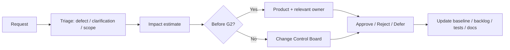

# 《微界工程師：生命迴路》Project Management Plan

> 版本 1.0｜狀態：2026 垂直切片執行基線候選｜日期：2026-07-26

| 文件欄位 | 內容 |
|---|---|
| 專案代號 | `MCE-LC-2026` |
| Product Owner | 待指派姓名 |
| Project／Delivery Owner | 待指派姓名 |
| 目標公開內容 | 前導章＋第一章＋展覽快速路徑 |
| 目標 RC | 2026-10-21（作外部 deliverable 檢查點；適用性須按 iGEM 當屆規則確認） |
| 展示凍結 | 2026-11-01 |
| Grand Jamboree | 2026-11-13 至 11-16 |
| 工作方法 | 兩週增量＋每週風險／科學 gate＋硬性 scope freeze |

## 修訂與核准

| 版本 | 日期 | 變更摘要 | Product | Delivery | Tech | Science／HP | QA |
|---|---|---|---|---|---|---|---|
| 1.0 | 2026-07-26 | 完成 charter、RACI、時程、容量、WBS、風險、品質、playtest、release | 待簽 | 待簽 | 待簽 | 待簽 | 待簽 |

---

## 1. Project Charter

### 1.1 目的

在 2026 iGEM 時程內，將已有的概念與腳本轉化為一個可公開、可在學校電腦運行、科學表述受控、可及且可被真實玩家完成的網頁遊戲垂直切片。專案不是以「產出最多章節」為成功，而是以一條完整、可信、可測試的責任循環證明團隊具備把合成生物學教育轉成遊戲的能力。

### 1.2 目標

| ID | Objective | Measure | Target／Gate |
|---|---|---|---|
| OBJ-01 | 完成 P0 Critical Path | 全新 profile 由 boot 至章末 | Beta 前 100% 可玩 |
| OBJ-02 | 科學與責任表述可追溯 | Claim Register、source、review | Content Freeze 100% 核准／移除 |
| OBJ-03 | 目標玩家能完成 | 中學生／公眾真實測試 | ≥80% C1 ≤30 分鐘；PRE 95% ≤8 分鐘 |
| OBJ-04 | 學校設備可運行 | 三台 baseline device | ≥30 FPS、無 crash／data loss |
| OBJ-05 | 可及性不阻擋核心 | keyboard、zoom、subtitles、reduced motion | QA 必測路徑全部通過 |
| OBJ-06 | 可在展覽可靠展示 | 3–5 分鐘 route、reset、offline、video fallback | RC 前完成演練 |
| OBJ-07 | 可公開重現／維護 | source、license、build、docs、tests | RC artifact 可由乾淨環境重建 |
| OBJ-08 | AI 提高速度而不降低責任 | AI log、independent review、protected claims | 每個 AI PR 有 human approver |

### 1.3 範圍

**In Scope P0**

- TypeScript／Vite／Three.js application shell；
- Preact＋semantic DOM 為 Baseline v2.0；只有 G1 spike 失敗且由 Tech／Accessibility Owner 記錄決定時，才退回原生 DOM 並保留同一 contracts；
- 模式／可及性設定；
- 前導章 S00–S05；
- 第一章 S00–S08；
- 河港、研究站、會議三個小型場景；
- 角色移動、互動、對話、證據簿、迴路、測試、安全、聲明、報告；
- 本機存檔、checkpoint、reset、import／export；
- zh-Hant 全 P0；英文核心 UI＋展覽路徑；
- QA、science／safety review、target-player playtest；
- static deploy、offline package、演示備援。

**P1 only after Beta capacity**

PWA、完整英文第一章、平板、教師摘要、少量語音、額外背景居民／遠景。P1 未完成不構成 P0 失敗。

**R&D／Future**

Junior Mission 僅紙面／2D／共用場景 greybox；第二至終章只保留設計庫。任何人不得在 P0 backlog 中暗中加入 Future chapter production。

### 1.4 假設與限制

| ID | Assumption／Constraint | Owner | Evidence Needed | Fallback |
|---|---|---|---|---|
| PC-01 | 高中團隊在學期／暑期有有限且波動工時 | Delivery | 每人每週 availability | 依 Capacity Tier 縮範圍 |
| PC-02 | 正式角色名冊尚未提供 | Product | 8/2 前 RACI | 無 Owner 的工作不得承諾 |
| PC-03 | MerR construct 尚未實測 | Science | Claim Register／核准文案 | 只保留機制＋proposal＋simulation 分層 |
| PC-04 | 目標設備未知 | Tech／QA | 三台 school device | 降 3D／受控 demo |
| PC-05 | 未成年人研究需所在地程序 | Education／HP | consent／school process | 只做成人／非研究 usability；不宣稱學習成效 |
| PC-06 | AI 工具與模型會快速更新 | Tech／AI Steward | milestone capability／terms check | vendor-neutral workflow／人工 fallback |
| PC-07 | 預算未提供 | Product／Finance | cap by 8/2 | 使用免費／已有工具；砍 P1、VO、外判 |
| PC-08 | iGEM deliverables 依 track／village 可能不同 | Product | 官方 guide／judging form check | 以最早合理外部日期作內部 gate |

### 1.5 成功定義

成功不等於「所有原有腳本已實作」。成功是：一個科學與社會因果完整、可在目標硬體穩定運行、真實玩家能完成、來源與限制透明、可以離線展示、團隊能解釋每項 AI／技術決定的 P0 RC。若最後只交付穩定的前導＋第一章，而沒有 Junior／PWA／完整英文，仍可是成功；若交付很多未測章節但核心崩潰、科學誤導或不能在學校設備運行，則是失敗。

## 2. 組織與責任

### 2.1 團隊名冊

在 2026-08-02 前用實際姓名取代「待指派」。一人可兼任多角，但同一高風險決定需第二人 review。

| Role | 姓名 | 每週有效工時 | 核心責任 | Backup |
|---|---|---:|---|---|
| Product Owner | 待指派 | 待填 | scope、外部承諾、最終取捨 | 待指派 |
| Delivery／PM | 待指派 | 待填 | 排程、風險、gate、status | 待指派 |
| Lead Game Designer | 待指派 | 待填 | GDD、玩法、節奏、content acceptance | 待指派 |
| Technical Lead | 待指派 | 待填 | 架構、repo、CI、performance、release | 待指派 |
| Gameplay／UI Developers | 待指派 | 待填 | systems、DOM、3D、tests | 待指派 |
| Art Lead／3D／UI | 待指派 | 待填 | asset scope、style、pipeline、licenses | 待指派 |
| Science Lead | 待指派 | 待填 | claims、sources、MerR／aptamer review | 待指派 |
| Safety／Security Lead | 待指派 | 待填 | biosafety、dual use、privacy／agent boundary | 待指派 |
| Education／HP Lead | 待指派 | 待填 | learning、stakeholders、research、teacher review | 待指派 |
| QA／Accessibility Lead | 待指派 | 待填 | test plan、devices、defects、release recommendation | 待指派 |
| Localization／Communications | 待指派 | 待填 | zh-Hant copy、English expo、public wording | 待指派 |
| AI Steward | 待指派 | 待填 | tool accounts、cost、data policy、AI log | Tech backup |

**有效工時**只計可實際投入並包含 review／meeting 的時間，不用「可能有空」或模型運行時間灌水。

### 2.2 Stakeholder Register

| Stakeholder | Interest／Need | Influence | Engagement | Owner |
|---|---|---:|---|---|
| iGEM team／advisors | 可交付、可信、與 team project 一致 | 高 | weekly gate／formal sign-off | Product |
| Science／Safety advisors | 機制、claims、risk boundaries | 高 | claim review at Alpha/Beta | Science／Safety |
| P4–P6 teachers／students | Junior 適齡性 | 中高 | only R&D separate study | Education |
| Secondary students／public | P0 usability／learning | 高 | Alpha／Beta playtests | Education／QA |
| River／community stakeholders | 角色與疑慮不被工具化 | 中高 | HP review／consent if based on real people | HP |
| School IT／workshop facilitators | device、network、reset、time | 高 | baseline device＋facilitator rehearsal | Tech／QA |
| iGEM judges／visitors | 3–5 min understandable demo | 高 | Expo route／English core／backup video | Product／Comms |
| Asset／voice contributors | clear brief、license、credit | 中 | written agreement／review | Art |
| Hosting provider | uptime、cache、HTTPS | 中 | staging／rollback | Tech／Ops |

### 2.3 RACI

R = Responsible，A = Accountable，C = Consulted，I = Informed。

| Deliverable／Decision | Product | Delivery | Design | Tech | Art | Science／Safety | Edu／HP | QA | AI Steward |
|---|---|---|---|---|---|---|---|---|---|
| P0 Scope Baseline | A | R | C | C | C | C | C | C | I |
| GDD | A | C | R | C | C | C | C | C | I |
| TDD／Architecture | C | I | C | A/R | C | C | I | C | C |
| Claim Register | I | I | C | I | I | A/R | C | C | I |
| Script／copy changes | C | I | A/R | I | I | C | C | C | I |
| Asset style／budget | C | C | C | C | A/R | C | C | C | I |
| Privacy／child research | A | I | I | C | I | C | A/R | C | C |
| AI policy／accounts | A | I | I | C | I | C | C | C | R |
| PR implementation | I | I | C | A/R | R as needed | C for claims | C for research UI | C | C |
| Test plan／defect severity | I | C | C | C | C | C | C | A/R | I |
| Release recommendation | A decision | C | C | C | C | C | C | R recommendation | I |
| Production deploy | A approval | C | I | R | I | I | I | C | I |

Science Lead cannot be replaced by AI；the implementer cannot be sole approver of their own high-risk change。

### 2.4 升級路徑

1. Task blocker >24 hours → Delivery Owner；
2. Scope／priority conflict → Product Owner within 24 hours；
3. Architecture／security／data risk → Tech＋Safety immediately；
4. Science claim／misconception → freeze affected content, Science Lead decision；
5. Child／consent／personal data concern → stop collection／upload, Education／Safety escalation；
6. License unknown → asset removed from build until Art／responsible reviewer resolves；
7. Release blocker within freeze → QA recommends rollback／cut；Product cannot silently downgrade severity without written rationale。

## 3. 工作方式

### 3.1 開發方法

採用「垂直增量＋風險先行」：每個 sprint 交付可從入口操作、具有 content、save、error、a11y 和 test 的薄切片，而不是分別完成所有 engine、所有 art、所有 script。首週先解最危險未知：低階 3D、DOM focus、physics、GLB、save、science source。

每張 work item 盡量 0.5–2 人日；超過 3 人日必須拆分或先做 spike。AI agent 任務通常 30–120 分鐘可驗證範圍；長時間 agent 也必須有 checkpoint 和禁止範圍。

### 3.2 工作週期

| Cadence | 會議／活動 | 時長 | 產出 |
|---|---|---:|---|
| Daily／async | blockers、today、AI jobs、test status | 5–10 min written | board update |
| 2× weekly | integration／science triage | 30 min | decisions／owners |
| Weekly | risk、scope、capacity、device／playtest | 45 min | status report／risk change |
| Fortnightly | sprint review＋retro＋planning | 60–90 min | playable build、next sprint goal |
| Gate dates | formal evidence review | 60 min | Go／Conditional／No-Go record |
| Content Freeze onward | daily release triage | 15 min | blocker list／build candidate |

Meeting time counts against capacity；不要安排沒有 decision／artifact 的長會議。

### 3.3 工具

| Need | Baseline | Rule |
|---|---|---|
| Source／PR | GitHub 或團隊核准等價平台 | main protected；one task／branch |
| Backlog | GitHub Projects／Linear／Trello one source | ticket IDs in commits／AI tasks |
| Docs | repository Markdown | signed decisions mirrored in repo |
| Design／UI | Figma or open equivalent | asset IDs／states／a11y annotations |
| 3D | Blender | approved exporter preset |
| Testing | Vitest／Playwright＋manual device log | test evidence attached |
| Communication | one agreed chat＋weekly written status | decisions not lost in DMs |
| AI | Claude Code、Codex、OpenCode、Cursor as approved | follow AI Playbook；no secret／child data |
| Password／keys | team password manager／platform secrets | never chat／repo／prompt |

### 3.4 溝通規範

- 建議／問題以 ticket 或 decision ID 引用，避免「之前說過」。
- 任何外部承諾、science claim、deadline change 需書面決定。
- AI output is a draft；不以「模型說可以」作決策理由。
- Blocker 在 24 小時內升級；不要讓 agent 多次盲試同一問題燒成本。
- Review comment 指向 acceptance／risk，避免只談個人偏好。
- 未成年人、健康、真實 stakeholder 或未公開 team data 不貼入一般 chat／AI。

### 3.5 文件單一來源

| Topic | Single Source of Truth |
|---|---|
| Scope／dates／owners | 本 PM＋Open Decisions／board |
| Player experience | GDD |
| Architecture／schema | TDD＋accepted ADR |
| Dialogue／flags | full scripts＋continuity |
| Science claims | [Source & Claim Register](22_SOURCE_AND_CLAIM_REGISTER.md)／Science sign-off |
| Assets／licenses | Asset Guidelines＋asset manifest |
| Tests／release | QA Plan＋test run／defect register |
| Agent rules | `AGENTS.md`＋AI Playbook |

對話訊息、AI session 和個人筆記不是單一來源；重要結果要落回 repo。

## 4. Roadmap 與里程碑

### 4.1 Phase

| Phase | 日期 | Goal | Exit Evidence |
|---|---:|---|---|
| P0 Audit／Scope／Spike | 7/27–8/09 | 鎖範圍、Owner、device、architecture unknowns | G0/G1 decision、playable spike |
| P1 Core Foundation | 8/03–8/16 | repo、CI、shell、settings、content schema、save、PRE vertical slice | green main、PRE S00–S02 |
| P2 Prelude＋C1 Greybox | 8/17–8/30 | PRE complete；C1 S00–S04 playable | G2 core greybox |
| P3 Full Chapter Alpha | 8/31–9/13 | C1 S05–S08、report、all zones、first assets | Alpha build＋first playtest |
| P4 Revision／Representative Art | 9/14–9/27 | fix comprehension、science、a11y；integrate P0 art/audio | Alpha 2／scope re-gate |
| P5 Beta／Localization／Performance | 9/28–10/11 | content freeze、performance、English Expo、offline | Beta gate |
| P6 QA／RC／Deliverables | 10/12–10/21 | regression、licenses、sources、release／rollback | RC candidate＋report |
| P7 Presentation Freeze | 10/22–11/01 | demo script、video、backup、last critical fixes | frozen Jamboree build |
| P8 Contingency／Jamboree | 11/02–11/16 | no features；rehearsal、support、archive | stable demo／post-event log |

Overlaps reflect role parallelism, not permission to skip gates。

### 4.2 Milestone

| Milestone | Date | Must Be True | Decision |
|---|---:|---|---|
| G0 Scope／Owner | 2026-08-02 | RACI、capacity、budget cap、devices、P0 signed | Go／reduce to 2D demo |
| G1 Technical Spike | 2026-08-09 | 30 FPS、DOM focus、collision、GLB、CI、save proof | accept／fallback architecture |
| M1 Prelude Slice | 2026-08-16 | S00–S02 playable with keyboard＋test | continue／simplify UI |
| G2 Core Greybox | 2026-08-30 | PRE full、C1 through S04、save／reset、content validation | continue／stop art expansion |
| G3 Alpha | 2026-09-14 | C1 full flow、first target playtest、science issue list | preserve／cut P1／shorten |
| M4 Art／A11y Integration | 2026-09-27 | representative P0 assets、keyboard／zoom pass | proceed Beta |
| G4 Beta／Content Freeze | 2026-10-11 | no new content、science approved draft、low device、English Expo | freeze／reduce scenes |
| G5 RC | 2026-10-21 | QA report、licenses、offline、rollback、no Blocker／High | release／hold／controlled demo |
| G6 Jamboree Freeze | 2026-11-01 | demo／video／backup rehearsed | blocker-only |

### 4.3 Release Plan

| Release | Audience | Purpose | Distribution |
|---|---|---|---|
| Prototype builds | internal | technical／interaction proof | preview URLs with noindex |
| Alpha | invited testers／advisors | usability、science、a11y、time | controlled link／consent process |
| Beta | wider controlled school／team | performance、LQA、regression | staging＋offline |
| RC | team／final reviewers | final recommendation | immutable artifact |
| Public 1.0 | public／iGEM | P0 experience | static site＋source／license info |
| Expo | visitors | 3–5 min loop | same tested artifact, expo mode |

Public release may occur after RC sign-off；do not force public launch solely because internal date arrived。

### 4.4 時間線

```text
2026-07-27  Audit actions / scope / owners
2026-08-02  G0 Scope & Capacity
2026-08-09  G1 Technical Spike
2026-08-16  Prelude Vertical Slice
2026-08-30  G2 Core Greybox
2026-09-14  G3 Alpha + first target-player evidence
2026-09-27  Representative Art / Accessibility Integration
2026-10-11  G4 Beta + Content Freeze
2026-10-21  G5 RC / external deliverable checkpoint if applicable
2026-11-01  G6 Jamboree Freeze
2026-11-13–16 Grand Jamboree
```

## 5. Work Breakdown Structure

| WBS | Workstream | Deliverables | Primary Role | Gate |
|---|---|---|---|---|
| 1.0 | Governance | scope、RACI、budget、decision log、AI policy | Product／Delivery | G0 |
| 2.0 | Science／Safety／HP | claim register、aptamer disposition、script sign-off、research ethics | Science／Safety／HP | Alpha／Beta |
| 3.0 | Technical Foundation | repo、CI、shell、router、services、content validator | Tech | G1／M1 |
| 4.0 | World／Character | renderer、scene loading、screen-relative movement、fixed isometric camera、interaction、anchors | Tech／Art | G2 |
| 5.0 | UI／Accessibility | setup、HUD、dialog、workbenches、settings、focus | UI／Tech／QA | G2／Beta |
| 6.0 | Prelude | content import、cards、simulation、transfer、save | Design／Content／Tech | M1／G2 |
| 7.0 | Chapter 1 | S00–S08、zones、claims、report、consequences | Cross-functional | G3 |
| 8.0 | Assets／Audio | P0 kits、characters、animations、VFX、music、license | Art／Audio | M4／Beta |
| 9.0 | Localization | zh-Hant QA、English core／Expo、pseudoloc | Content／Comms／QA | Beta |
| 10.0 | QA／Research | automated、device、a11y、science、playtest、defects | QA／Education | every gate |
| 11.0 | Release／Operations | hosting、offline、PWA decision、source、SBOM、rollback | Tech／Ops | RC |
| 12.0 | Presentation | demo route、facilitator script、video、poster screenshots | Product／Comms | Freeze |

Each WBS item decomposes into tickets with acceptance and estimated effective hours；avoid assigning one ticket to “entire chapter”。

## 6. Backlog 管理

### 6.1 Epic

P0 epics：EP-GOV、EP-SCIENCE、EP-FOUNDATION、EP-ACCESSIBILITY、EP-PRELUDE、EP-C1-HARBOR、EP-C1-LAB、EP-C1-CIVIC、EP-ASSETS、EP-QA、EP-RELEASE、EP-EXPO。Junior and Future epics live in separate view and cannot appear in current sprint without Product change request。

### 6.2 Work Item

Required fields：Ticket ID、user／system outcome、source links、scope／allowed files、acceptance IDs、science／a11y／privacy implications、estimate、owner、reviewer、dependencies、test command、AI allowed／prohibited、definition of done。Use [AI Task Packet](21_AI_TASK_PACKET_TEMPLATE.md) when delegating to an agent。

### 6.3 Definition of Ready

A ticket is Ready when：

1. It belongs to P0 or approved spike；
2. outcome and non-goals are explicit；
3. acceptance test can be stated before implementation；
4. source／claim／script ID is known；
5. dependencies and allowed paths are available；
6. estimate ≤3 effective person-days or split；
7. reviewer assigned；
8. science／child／license／security gate identified；
9. no unresolved product decision hidden inside；
10. test environment exists or is part of ticket。

### 6.4 Definition of Done

A ticket is Done when：code／content／asset integrated；relevant automated and manual tests pass；keyboard／error／save／performance considered；license／provenance complete；docs／schema updated；different reviewer approves；preview evidence attached；no unrelated changes；board and AI log updated。A generated file or passing unit test alone is not Done。

### 6.5 Priority 規則

Use `Must / Should / Could / Won't` plus risk score. Order：

1. safety／science／privacy／data loss blocker；
2. Critical Path broken；
3. target-device／a11y blocker；
4. gate evidence；
5. core comprehension／time；
6. P0 art／polish；
7. P1；
8. R&D／Future。

New work enters only if equal or larger work leaves after G2。AI making a task “cheap” does not bypass this rule because QA／integration cost remains。

## 7. 資源與容量

### 7.1 Capacity Plan

Calculate weekly effective capacity：

`sum(committed hours × availability factor) – meetings – review/support reserve`

Use 0.6–0.75 availability factor for students because school、experiments、exams and context switching are real. Reserve at least 20% for integration／QA／review from Alpha onward。

| Capacity Tier | Effective Team Hours／Week | Realistic 2026 Scope | Mandatory Decision |
|---|---:|---|---|
| A | <35 | PRE 2D＋3–5 min 3D／video demo；C1 only concept proof | immediately cut full C1 art／systems |
| B | 35–69 | PRE＋C1 greybox／limited art；no Junior／PWA／full English | P0 as minimal slice；asset stock/self-made reuse |
| C | 70–109 | P0 polished with representative art and English Expo | current baseline feasible with discipline |
| D | ≥110 sustained＋specialists | P0 plus selected P1 after Beta | still no Future chapters before RC |

AI model runtime does not count as team capacity；human specification、review、debug、integration and verification do。

### 7.2 技能矩陣

Before G0 each person self-rates 0–3 and identifies backup：TypeScript、Three.js、DOM/a11y、game state、testing、Blender、rig/animation、UI、audio、science、safety、education research、localization、release。Any P0 skill with no level-2 owner triggers training／scope reduction／external advisor plan。

### 7.3 外部資源

| Resource | Use | Boundary |
|---|---|---|
| Advisors／teachers | science／education／safety review | must have scheduled review dates, not “ask later” |
| Open-source packages | runtime／testing | license、security、size、maintenance ADR |
| Stock／library assets | limited props／audio | provenance／license；style consistency |
| AI coding tools | code、tests、docs、review | approved data、small tasks、human merge |
| Freelance／volunteer art／audio | only if budget／agreement | clear deliverables、rights、revision、credit |
| School devices／lab computers | performance／workshop | device ID、browser policy、no personal student data |

## 8. 預算與採購

### 8.1 Budget

Actual budget is a G0 blocker and must be filled by Product／Finance。Until then use caps rather than assumptions。

| Category | Baseline Policy | Budget Cap | Approval |
|---|---|---:|---|
| AI subscriptions／API | use existing educational/team plans where lawful；monthly hard cap | 待填 | Product＋AI Steward |
| Hosting／domain | static low-cost；avoid backend | 待填 | Tech＋Product |
| Assets／fonts／audio | prefer original／open licensed；no impulse packs | 待填 | Art＋Product |
| External review／honorarium | prioritize target-player／teacher／accessibility input | 待填 | Product／Education |
| Devices／adapters | use actual school devices；minimal demo hardware | 待填 | Tech |
| Voice | P1 only | 0 in P0 baseline | Product／Art |
| Contingency | 10–15% of approved cash budget | 待填 | Product |

AI cost must be tracked per provider／project／week。At 80% of monthly cap，disable non-critical long agent jobs；at 100%，use local／included tools or manual work，不臨時超支。

### 8.2 Purchase Register

| Purchase ID | Item／Vendor | Purpose | Cost | License／Term | Owner | Approval | Status |
|---|---|---|---:|---|---|---|---|
| PR-001 | 待填 | — | — | — | — | — | Not requested |

No student uses personal payment without reimbursement agreement。Do not buy model access before confirming data terms、workspace controls and actual task need。

## 9. Dependency 管理

| DEP ID | Dependency | Needed By | Owner | Status | Fallback |
|---|---|---:|---|---|---|
| DEP-01 | Team roster／capacity | G0 | Product | Open | Tier A scope |
| DEP-02 | School baseline devices | G0/G1 | Tech／QA | Open | reduce 3D／controlled demo |
| DEP-03 | MerR claim review | Alpha | Science | Open | generic wording／remove performance |
| DEP-04 | Aptamer correction | before public proposal use | Science | Open | exclude pages／design |
| DEP-05 | Research consent／recruitment | Alpha playtest | Education／HP | Open | adult usability only／no efficacy claim |
| DEP-06 | Blender export／compression | G1 | Art／Tech | Open | uncompressed limited blockout／simpler assets |
| DEP-07 | Font license／glyph | Alpha | Art／Localization | Open | system font stack |
| DEP-08 | Hosting／domain | Beta | Tech／Ops | Open | approved static backup／offline |
| DEP-09 | English reviewer | Beta | Comms／Science | Open | English Expo only／scripted presenter |
| DEP-10 | Official iGEM deliverables | RC planning | Product | Verify | internal 10/21 checkpoint |

Review dependencies weekly；closed means evidence attached, not verbal confidence。

## 10. Risk Register

| ID | Risk | P | I | Score | Trigger | Mitigation | Contingency | Owner |
|---|---|---:|---:|---:|---|---|---|---|
| R-01 | Scope expands to all chapters／Junior | 5 | 5 | 25 | Future ticket enters sprint | protected scope、board separation、change control | ship PRE＋C1 only | Product |
| R-02 | Team capacity drops due school／experiments | 4 | 5 | 20 | <80% plan two weeks | weekly actuals、backup、small tickets | capacity-tier cut | Delivery |
| R-03 | Core 3D underperforms school device | 4 | 5 | 20 | <30 FPS／crash | G1 spike、budgets、low tier | 2D/guided demo、simpler world | Tech |
| R-04 | Science claim misstates proposal as result | 4 | 5 | 20 | “proved／detected” in copy | claim register、protected paths、watermark | remove claim／delay public | Science |
| R-05 | Aptamer graphic reused without correction | 3 | 5 | 15 | wiki／slides use p4–5 | block asset、Science note | exclude／label concept only | Science／Comms |
| R-06 | AI produces broad unreviewed changes | 5 | 4 | 20 | huge PR／new deps／script edits | task packets、AGENTS、review agent＋human | revert／freeze agent access | Tech／AI |
| R-07 | Save corruption／PWA stale version | 3 | 5 | 15 | migration fail／mixed chunk | backup、PWA Beta-only、rollback | disable SW／restore old build | Tech／QA |
| R-08 | Playtest recruitment／consent late | 4 | 4 | 16 | no sessions booked by 8/30 | schedule at G0、adult fallback | no learning-effect claim；usability only | Education |
| R-09 | 24–25 min chapter runs long | 4 | 4 | 16 | median >30 min | early timing、trim optional text／walking | cut/merge scenes；Expo route | Design |
| R-10 | Accessibility issues found late | 4 | 4 | 16 | mouse-only／focus traps | DOM-first、weekly keyboard pass | guided point-and-click／remove blocked mechanic | QA／UI |
| R-11 | Asset／font／audio license unclear | 3 | 5 | 15 | missing source／terms | import gate、provenance | replace/remove asset | Art |
| R-12 | Full English doubles LQA | 4 | 3 | 12 | translation starts before Alpha | English Expo first、locale-ready | drop full C1 English | Product／Loc |
| R-13 | Single specialist unavailable | 3 | 4 | 12 | no backup／absence | pairing、docs、shared rig/pipeline | simplify asset／system | Delivery |
| R-14 | Public assumes simulation is real data | 3 | 5 | 15 | screenshot without context | permanent watermark、source page、comms review | takedown/correction | Science／Comms |
| R-15 | Hosting or school network blocked | 3 | 4 | 12 | loading/MIME/proxy failure | same-origin、offline package、rehearsal | local server＋video | Tech／Ops |
| R-16 | PWA consumes Beta time | 3 | 3 | 9 | update bugs／SW work >1 day | hard P1 gate | no PWA in 2026 | Tech |
| R-17 | Public concern characters feel tokenized | 3 | 4 | 12 | HP review flags | stakeholder review、specific needs、revision | rewrite／remove borrowed detail | HP／Narrative |
| R-18 | Cost overrun from frontier models | 4 | 3 | 12 | 80% cap before month end | routing、cache context、task size、budget alerts | cheaper model/manual／pause | AI Steward |
| R-19 | Agent leaks secrets／child data | 2 | 5 | 10 | sensitive prompt／log | data classification、approved workspace、redaction | revoke token、incident response | Safety／AI |
| R-20 | Content freeze ignored for polish | 4 | 4 | 16 | new features after 10/11 | branch protection／change board | revert／hold release | Product／QA |

P/I scale 1–5。Score ≥15 reviewed at least twice weekly；≥20 has named contingency exercise。

## 11. Issue Register

Issues are realized problems, not risks。Fields：ID、date、description、impact、owner、severity、current workaround、target date、decision needed、linked defect／ticket。The first issue meeting should create at minimum：Owner gaps、device availability、aptamer correction、budget、playtest recruitment、hosting choice。

| Issue ID | Description | Severity | Owner | Target | Status |
|---|---|---|---|---:|---|
| I-001 | 正式 Owner／容量尚未填寫 | Blocker | Product | 2026-08-02 | Open |
| I-002 | 目標裝置尚未取得 | Blocker | Tech／QA | 2026-08-02 | Open |
| I-003 | aptamer p4–5 機制未定義完整 expression platform | Blocker for public use | Science | 2026-08-02 | Open |
| I-004 | 現金／AI／asset budget 未核准 | High | Product | 2026-08-02 | Open |
| I-005 | 目標玩家招募與同意未排期 | High | Education／HP | 2026-08-09 | Open |

## 12. Decision Log

Every decision records ID、date、context、options、decision、why、approver、affected docs、review date。Use `20_OPEN_DECISIONS_REGISTER.md` for open items and move closed summary here。

| Decision ID | Decision | Status | Date | Review |
|---|---|---|---:|---:|
| D-001 | 2026 P0 = PRE＋C1＋Expo | Proposed baseline | 2026-07-26 | G0 |
| D-002 | No jump／dynamic gameplay | Proposed baseline | 2026-07-26 | G1 |
| D-003 | zh-Hant full；English Expo first | Proposed baseline | 2026-07-26 | Alpha |
| D-004 | PWA Beta-only | Proposed baseline | 2026-07-26 | Beta |
| D-005 | No backend／default telemetry | Proposed baseline | 2026-07-26 | RC |
| D-006 | Junior stays R&D until separate gate | Proposed baseline | 2026-07-26 | G2 |

## 13. Change Control

### 13.1 Change Request

Required：CR ID、requester、problem／evidence、scope added／removed、hours、bytes／assets、science／a11y／privacy impact、deadline impact、alternatives、acceptance、rollback。No change is accepted because “AI can build it quickly”。

### 13.2 變更流程



After G2, adding a P0 feature requires equal or greater scope removal unless it closes Blocker／High。After Content Freeze, only blocker、science/safety correction、data loss、critical accessibility or release infrastructure change；Product＋QA＋relevant specialist sign。

### 13.3 Scope Baseline

Baseline artifact is the P0 table in GDD／PM plus asset master list and RTM。At each gate export a snapshot／tag。Do not rewrite history；changes show delta and approval。

## 14. 品質管理

### 14.1 Quality Gate

| Gate | Product／Design | Tech | Science／Safety／HP | QA／Research |
|---|---|---|---|---|
| G0 | scope、owner、success | repo plan、devices | reviewer schedule、data boundary | test strategy／device plan |
| G1 | playable risk proof | performance、focus、physics、GLB、save | claim paths protected | spike evidence |
| G2 | PRE complete、C1 core loop | content validation、save、reset | first claim review | automated smoke＋internal usability |
| Alpha | full C1 | all systems integrated | issue list／no dangerous claim | target playtest＋severity baseline |
| Beta | content freeze | performance／offline／migration | formal content draft sign | regression、a11y、LQA、device |
| RC | no new design | exact artifact／rollback | final sign／source page | release recommendation |

### 14.2 Review Calendar

- Science／Safety copy review：8/16 sample、9/14 full draft、10/11 final。
- Accessibility：weekly keyboard smoke；8/30 component audit；9/27 user/manual；10/11 regression。
- Device performance：8/9、8/30、9/27、10/11、RC。
- Asset license：on import＋weekly report＋RC audit。
- AI usage／cost：weekly；data terms at model/tool change。
- Target player：early greybox no later than Alpha；revision session before Beta。

### 14.3 審核追蹤

Review is complete only with artifact、reviewer、date、decision、conditions and linked fixes。Comments in transient AI／chat session are copied to ticket／PR。Conditional approval has expiry；conditions not met automatically reopen。

## 15. Playtest 與研究排程

| Round | Date Window | Participants | Build | Questions | Minimum Evidence | Decision |
|---|---:|---|---|---|---|---|
| PT-0 Internal | 8/16–8/20 | team members not authors | PRE slice | controls、focus、time、obvious confusion | observation＋bugs | fix interaction |
| PT-1 Greybox | 8/24–9/04 | 5–8 secondary/public | PRE＋C1 S00–S04 | transfer、3D、controls、claim scope | consent、task completion、quotes de-identified | Alpha scope |
| PT-2 Alpha | 9/07–9/18 | 8–12 target players | full C1 | 30 min、misconceptions、HP、hints | pre/post equivalent prompts＋usability | cut/rewrite |
| PT-A11Y | 9/14–9/27 | 2–4 users/reviewers with relevant needs where feasible | critical DOM＋3D fallback | keyboard、zoom、motion、screen reader limits | task log＋barriers | accessibility fixes |
| PT-3 Beta | 9/28–10/07 | 8–15 target／teachers／facilitators | near-final | comprehension、device、workshop reset | completion、facilitator feedback | freeze／release |
| PT-JR | only if JR gate passes | separate P4–P6＋teachers | Junior greybox | reading、3D、transfer、22 min | separate consent／analysis | 2026 no/yes |
| PT-EXPO | 10/12–10/21 | unfamiliar adults／team presenters | Expo | 3–5 min clarity、reset | timed rehearsals | demo script |

Research protocol distinguishes product usability from educational effect。Small sample results are formative, not population claims。No hidden recording；data minimization、consent、withdrawal、de-identification and retention are explicit。

## 16. Release Readiness

Release checklist is owned by QA but each workstream signs evidence：

- Scope／content freeze complied；
- GDD/TDD／scripts／claims match build；
- no Blocker／High；Medium accepted with workaround；
- target-browser／device／offline／save／migration／a11y／science suites pass；
- source、license、AI provenance、attribution、privacy pages complete；
- exact artifact archived、checksum、build ID、SBOM、rollback tested；
- public URL、offline package、demo laptop、video fallback ready；
- facilitator／support contacts and incident procedure known；
- no unreviewed model-generated copy／asset／code in release；
- Product signs release only after QA recommendation, not instead of it。

## 17. Launch 與營運

### 17.1 Launch Runbook

1. Freeze tested RC artifact and hashes；
2. backup current production；
3. deploy staging exact artifact；
4. smoke boot、PRE、C1 load、save、sources、privacy、Expo reset；
5. Science／QA visually check simulated labels and key claims；
6. Product approves production pointer；
7. deploy exact artifact，不重新 build；
8. production smoke on two networks／one school device；
9. publish version／known issues／source／credits；
10. monitor manual support channel；if blocker, rollback immediately。

### 17.2 Support

P0 support is best-effort through Jamboree. One public contact／issue form may be used，但不得收集 unnecessary personal data。Support macros：browser unsupported、save export、audio blocked、low graphics、offline package、known issue。Do not ask minors to send screenshots containing personal information without approved process。

### 17.3 Incident

| Incident | Immediate Action | Owner | Communication |
|---|---|---|---|
| Game unavailable／crash | rollback／offline fallback | Tech／Ops | status note |
| Save data loss | stop rollout、preserve artifact、recover backup | Tech／QA | transparent workaround |
| Scientific error | hide／disable affected content、Science review | Science／Product | correction notice |
| License complaint | remove asset／take down if needed | Art／Product | acknowledge／investigate |
| Privacy／child data | stop collection／sharing、revoke access | Safety／Product | follow institution process |
| AI account／secret exposure | revoke token、audit logs、rotate | AI／Tech | incident record |

### 17.4 Post-launch Review

Within 7 days after public release／Jamboree：quality metrics、support、performance、misconceptions、AI cost、scope changes、what to archive、maintenance owner、whether to start Junior／C2。Do not roll directly into all Future chapters without new charter and evidence。

## 18. Status Report 範本

### Reporting Period：YYYY-MM-DD to YYYY-MM-DD

| Metric | Plan | Actual | Trend |
|---|---:|---:|---|
| Effective capacity hours |  |  |  |
| P0 tickets done／planned |  |  |  |
| Critical Path playable % |  |  |  |
| Automated pass rate |  |  |  |
| Open Blocker／High |  |  |  |
| Baseline FPS／bundle |  |  |  |
| AI spend／cap |  |  |  |
| Playtests completed |  |  |  |

#### 本期完成

- 以可演示 outcome列出，不只列 activity。

#### 下期計劃

- 一個 sprint goal＋最多五個關鍵 outcome。

#### 需要決策

| ID | Decision | Owner | Due | Default if missed |
|---|---|---|---:|---|

#### 主要風險／阻礙

| ID | Change | Current action | Escalation |
|---|---|---|---|

## 19. Meeting Notes 範本

```markdown
# Meeting <ID> — <Date>

- Purpose／decision needed：
- Attendees／roles：
- Evidence reviewed：
- Build／commit：

## 決定
| Decision ID | Decision | Approver | Effective date | Affected docs |
|---|---|---|---|---|

## Action Items
| Action | Owner | Due | Acceptance |
|---|---|---|---|

## Parking Lot
| Item | Why deferred | Review date |
|---|---|---|
```

## 附錄 A：聯絡與權限

Fill in private team system, not public repo：Product／Tech／Science／Safety／QA escalation contacts；repo admin；hosting deploy；AI billing；asset store；playtest data custodian。Use least privilege、2FA、backup admin and offboarding checklist。

## 附錄 B：歷史版本

| Baseline Tag | Date | Scope／Key Decision | Evidence Location |
|---|---:|---|---|
| `planning-v1.0` | 2026-07-26 | Reduced P0 production pack | this package |
| `scope-g0` | 2026-08-02 planned | team-approved scope／capacity | to be created |
| `tech-g1` | 2026-08-09 planned | architecture spike decision | to be created |
| `alpha-g3` | 2026-09-14 planned | full flow／playtest findings | to be created |
| `beta-g4` | 2026-10-11 planned | content freeze | to be created |
| `rc-g5` | 2026-10-21 planned | release candidate | to be created |
