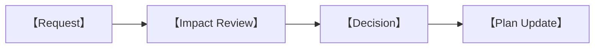

# 【專案名稱】Project Management Plan

> 專案管理文件｜版本【　】｜狀態【　】

| 文件欄位 | 內容 |
|---|---|
| Project Owner | 【　】 |
| Project Manager | 【　】 |
| 開始日期 | 【　】 |
| 目標日期 | 【　】 |
| 當前 Phase | 【　】 |
| 當前 Release | 【　】 |

## 修訂與核准

| 版本 | 日期 | 作者 | 變更摘要 | 核准人 |
|---|---|---|---|---|
|  |  |  |  |  |

---

## 1. Project Charter

### 1.1 目的

【　】

### 1.2 目標

| ID | 目標 | 指標 | Target | Due | Owner |
|---|---|---|---|---|---|
| OBJ-001 |  |  |  |  |  |

### 1.3 範圍

| In Scope | Out of Scope |
|---|---|
|  |  |

### 1.4 假設與限制

| ID | 類型 | 內容 | 驗證 | Owner | 狀態 |
|---|---|---|---|---|---|
|  |  |  |  |  |  |

### 1.5 成功定義

| 維度 | 指標 | Target | 測量 | 核准人 |
|---|---|---|---|---|
|  |  |  |  |  |

## 2. 組織與責任

### 2.1 團隊名冊

| 成員 | 角色 | 專長 | 可用時間 | 聯絡 | 備援 |
|---|---|---|---|---|---|
|  |  |  |  |  |  |

### 2.2 Stakeholder Register

| Stakeholder | 需求／利益 | 影響力 | 參與方式 | 頻率 | Owner |
|---|---|---|---|---|---|
|  |  |  |  |  |  |

### 2.3 RACI

| Deliverable／Decision | Responsible | Accountable | Consulted | Informed |
|---|---|---|---|---|
|  |  |  |  |  |

### 2.4 升級路徑

| 問題類型 | First Contact | Escalate To | 時限 | 最終決策人 |
|---|---|---|---|---|
|  |  |  |  |  |

## 3. 工作方式

### 3.1 開發方法

【　】

### 3.2 工作週期

| Event | 目的 | 參與者 | 頻率 | 時限 | 輸出 |
|---|---|---|---|---|---|
|  |  |  |  |  |  |

### 3.3 工具

| 類別 | 工具 | 用途 | Owner | 權限 |
|---|---|---|---|---|
|  |  |  |  |  |

### 3.4 溝通規範

| 類型 | Channel | 回應時限 | 記錄位置 | 避免使用 |
|---|---|---|---|---|
|  |  |  |  |  |

### 3.5 文件單一來源

| 資訊 | Source of Truth | Owner | 更新時機 |
|---|---|---|---|
|  |  |  |  |

## 4. Roadmap 與里程碑

### 4.1 Phase

| Phase | 目的 | Start | End | Entry Gate | Exit Gate | Owner |
|---|---|---|---|---|---|---|
|  |  |  |  |  |  |  |

### 4.2 Milestone

| ID | Milestone | Date | Deliverable | Acceptance | Dependencies | Status |
|---|---|---|---|---|---|---|
| MS-001 |  |  |  |  |  |  |

### 4.3 Release Plan

| Release | Goal | Scope Lock | Code Freeze | QA | Launch | Owner |
|---|---|---|---|---|---|---|
|  |  |  |  |  |  |  |

### 4.4 時間線

```mermaid
gantt
    title 【Project Timeline】
    dateFormat  YYYY-MM-DD
    section 【Phase】
    【Task】 :a1, YYYY-MM-DD, 1d
```

## 5. Work Breakdown Structure

| WBS ID | Deliverable | Work Package | Owner | Estimate | Start | Due | Dependency | Status |
|---|---|---|---|---:|---|---|---|---|
|  |  |  |  |  |  |  |  |  |

## 6. Backlog 管理

### 6.1 Epic

| Epic ID | Outcome | Owner | Target Release | Progress | Status |
|---|---|---|---|---:|---|
|  |  |  |  |  |  |

### 6.2 Work Item

| ID | Type | Summary | Priority | Estimate | Owner | Sprint | Status | Link |
|---|---|---|---|---:|---|---|---|---|
|  |  |  |  |  |  |  |  |  |

### 6.3 Definition of Ready

- [ ] 【　】
- [ ] 【　】
- [ ] 【　】

### 6.4 Definition of Done

- [ ] 【　】
- [ ] 【　】
- [ ] 【　】

### 6.5 Priority 規則

| Priority | 定義 | SLA／處理 |
|---|---|---|
|  |  |  |

## 7. 資源與容量

### 7.1 Capacity Plan

| 成員／職能 | Period | Available | Planned | Buffer | Notes |
|---|---|---:|---:|---:|---|
|  |  |  |  |  |  |

### 7.2 技能矩陣

| Skill | Primary | Secondary | Gap | Action |
|---|---|---|---|---|
|  |  |  |  |  |

### 7.3 外部資源

| Resource | Provider | Scope | Start | End | Contact | Risk |
|---|---|---|---|---|---|---|
|  |  |  |  |  |  |  |

## 8. 預算與採購

### 8.1 Budget

| Category | Planned | Committed | Actual | Variance | Owner |
|---|---:|---:|---:|---:|---|
|  |  |  |  |  |  |

### 8.2 Purchase Register

| ID | Item | Vendor | Cost | Approval | Purchase Date | License／Renewal | Owner |
|---|---|---|---:|---|---|---|---|
|  |  |  |  |  |  |  |  |

## 9. Dependency 管理

| ID | Dependency | Type | Provider | Needed By | Impact | Fallback | Owner | Status |
|---|---|---|---|---|---|---|---|---|
| DEP-001 |  |  |  |  |  |  |  |  |

## 10. Risk Register

| ID | Risk | Category | Probability | Impact | Exposure | Mitigation | Trigger | Contingency | Owner | Status |
|---|---|---|---:|---:|---:|---|---|---|---|---|
| RSK-001 |  |  |  |  |  |  |  |  |  |  |

## 11. Issue Register

| ID | Issue | Severity | Opened | Impact | Action | Due | Owner | Status | Resolution |
|---|---|---|---|---|---|---|---|---|---|
| ISS-001 |  |  |  |  |  |  |  |  |  |

## 12. Decision Log

| ID | Date | Decision | Options | Reason | Decider | Impact | Link |
|---|---|---|---|---|---|---|---|
| DEC-001 |  |  |  |  |  |  |  |

## 13. Change Control

### 13.1 Change Request

| CR ID | Request | Requester | Date | Scope | Schedule | Cost | Quality | Decision | Decider |
|---|---|---|---|---|---|---|---|---|---|
|  |  |  |  |  |  |  |  |  |  |

### 13.2 變更流程



### 13.3 Scope Baseline

| Baseline Version | Date | Included | Excluded | Approved By |
|---|---|---|---|---|
|  |  |  |  |  |

## 14. 品質管理

### 14.1 Quality Gate

| Gate | Entry | Required Evidence | Approver | Failure Action |
|---|---|---|---|---|
|  |  |  |  |  |

### 14.2 Review Calendar

| Review | Scope | Participants | Date／Frequency | Output | Owner |
|---|---|---|---|---|---|
|  |  |  |  |  |  |

### 14.3 審核追蹤

| Review ID | Finding | Severity | Owner | Due | Resolution | Verified By | Status |
|---|---|---|---|---|---|---|---|
|  |  |  |  |  |  |  |  |

## 15. Playtest 與研究排程

| Session ID | Audience | Goal | Date | Build | Sample | Consent | Owner | Report |
|---|---|---|---|---|---:|---|---|---|
|  |  |  |  |  |  |  |  |  |

## 16. Release Readiness

| Area | Owner | Entry Criteria | Evidence | Decision | Date |
|---|---|---|---|---|---|
| Design |  |  |  |  |  |
| Engineering |  |  |  |  |  |
| Art / Audio |  |  |  |  |  |
| Science / Education |  |  |  |  |  |
| Safety / Security |  |  |  |  |  |
| QA |  |  |  |  |  |
| Operations |  |  |  |  |  |

## 17. Launch 與營運

### 17.1 Launch Runbook

| Time | Action | Owner | Verify | Rollback Trigger |
|---|---|---|---|---|
|  |  |  |  |  |

### 17.2 Support

| Request Type | Channel | Triage | SLA | Owner |
|---|---|---|---|---|
|  |  |  |  |  |

### 17.3 Incident

| Severity | Definition | Response | Escalation | Communication |
|---|---|---|---|---|
|  |  |  |  |  |

### 17.4 Post-launch Review

| Review Date | Metrics | Feedback | Defects | Decision | Owner |
|---|---|---|---|---|---|
|  |  |  |  |  |  |

## 18. Status Report 範本

### Reporting Period：【　】

| 欄位 | 狀態 |
|---|---|
| Overall |  |
| Scope |  |
| Schedule |  |
| Budget |  |
| Quality |  |
| Team |  |

#### 本期完成

- 【　】

#### 下期計劃

- 【　】

#### 需要決策

| ID | 決策 | Decider | Due | Impact |
|---|---|---|---|---|
|  |  |  |  |  |

#### 主要風險／阻礙

| ID | 項目 | Owner | Action | Due |
|---|---|---|---|---|
|  |  |  |  |  |

## 19. Meeting Notes 範本

| 欄位 | 內容 |
|---|---|
| Meeting |  |
| Date / Time |  |
| Facilitator |  |
| Attendees |  |
| Objective |  |

### 決定

| ID | Decision | Owner | Date |
|---|---|---|---|
|  |  |  |  |

### Action Items

| ID | Action | Owner | Due | Status |
|---|---|---|---|---|
|  |  |  |  |  |

### Parking Lot

| ID | Topic | Revisit Date | Owner |
|---|---|---|---|
|  |  |  |  |

## 附錄 A：聯絡與權限

| System／Channel | Owner | Admin | Member | Guest | Recovery |
|---|---|---|---|---|---|
|  |  |  |  |  |  |

## 附錄 B：歷史版本

| Release | Date | Scope | Outcome | Retrospective |
|---|---|---|---|---|
|  |  |  |  |  |
