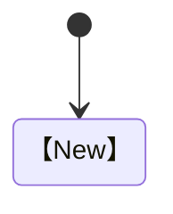

# 【遊戲名稱】Quality Assurance & Test Plan

> QA 測試計劃｜版本【　】｜狀態【　】

| 文件欄位 | 內容 |
|---|---|
| QA Owner | 【　】 |
| Target Release | 【　】 |
| Build / Commit | 【　】 |
| Test Window | 【　】 |
| 建立日期 | 【　】 |
| 最後更新 | 【　】 |

## 修訂與核准

| 版本 | 日期 | 作者 | 變更摘要 | 核准人 |
|---|---|---|---|---|
|  |  |  |  |  |

| 角色 | 姓名 | 決定 | 日期 | 備註 |
|---|---|---|---|---|
| QA Lead |  |  |  |  |
| Product Owner |  |  |  |  |
| Technical Lead |  |  |  |  |
| Design Lead |  |  |  |  |
| Science / Education Reviewer |  |  |  |  |

---

## 1. 目的與範圍

### 1.1 品質目標

| ID | 目標 | Measure | Target | Gate |
|---|---|---|---|---|
| QO-001 |  |  |  |  |

### 1.2 In Scope

【　】

### 1.3 Out of Scope

【　】

### 1.4 假設與限制

| ID | 假設／限制 | 影響 | 應對 | Owner |
|---|---|---|---|---|
|  |  |  |  |  |

### 1.5 相關文件

| 文件 | 版本 | 連結 | 用途 |
|---|---|---|---|
|  |  |  |  |

## 2. 品質模型

| 維度 | 定義 | 指標 | Release Bar | Owner |
|---|---|---|---|---|
| Functional |  |  |  |  |
| Usability |  |  |  |  |
| Performance |  |  |  |  |
| Compatibility |  |  |  |  |
| Accessibility |  |  |  |  |
| Reliability |  |  |  |  |
| Security / Privacy |  |  |  |  |
| Content Accuracy |  |  |  |  |
| Educational Outcome |  |  |  |  |

## 3. 測試策略

### 3.1 Test Level

| Level | Scope | Owner | Automation | Trigger | Gate |
|---|---|---|---:|---|---|
|  |  |  |  |  |  |

### 3.2 Test Type

| Type | Objective | Technique | Environment | Frequency | Owner |
|---|---|---|---|---|---|
|  |  |  |  |  |  |

### 3.3 Risk-based Priority

| Risk Level | Criteria | Coverage | Execution Order |
|---|---|---|---|
|  |  |  |  |

### 3.4 Entry Criteria

- [ ] 【　】
- [ ] 【　】
- [ ] 【　】

### 3.5 Exit Criteria

- [ ] 【　】
- [ ] 【　】
- [ ] 【　】

### 3.6 Suspension／Resumption

| Trigger | Suspend | Required Fix | Resume Approval |
|---|---|---|---|
|  |  |  |  |

## 4. 測試環境

### 4.1 Environment

| ID | Environment | URL／Build | Data | Access | Reset | Owner |
|---|---|---|---|---|---|---|
|  |  |  |  |  |  |  |

### 4.2 Device／Browser Matrix

| Priority | Device | OS | Browser | Version | Input | Resolution | Owner |
|---|---|---|---|---|---|---|---|
|  |  |  |  |  |  |  |  |

### 4.3 Network Matrix

| Profile | Download | Upload | Latency | Packet Loss | Offline |
|---|---:|---:|---:|---:|---|
|  |  |  |  |  |  |

### 4.4 Account／Save State

| Fixture ID | Progress | Settings | Inventory／State | Version | Reset |
|---|---|---|---|---|---|
|  |  |  |  |  |  |

### 4.5 Test Data

| Data ID | Purpose | Source | Sensitivity | Version | Cleanup |
|---|---|---|---|---|---|
|  |  |  |  |  |  |

## 5. 需求追蹤

### 5.1 Requirement Traceability Matrix

| Requirement ID | Source | Description | Risk | Test Case | Result | Evidence |
|---|---|---|---|---|---|---|
|  |  |  |  |  |  |  |

### 5.2 Learning Outcome Traceability

| LO ID | Gameplay Evidence | Test Method | Audience | Expected | Result | Reviewer |
|---|---|---|---|---|---|---|
|  |  |  |  |  |  |  |

### 5.3 Content Claim Traceability

| Claim ID | In-game Location | Source | Reviewer | Test | Status |
|---|---|---|---|---|---|
|  |  |  |  |  |  |

## 6. 測試案例

### 6.1 Test Case Template

| 欄位 | 內容 |
|---|---|
| Test Case ID |  |
| Title |  |
| Requirement |  |
| Priority |  |
| Preconditions |  |
| Test Data |  |
| Environment |  |
| Owner |  |

| Step | Action | Expected Result | Actual Result | Evidence | Status |
|---|---|---|---|---|---|
|  |  |  |  |  |  |

### 6.2 Exploratory Charter

| 欄位 | 內容 |
|---|---|
| Charter ID |  |
| Mission |  |
| Area |  |
| Risks |  |
| Time Box |  |
| Tester |  |
| Build |  |

| Observation | Evidence | Severity | Follow-up |
|---|---|---|---|
|  |  |  |  |

### 6.3 Checklist Test

- [ ] 【　】
- [ ] 【　】
- [ ] 【　】

## 7. 功能測試套件

| Suite ID | Area | Scope | Cases | Automation | Owner | Status |
|---|---|---|---:|---:|---|---|
|  |  |  |  |  |  |  |

### 7.1 啟動與載入

| Test ID | Scenario | Priority | Result | Defect |
|---|---|---|---|---|
|  |  |  |  |  |

### 7.2 控制與鏡頭

| Test ID | Scenario | Priority | Result | Defect |
|---|---|---|---|---|
|  |  |  |  |  |

### 7.3 角色與物理

| Test ID | Scenario | Priority | Result | Defect |
|---|---|---|---|---|
|  |  |  |  |  |

### 7.4 互動

| Test ID | Scenario | Priority | Result | Defect |
|---|---|---|---|---|
|  |  |  |  |  |

### 7.5 任務與對話

| Test ID | Scenario | Priority | Result | Defect |
|---|---|---|---|---|
|  |  |  |  |  |

### 7.6 模擬與數值

| Test ID | Scenario | Input | Expected | Tolerance | Result |
|---|---|---|---|---|---|
|  |  |  |  |  |  |

### 7.7 UI／設定

| Test ID | Scenario | Priority | Result | Defect |
|---|---|---|---|---|
|  |  |  |  |  |

### 7.8 存檔／載入／遷移

| Test ID | Save Version | Scenario | Expected | Result | Defect |
|---|---|---|---|---|---|
|  |  |  |  |  |  |

### 7.9 音訊

| Test ID | Scenario | Priority | Result | Defect |
|---|---|---|---|---|
|  |  |  |  |  |

### 7.10 離線／復原

| Test ID | Failure | Action | Expected Recovery | Result | Defect |
|---|---|---|---|---|---|
|  |  |  |  |  |  |

## 8. 非功能測試

### 8.1 Performance

| PERF ID | Scene／Flow | Device Tier | Metric | Target | Result | Evidence |
|---|---|---|---|---:|---:|---|
|  |  |  |  |  |  |  |

### 8.2 Memory／Leak

| Test ID | Duration／Loop | Start | Peak | End | Target | Result |
|---|---|---:|---:|---:|---:|---|
|  |  |  |  |  |  |  |

### 8.3 Loading／Bundle

| Test ID | Network | Cache State | Metric | Target | Result |
|---|---|---|---|---:|---:|
|  |  |  |  |  |  |

### 8.4 Reliability／Soak

| Test ID | Duration | Actions | Failure Threshold | Result | Evidence |
|---|---:|---|---|---|---|
|  |  |  |  |  |  |

### 8.5 Compatibility

| Matrix ID | Environment | Core Flow | Visual | Input | Audio | Result |
|---|---|---|---|---|---|---|
|  |  |  |  |  |  |  |

### 8.6 Security／Privacy

| SEC ID | Threat／Requirement | Method | Expected | Result | Reviewer |
|---|---|---|---|---|---|
|  |  |  |  |  |  |

## 9. Accessibility QA

| A11Y ID | Requirement | WCAG／Policy | Method | Device／AT | Result | Evidence |
|---|---|---|---|---|---|---|
|  |  |  |  |  |  |  |

### 9.1 Keyboard／Focus

- [ ] 【　】
- [ ] 【　】

### 9.2 Visual／Color／Text

- [ ] 【　】
- [ ] 【　】

### 9.3 Audio／Caption

- [ ] 【　】
- [ ] 【　】

### 9.4 Motion／Timing

- [ ] 【　】
- [ ] 【　】

### 9.5 Cognitive Load

- [ ] 【　】
- [ ] 【　】

## 10. 本地化 QA

| LQA ID | Language | Screen／Flow | Linguistic | Layout | Font | Result |
|---|---|---|---|---|---|---|
|  |  |  |  |  |  |  |

### 10.1 Pseudolocalization

| Test ID | Expansion | Glyph | Mirroring | Result |
|---|---:|---|---|---|
|  |  |  |  |  |

### 10.2 Terminology

| Term ID | Approved Term | Prohibited Variant | Context | Reviewer |
|---|---|---|---|---|
|  |  |  |  |  |

## 11. 內容、科學與教育 QA

### 11.1 Content Review

| Content ID | Location | Science | Safety | Ethics | Age Fit | Citation | Status |
|---|---|---|---|---|---|---|---|
|  |  |  |  |  |  |  |  |

### 11.2 Misconception Audit

| ID | Possible Misconception | Trigger Content | Detection Method | Expected Correction | Result |
|---|---|---|---|---|---|
|  |  |  |  |  |  |

### 11.3 Learning Validation

| LO ID | Audience | Sample | Method | Baseline | Post | Target | Result |
|---|---|---:|---|---:|---:|---:|---|
|  |  |  |  |  |  |  |  |

### 11.4 Sensitive Content

| Content | Risk | Age Mode | Safeguard | Reviewer | Result |
|---|---|---|---|---|---|
|  |  |  |  |  |  |

## 12. Playtest 與可用性

### 12.1 Research Plan

| Session ID | Question | Audience | Sample | Method | Build | Consent | Owner |
|---|---|---|---:|---|---|---|---|
|  |  |  |  |  |  |  |  |

### 12.2 Session Script

| Phase | Time | Prompt／Task | Observe | Avoid |
|---|---:|---|---|---|
|  |  |  |  |  |

### 12.3 Observation Log

| Participant ID | Task | Behavior | Quote | Severity | Interpretation | Follow-up |
|---|---|---|---|---|---|---|
|  |  |  |  |  |  |  |

### 12.4 Usability Metric

| Metric | Definition | Target | Result | Segment |
|---|---|---:|---:|---|
|  |  |  |  |  |

### 12.5 Research Ethics

| Requirement | Evidence | Owner | Status |
|---|---|---|---|
|  |  |  |  |

## 13. Automation

### 13.1 Automation Scope

| Suite | Tool | Trigger | Environment | Runtime | Owner |
|---|---|---|---|---|---|
|  |  |  |  |  |  |

### 13.2 Automated Flow

| Test ID | Flow | Viewport | Browser | Assertions | Artifact |
|---|---|---|---|---|---|
|  |  |  |  |  |  |

### 13.3 Visual Regression

| Baseline | Scene／Screen | Viewport | Threshold | Mask | Reviewer |
|---|---|---|---:|---|---|
|  |  |  |  |  |  |

### 13.4 Flaky Test Register

| Test ID | Failure Rate | Cause | Quarantine | Owner | Due |
|---|---:|---|---|---|---|
|  |  |  |  |  |  |

## 14. Defect 管理

### 14.1 Severity

| Severity | 定義 | Release Impact | Response Time |
|---|---|---|---|
|  |  |  |  |

### 14.2 Priority

| Priority | 定義 | Scheduling |
|---|---|---|
|  |  |  |

### 14.3 Bug Report Template

| 欄位 | 內容 |
|---|---|
| Bug ID |  |
| Title |  |
| Build / Commit |  |
| Environment |  |
| Preconditions |  |
| Steps |  |
| Expected |  |
| Actual |  |
| Repro Rate |  |
| Severity / Priority |  |
| Evidence |  |
| Save / Log |  |
| Reporter |  |
| Owner |  |

### 14.4 Defect Workflow

### 14.5 Defect Register

| Bug ID | Title | Severity | Priority | Build | Owner | Status | Fix Build | Verification |
|---|---|---|---|---|---|---|---|---|
|  |  |  |  |  |  |  |  |  |

### 14.6 Deferred Defect

| Bug ID | Reason | Player Impact | Workaround | Target | Approved By |
|---|---|---|---|---|---|
|  |  |  |  |  |  |

## 15. Smoke、Regression 與 Acceptance

### 15.1 Smoke Suite

| Test ID | Critical Flow | Environment | Expected | Result |
|---|---|---|---|---|
|  |  |  |  |  |

### 15.2 Regression Suite

| Suite | Trigger | Coverage | Duration | Owner | Result |
|---|---|---|---:|---|---|
|  |  |  |  |  |  |

### 15.3 User Acceptance

| UAT ID | Stakeholder | Scenario | Acceptance | Result | Sign-off |
|---|---|---|---|---|---|
|  |  |  |  |  |  |

## 16. Test Execution

### 16.1 Run Summary

| Run ID | Build | Date | Scope | Passed | Failed | Blocked | Not Run | Owner |
|---|---|---|---|---:|---:|---:|---:|---|
|  |  |  |  |  |  |  |  |  |

### 16.2 Daily Result

| Date | Build | Tests | Pass Rate | New Bugs | Closed Bugs | Blockers |
|---|---|---:|---:|---:|---:|---|
|  |  |  |  |  |  |  |

### 16.3 Blocker

| ID | Blocked Scope | Cause | Owner | ETA | Workaround |
|---|---|---|---|---|---|
|  |  |  |  |  |  |

## 17. Release Checklist

### 17.1 Build

- [ ] 【　】
- [ ] 【　】

### 17.2 Functional

- [ ] 【　】
- [ ] 【　】

### 17.3 Content

- [ ] 【　】
- [ ] 【　】

### 17.4 Compatibility／Performance

- [ ] 【　】
- [ ] 【　】

### 17.5 Accessibility／Localization

- [ ] 【　】
- [ ] 【　】

### 17.6 Security／Privacy／Child Safety

- [ ] 【　】
- [ ] 【　】

### 17.7 Operations／Rollback

- [ ] 【　】
- [ ] 【　】

## 18. Release Recommendation

| Area | Status | Open Risk | Owner | Recommendation |
|---|---|---|---|---|
|  |  |  |  |  |

### 18.1 Open Defects by Severity

| Severity | Open | Deferred | Accepted Risk | Target |
|---|---:|---:|---:|---|
|  |  |  |  |  |

### 18.2 Known Issues

| Issue | Player Impact | Workaround | Communication | Target Fix |
|---|---|---|---|---|
|  |  |  |  |  |

### 18.3 Sign-off

| Role | Name | Go／No-Go | Conditions | Date |
|---|---|---|---|---|
|  |  |  |  |  |

## 19. Post-release Verification

| Check | Environment | Expected | Result | Owner | Time |
|---|---|---|---|---|---|
|  |  |  |  |  |  |

## 附錄 A：測試證據索引

| Evidence ID | Type | Test／Bug | Location | Build | Date |
|---|---|---|---|---|---|
|  |  |  |  |  |  |

## 附錄 B：測試帳號與資料清理

| Fixture | Owner | Access | Reset | Expiry | Notes |
|---|---|---|---|---|---|
|  |  |  |  |  |  |

## 附錄 C：最終測試報告

| 欄位 | 結果 |
|---|---|
| Release |  |
| Build |  |
| Test Window |  |
| Scope |  |
| Pass Rate |  |
| Open Risk |  |
| Recommendation |  |
| Approved By |  |
